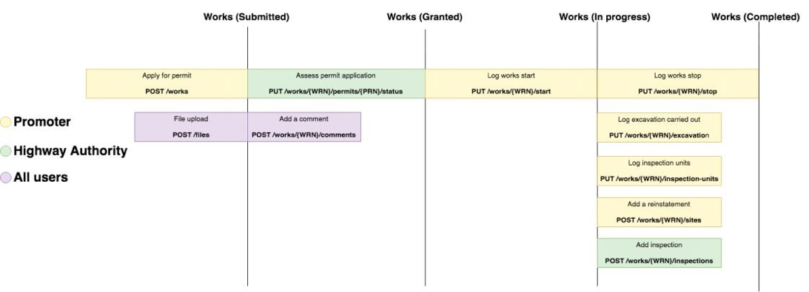

# API specification
{: .govuk-heading-xl}

Version 1.16
{: .govuk-body-l}

As of Version 1.12, this document details all the legally required API functions for integrating with Street Manager via the API. Future releases of V1 for the API will only include non-breaking changes to the API interface for additional functionality added after this point. See the 'Versions and Changes' section for details on previous versions.
{: .govuk-body}

## Table of contents
{: .govuk-heading-l #table-of-contents}

<ul class="govuk-list govuk-list--number">
  <li><a class="govuk-link" href="#introduction">Introduction</a></li>
  <li><a class="govuk-link" href="#swagger-documentation">Swagger Documentation</a></li>
  <li><a class="govuk-link" href="#environments">Environments</a></li>
  <li><a class="govuk-link" href="#connecting">Connecting to the API services</a></li>
  <li><a class="govuk-link" href="#timing">Timing</a></li>
  <li><a class="govuk-link" href="#technical-overview">Technical Overview</a></li>
  <li><a class="govuk-link" href="#versioningandreleasemanagement">Versioning and Release Management</a></li>
  <li><a class="govuk-link" href="#integration-guide">Integration guide</a></li>
  <li><a class="govuk-link" href="#testing">Testing</a></li>
  <li><a class="govuk-link" href="#security">Security</a></li>
  <li><a class="govuk-link" href="#sequencing">Sequencing</a></li>
  <li><a class="govuk-link" href="#resource-guide">Resource Guide</a></li>
  <li><a class="govuk-link" href="#roadmap">Roadmap</a></li>
  <li><a class="govuk-link" href="#versions">Versions and Changes</a></li>
</ul>

## Introduction
{: .govuk-heading-l #introduction}

This is the API guidance documentation for Street Manager, intended as a guide for developers integrating their systems to submit and retrieve information about street works. It is intended as a technical guide to be used with the API definition documentation and not a business change guide.
{: .govuk-body}

The Street Manager APIs are RESTful APIs to read/write data to the centralised Street Manager system following [GDS guidelines](https://www.gov.uk/guidance/gds-api-technical-and-data-standards), not a peer to peer solution.
{: .govuk-body}

### References
{: .govuk-heading-m}

For supplemental details, please see the following documents:
{: .govuk-body}

<ol class="govuk-list govuk-list--bullet">
  <li><a href="/street-manager-docs/articles/business-rules-home.html">Business rules</a>, for details on Street Managers business processes and logic</li>
  <li><a href="/street-manager-docs/onboarding/">Onboarding</a>, for details on how to start using Street Manager with-in your organisation</li>
</ol>

## Swagger Documentation
{: .govuk-heading-l #swagger-documentation}

The services APIs are documented and defined using <a href="https://swagger.io/docs/specification/about/">OpenAPI Specification Version 2 (Swagger)</a>. This allows developers to get the full technical detail for the API endpoints, including Request/Response object definitions. The Swagger JSON includes comments for field validation rules and references to the business rules. You can use the files to <a href="https://swagger.io/tools/swagger-codegen/">generate interface code</a> for your chosen language.
{: .govuk-body}

The Swagger JSON files for each API are available below:
{: .govuk-body}

<ol class="govuk-list govuk-list--bullet">
  <li><a href="json/work-swagger.json">Work API JSON</a></li>
  <li><a href="json/reporting-swagger.json">Reporting API JSON</a></li>
  <li><a href="json/lookup-swagger.json">Street Lookup API JSON</a></li>
  <li><a href="json/geojson-swagger.json">GeoJSON API JSON</a></li>
  <li><a href="json/party-swagger.json">Party API JSON</a></li>
  <li><a href="json/export-swagger.json">Data Export API JSON</a></li>
</ol>

You can see the Swagger definitions rendered as HTML on the SANDBOX environment:
{: .govuk-body}

<ol class="govuk-list govuk-list--bullet">
  <li><a href="https://api.sandbox.stwrks-dev.net/v1/work/docs/">Work API</a></li>
  <li><a href="https://api.sandbox.stwrks-dev.net/v1/reporting/docs/">Reporting API</a></li>
  <li><a href="https://api.sandbox.stwrks-dev.net/v1/lookup/docs/">Street Lookup API</a></li>
  <li><a href="https://api.sandbox.stwrks-dev.net/v1/geojson/docs/">GeoJSON API</a></li>
  <li><a href="https://api.sandbox.stwrks-dev.net/v1/party/docs/">Party API</a></li>
  <li><a href="https://api.sandbox.stwrks-dev.net/v1/export/docs/">Data Export API</a></li>
</ol>

**Please be aware of the following:**
{: .govuk-body}

If you attempt to validate the above swagger files using the online tool <a href="https://editor.swagger.io"> https://editor.swagger.io </a> or `swagger-cli`, you may see schema errors. Please note we are aware of this issue and it will not stop you from being able to generate mock server/clients. We aim to fix this in a future version.
{: .govuk-body}

Swagger UI does not display all description text for enumerations and child elements, instead check each of the swagger.json files above for full description text.
{: .govuk-body}

In the Work API several request definitions contain `internal_user_identifier` and `internal_user_name`. Please see <a class="govuk-link" href="#delegated-users">Works API - Delegated Users section</a> for details.
{: .govuk-body}

## Environments
{: .govuk-heading-l #environments}

The Street Manager service provides two separate isolated application service environments.  Both of these environments contains a full stack deployment of Street Manager and are designated for specific purposes, as outlined below.
{: .govuk-body}

### SANDBOX environment
{: .govuk-heading-m  #sandbox-env}

API URL: https://api.sandbox.stwrks-dev.net
{: .govuk-body}

<ol class="govuk-list govuk-list--bullet">
  <li>SANDBOX environment is primarily intended as an integration testing environment for API integrators and an initial orientation environment for organisations intending to use the Street Manager web frontend.</li>
  <li>Each Public Beta participant organisation will be provided with credentials as part of the initial onboarding process.  User credentials can be valid for either the Street Manager web frontend, or the Street Manager API interfaces - not both at the same time.  In order to have existing credentials reconfigured for API access, please contact the Street Manager service desk.</li>
  <li>Organisations who are not a recognised Street Works Authority (do not have a SWA code, Contractor/Vendors etc.) may test using accounts for associated Street Works Authority organisations.</li>
  <li>Organisations intending to use only the Street Manager web frontend can leverage SANDBOX environment to test end-to-end permit journeys and familiarise their staff with the service.</li>
  <li>API integration developers can leverage the SANDBOX environment to access the latest Swagger documentation for the available API endpoints, as well as test their API clients against the Street Manager API services from their CI integration environment.</li>
  <li>Organisations are permitted to leverage SANDBOX for additional assurance activities such as focussed end-user testing, however no form of performance testing is permitted against this environment.  Organisations who wish to carry out performance testing must contact the Street Manager project team directly in order to discuss options.</li>
  <li>SANDBOX is development-grade, therefore a) is subject to higher-velocity changes and releases; b) is not guaranteed to be highly-available nor highly-performant; c) may be subject to occasional resets of the underlying databases.</li>
  <li><b>Organisations and their users of Street Manager must agree not to submit sensitive nor personally identifiable data into the SANDBOX environment under any circumstances – only use of ‘dummy’ data is permitted.</b></li>
</ol>

### PRODUCTION environment
{: .govuk-heading-m #production-env}

API URL: https://api.manage-roadworks.service.gov.uk
{: .govuk-body}

<ol class="govuk-list govuk-list--bullet">
  <li>The PRODUCTION environment is <b>for LIVE use and LIVE data only</b> – neither functional nor non-functional testing is permitted against the live environment.</li>
  <li>Once an organisation has reached production-readiness – and have aligned with their local area ecosystem partners in that production-readiness – the organisations must engage with the Street Manager team to inform them of their production readiness.  At this stage the team will work with the organisation to facilitate a transition into the PRODUCTION environment.</li>
  <li>In some cases, local area ecosystem alignment may not be possible within reasonable timeframes due to external factors.  In these cases, dual-keying may be necessary between the organisation, their existing EToN system, and the Street Manager Service.</li>
</ol>

## Connecting to the API services
{: .govuk-heading-l #connecting}

In order to connect to the Street Manager environments, your API client must be configured to connect to an environment-specific API URL via [HTTPS](#https).
{: .govuk-body}

It is important to note that the hostname within the URL contains a DNS CNAME. Due to the nature of Street Manager's highly-available cloud-native design, <b>the underlying IP addresses resolved from this CNAME are subject to change frequently and without notice.</b>
{: .govuk-body}

Therefore, if your IT department restrict outbound internet access from your API client to the Street Manager service via a perimeter firewall or some other means, it is important that access to Street Manager is whitelisted on the basis of the DNS CNAME and not the transient underlying IP addresses.
{: .govuk-body}

## Timing
{: .govuk-heading-l #timing}

All Street Manager environments use standard [NTP Pool](https://www.ntppool.org/en/) servers to synchronise their system clocks, ensuring they keep accurate and consistent time. To learn more about how Street Manager uses time and defines rules like working day, see the [Business rules](/street-manager-docs/articles/business-rules-version-1-15.html).
{: .govuk-body}

## Technical Overview
{: .govuk-heading-l #technical-overview}

### Available APIs
{: .govuk-heading-m}

Street Manager exposes a number of APIs to allow external applications
to retrieve and submit data.
{: .govuk-body}

#### Work API
{: .govuk-heading-s}

The Street Manager Work API allows promoters and highway authority
users to carry out a number of key workflows relevant to their
organization and role. We will cover each in detail but at a high level
they are:
{: .govuk-body}

**Promoter workflows**
{: .govuk-body}

<ol class="govuk-list govuk-list--bullet">
  <li>Submit permit application</li>
  <li>Submit forward plan</li>
  <li>Carry out a work</li>
  <li>Create reinstatement</li>
  <li>Action an FPN</li>
  <li>Add comments to a works record</li>
  <li>Submit a permit alteration (change-request, work extension)</li>
</ol>

**Highway Authority workflows**
{: .govuk-body}

<ol class="govuk-list govuk-list--bullet">
  <li>Assess permit application</li>
  <li>Issue an inspection</li>
  <li>Schedule reinspections</li>
  <li>Issue an FPN</li>
  <li>Submit event and highway license activities</li>
  <li>Add comments to a works record</li>
</ol>

In order to ensure a user has the appropriate permissions to carry out
the above workflows they must authenticate to the API and acquire a JWT
to be used as part of their request.
{: .govuk-body}

#### Street Lookup API
{: .govuk-heading-s}

The Street Manager Street Lookup API allows querying of NSG and ASD data
based on location and USRN. This function is only available as part of
submitting a permit for a work. See the resource guide for details.
{: .govuk-body}

#### GeoJson API
{: .govuk-heading-s}

The Street Manager GeoJson API exposes works and events spatial data to
authenticated users for use with mapping queries. This API returns data in the form of [GeoJSON](https://tools.ietf.org/html/rfc7946#section-4) using BNG (British National Grid [EPSG:27700](https://epsg.io/27700)) as the Coordinate Reference System, as per Street Works industry standard. See the resource guide for details.
{: .govuk-body}

#### Data Export API
{: .govuk-heading-s}

Street Manager supports an API for Open Data users. The Data Export API allows non street works authority users, such as Mobile Application developers, to retrieve information about works. See Open Data and the resource guide for details.
{: .govuk-body}

#### Reporting API
{: .govuk-heading-s}

The reporting API allows promoters and highway authority users to carry
out a number of data analysis and reporting workflows, allowing them to
retrieve data with configurable filtering, sorting and paging. This is
the backbone of our dashboard and list functionality. This API should be
used as a primary API to retrieve large volumes of data about your
works.
{: .govuk-body}

### Getting data from Street Manager
{: .govuk-heading-m #getting-data-from-street-manager}

External systems integrating with Street Manager need to retrieve data
from the service to give their users the most up-to-date view on what is
going on with their works. Street Manager has a number of ways which you
can extract data from the service.
{: .govuk-body}

**Individual work data**
{: .govuk-body}

The Work API provides endpoints which give the full detail available
for individual Works and Permits. Use these endpoints to retrieve
details such as timings, comments, history and changes.
{: .govuk-body}

**Reporting**
{: .govuk-body}

You can use the Data Export API to extract data from the service in
CSV format. These endpoints allow you to extract most Work
information efficiently for your organisation.
{: .govuk-body}

**Continuous** **Polling**
{: .govuk-body}

The reporting API exposes a `/works/updates` endpoint for polling. See the resource guide for full information.
{: .govuk-body}

**Notifications**
{: .govuk-body}

*Note: Notifications are currently in roadmap for future release (post April 2020).*
{: .govuk-body}

Street Manager will offer a Notification service which will send Push
notifications to organisations for updates to their Works to subscribed
systems. Organisations who wish to receive notifications need to expose
an HTTPS endpoint capable of receiving POST requests from the
Notification service containing the update event data as JSON.
{: .govuk-body}

Notifications cannot offer guaranteed delivery (network issues, service
downtime etc.) so to reconcile for missed Notifications you can use the
Polling API endpoint to validate you have received notifications for all
updated works.
{: .govuk-body}

**Contractors**
{: .govuk-body}

Contractors can use the Data Export API to extract data from the service in CSV format. These endpoints allow you to extract most Work information efficiently for the organisation you are working on behalf of. <code>swa_code</code> parameters are available on the endpoints which can be used by contractors to provide the SWA code of the promoter they are working on behalf of. Additionally, contractors can carry out promoter workflows via the <code>work-api</code>.
{: .govuk-body}

**Open Data**
{: .govuk-body}

Street Manager maintains an hourly scheduled job, which retrieves data of permits that have been added or changed in the past hour, and stores it as CSV. This data is only available to data export users.
{: .govuk-body}

The CSV will contain:
{: .govuk-body}
<ol class="govuk-list govuk-list--bullet">
  <li>Work reference number</li>
  <li>Permit reference number</li>
  <li>Promoter SWA code</li>
  <li>Promoter organisation</li>
  <li>Highway authority</li>
  <li>Works location coordinates (in <a title="Well-known Text" href="https://en.wikipedia.org/wiki/Well-known_text_representation_of_geometry">WKT</a> format)</li>
  <li>Works location description</li>
  <li>Street name</li>
  <li>Area name</li>
  <li>Work category</li>
  <li>Description of work</li>
  <li>Traffic management type</li>
  <li>Assessment status</li>
  <li>Proposed start date</li>
  <li>Proposed end date</li>
  <li>Proposed start time</li>
  <li>Proposed end time</li>
  <li>Actual start date</li>
  <li>Actual end date</li>
  <li>Permit status</li>
  <li>Work status</li>
  <li>Deadline date</li>
  <li>Date created</li>
  <li>Status changed date</li>
  <li>USRN</li>
  <li>Is active permit</li>
  <li>Permit conditions</li>
  <li>Road category</li>
  <li>Is traffic sensitive</li>
  <li>Has no final reinstatement</li>
  <li>Is deemed</li>
  <li>Excavation carried out</li>
  <li>Is early start</li>
  <li>Is high impact traffic management</li>
  <li>Is lane rental</li>
  <li>Lane rental assessment outcome</li>
  <li>Lane rental charges not agreed</li>
  <li>Lane rental charges potentially apply</li>
</ol>

## Versioning and Release Management
{: .govuk-heading-l #versioningandreleasemanagement}

During Public Beta and beyond, the Street Manager services will remain under continual active development.  Therefore, a process must be established which allows low-friction development to continue at pace, whilst providing the option for web frontend users and API integrators to focus on a higher-stability version of the services.
{: .govuk-body}

This section aims to describe the approach taken by the Street Manager team in order to meet both of those requirements.  The approach is based upon existing GDS [best practices](https://gdstechnology.blog.gov.uk/2016/07/26/considering-our-approach-to-api-iteration/) and will undergo continual refinement over time, based on feedback from the consumers of the service environments as well as observations by the Street Manager project team.
{: .govuk-body}

### API Versioning Approach
{: .govuk-heading-m}

The Street Manager API services will be versioned via the URL path, for example <code>api.sandbox.domain.com/v1/works/.../</code> versus <code>api.sandbox.domain.com/v2/works/.../</code>.  Initially, the Public Beta will focus on the <code>v1</code> major version of the codebase, with new major versions being introduced at a later date.
{: .govuk-body}

### Release Management
{: .govuk-heading-m}

As described in the section above, initially only <code>v1</code> of the Street Manager API services will be available within the environments.  Minor version updates will be released into <code>v1</code> every two weeks - these updates may include existing feature enhancements, entirely new feature additions, as well as issue hotfixes.  Although regular releases will continue throughout Public Beta, the Street Manager development team will strive to minimise the number of breaking changes where possible.
{: .govuk-body}

It should however be noted that during Public Beta development, there remains the potential that breaking changes may occasionally be required in order to release corrective hotfixes deemed to be service critical.  In such situations, the project team will notify potentially affected participant organistations in advance of the release and provide support with a view to minimising disruption.
{: .govuk-body}

The following are examples of what we consider to be breaking and non-breaking changes.
{: .govuk-body}

#### What is a breaking change
{: .govuk-heading-s}

<ol class="govuk-list govuk-list--bullet">
<li>Adding new mandatory field to existing endpoint request object</li>
<li>Removing/renaming enum value for field in existing endpoint request object</li>
<li>Removing/renaming existing field in endpoint response object</li>
<li>Adding new required endpoint to use an existing flow (e.g. submitting a permit)</li>
</ol>

#### What is a non-breaking change
{: .govuk-heading-s}

<ol class="govuk-list govuk-list--bullet">
<li>Adding a new optional field to existing endpoint request object</li>
<li>Adding new enum values for field in existing endpoint request object</li>
<li>Adding new data to response objects (accepting risk that this breaks some formal contract JSON deserialisers)</li>
<li>Adding a new endpoint to support new functionality or an enhancement to existing functionality</li>
</ol>

When the first participant organisations are approaching production readiness, <code>v1</code> will be 'locked down' to ensure only non-breaking hotfixes and additive enhancements are permitted into the codebase.  At this point in time, a <code>v2</code> version will be published alongside <code>v1</code> in the SANDBOX environment alongside updated Swagger JSON definitions - this is aimed at parties interested in tracking Street Manager development more closely. Similiar to <code>v1</code>, updates will be released into <code>v2</code> every two weeks, and whilst the Street Manager development team will strive to minimise them, the occasional breaking change may be required in order to release critical fixes.
{: .govuk-body}

## Integration guide
{: .govuk-heading-l #integration-guide}

This section is a brief guide on how to design your API integration with Street Manager with some best practises and guidance.
{: .govuk-body}

### Integration for an organisations line of business application
{: .govuk-heading-s}

An example of this would be a new or existing line of business application used by many users in an organisation involved in street works. The application could have many functions specific to the organisation and complex case management workflows, but also need to submit and retrieve data about street works to Street Manager. Many users in the organisation use the application to interact with their organisations street works but do not necessarily have UI accounts to
{: .govuk-body}

In this case the application will need an API account created for the service user (or two if acting as both an HA and Promoter). This account will be for API use only, assigned with permissions appropriate for all organisation users and should identifiable as a service account. Internal system user identifiers should be passed via the `internal_user_identifier` and `internal_user_name` in POST/PUT requests to allow Street Manager to record and display who performed actions submitted from your system.
{: .govuk-body}

Applications should use a synchronous approach for submitting and updating items, calling the API when a user makes a significant change that would affect a work, as the user may miss an error returned by API (validation/duplicate data etc.) if updates are pushed onto a backround queue.
{: .govuk-body}

If notifcations for changes to items (e.g. Permit rejections/comments) to organisation users are required, the application should monitor Street Manager for updates. See the [Getting data from Street Manager](#getting-data-from-street-manager) section for details on this.
{: .govuk-body}

### Integration for software acting for a single user
{: .govuk-heading-s}

An example of this would be an application used to submit or retrieve information on works relating to a single user calling the Street Manager API synchronously, such as a mobile application used by an  inspector to view permit details and submit inspection results.
{: .govuk-body}

The users for this application should be setup as both UI/API users. These accounts should not be shared between users, so actions carried out by the user can be traced back to individuals.
{: .govuk-body}

### Integration for extracting reporting data on street works
{: .govuk-heading-s}

An example of this would be an application used by an organisation to extract specific street work data for organisation specific reporting. This could be for automating operational reports that are generated on a scheduled basis.
{: .govuk-body}

This account should use an individual API service account with only permissions to retrieve necessary data for reporting, not a shared account used by other systems. This ensures that the account cannot accidentally submit information or affect your other systems integration.
{: .govuk-body}

### Authentication best practises
{: .govuk-heading-s}

<ol class="govuk-list govuk-list--bullet">
  <li>
    You should not re-authenticate each time you make an API call. The same authentication token should be used for multiple API calls until it expires.
  </li>
  <li>
    The refresh token given in the <code>/authenticate</code> endpoint has a much longer expiry than the id token, you should store and use it to get a new id token when it expires via the Party API <code>/party/refresh</code> endpoint. This avoids needing to re-authenticate with credentials, useful if using user supplied credentials, and reduces unnecessary load on the systems.
  </li>
  <li>
    Logging in again will not invalidate a previous token. To explicitly invalidate all a users tokens you must call the Party API <code>/party/logout</code> endpoint.
  </li>
  <li>
    There are system limits on the number of concurrent authentication requests, so you should have exception handling to retry authentication using a sensible exponential back-off algorithm in case the service is busy.
  </li>
  <li>
    Do not use the same API credentials for multiple systems, as makes calls from different systems appear to come from the same source and risks multiple systems going down if the shared user is disabled.
  </li>
  <li>
    Update your passwords for API accounts on a sensible schedule.
  </li>
  <li>
    Do not store or send passwords and tokens in plain text.
  </li>
  <li>
    See the <a href="#jwt">JWT</a> section for full details on authentication.
  </li>
</ol>

### Rate limiting and error handling best practises
{: .govuk-heading-s}

<ol class="govuk-list govuk-list--bullet">
  <li>
    Street Manager uses rate limiting for denial of service protection, see <a href="#rate-limiting">rate limiting</a> section for details.
  </li>
  <li>
    Employ a sensible retry policy for your API call failures to avoid cascading failures, where you repeatedly retry many failed calls at the same time continually triggering rate limiting <code>429</code> errors. Use a sensible exponential back-off algorithm in case the service is busy.
  </li>
  <li>
    <code>GET</code> calls can be retried without side effects within rate limit constraints, but repeating <code>POST</code> and <code>PUT</code> calls could cause duplicate data. Your error handling logic on important submit/update calls should check error responses to ensure the call did not complete a transaction.
  </li>
</ol>

## Testing
{: .govuk-heading-l #testing}

#### Environments and usage
{: .govuk-heading-s}

See the <a href="#environments">Environments</a> section for details on the environments. If you require non-functional performance or security testing please contact Street Manager support to agree scope, volumes and scheduling beforehand, as this may have an impact on other users and each environment has specific rate limiting and protective controls which may invalidate your tests.
{: .govuk-body}

#### Recommended testing strategy
{: .govuk-heading-s #recommended-testing-strategy}

Our recommendation for organisations who want to start testing Street Manager is to get access to the SANDBOX environment and test in collaborative groups that reflect their normal operational area and actions. This allows more realistic test scenarios and will help better understand how other organisations plan to use Street Manager.
{: .govuk-body}

This will not always be possible and organisations may need to test using accounts for other organisations in order to test certain scenarios independently (e.g. a Utility company using a HA account to assess a permit they submitted). To enable this we will allow organisations to request accounts for other organisations with some restrictions to prevent conflicts in testing between organisations test data. See below for recommendations per type of organisation for independent testing.
{: .govuk-body}

<ol class="govuk-list govuk-list--bullet">
  <li>
    
Highway Authorities

    

    Use self permitting, submitting permits as a HA Planner and assessing permits under your own area.
    

  </li>
  <li>
    
Promoters

    

    Request an HA account for a HA which you normally interact with and submit permits using a specific Workstream which identifies your test permits from the HA's own test data. This allows the HA to differentiate between your test data and their own. Use your HA account to respond to your Workstream permits and test your scenarios. You will need permission from the HA to do this and must liaise with the HA to ensure your testing does not interfere with their testing.
    

  </li>
  <li>
    
Contractors

    

    Request your contractor organisation to be associated with a specific Promoter (or HA acting as Promoter for self permitting) in SANDBOX. Arrange with Promoter to create a Workstream for your test permits. If you need an HA account to assess your test permits you may request an HA account (same as a Promoter, see above).
    

    

    If your users operate directly as users for a Promoter, managed by their organisation directly and not as contractors users working for many organisations under single account, you may request users for that Promoter and test under Workstreams based on your normal actions for the Promoter and should liaise with the Promoter during testing.
    

  </li>
  <li>
    
Vendors/Non-SWA organisations

    

    If you are not testing for a specific SWA Promoter/HA (e.g. developing API integration for your product) you may request accounts for a Promoter/HA organisation (with their permission) and test using specific Workstreams to isolate your test data from their own.
    

  </li>
</ol>

#### Reporting issues
{: .govuk-heading-s}

In order to correct issues and bugs found in Street Manager we require specific information so we can trace and attempt to reproduce errors.
{: .govuk-body}

Details will be provided to you at onboarding regarding how to report issues, the format and information required.
{: .govuk-body}

#### Generating test client and server stubs
{: .govuk-heading-s}

It is possible to generate test clients and servers using the available API documentation (Swagger JSON) which can be retrieved directly from the exposed APIs in SANDBOX environments. This allows isolated testing of your integration without dependency on test environments and can speed up development.
{: .govuk-body}

[Swagger-codegen](https://swagger.io/tools/swagger-codegen/) supports generating client and server stubs for a variety of languages, see here for details. Below is an example of generating Java client and server stubs using the [Swagger-codegen](https://swagger.io/tools/swagger-codegen/) utility.
{: .govuk-body}

**Requires**
{: .govuk-body}

<ol class="govuk-list govuk-list--bullet">
  <li>Java (tested with openjdk version "11.0.1" 2018-10-16)</li>
  <li>Maven for build</li>
  <li>Swagger Codegen</li>
</ol>

#### Client
{: .govuk-heading-s}

Generated with command:
{: .govuk-body}

<code>swagger-codegen generate -i swagger.json -l java -o ./streetmanager-apiclient-java</code>

The generated code for the template had a number of errors which required manual corrections.
{: .govuk-body}

Corrections:
{: .govuk-body}

<ol class="govuk-list govuk-list--bullet">
  <li>pom.xml - updated <java.version>1.7</java.version> to <java.version>1.8</java.version> to support annotations</li>
  <li>pom.xml - added dependency javax.annotation to replace deprecated class</li>
  <li>Find/Replace body@ApiParam to body,@ApiParam due to template error on generated clients</li>
  <li>Find/Replace new BigDecimal() to new BigDecimal(0)due to template error on generated tests</li>
</ol>

To build:
{: .govuk-body}

<code>mvn package</code>

#### Server
{: .govuk-heading-s}

Generated with command:
{: .govuk-body}

<code>swagger-codegen generate -i swagger.json -l spring -o ./streetmanager-apistub-java-spring<code>

The generated code for the template had a number of errors which required manual corrections.
{: .govuk-body}

Corrections:
{: .govuk-body}

<ol class="govuk-list govuk-list--bullet">
  <li>pom.xml - updated <java.version>1.7</java.version> to <java.version>1.8</java.version> to support annotations</li>
  <li>pom.xml - added dependencies for javax.xml.bind to replace deprecated class</li>
  <li>Find/Replace body\@ApiParam to body,\@ApiParam due to template error on generated controllers</li>
  <li>Find/Replace new BigDecimal() to new BigDecimal(0)due to template error on generated tests To run:</li>
</ol>

<code>
mvn package
java -jar target/swagger-spring-1.0.0.jar --server.port=8080
</code>

## Security
{: .govuk-heading-l #security}

### HTTPS
{: .govuk-heading-m #https}

All Street Manager web and API interfaces are secured using Transport Layer Security (TLS) v1.2
certificates issued by Amazon Web Services.  These certificates are signed by the 'Amazon Root CA 1' certificate as listed in the 'Certification Authorities' section of the [AWS Chain of Trust](https://www.amazontrust.com/repository/) document.
{: .govuk-body}

When sending requests to the Street Manager APIs the URL must start with <code>https://</code>. Requests sent with <code>http://</code> will result in an error.
{: .govuk-body}

### Authentication and Authorisation
{: .govuk-heading-m}

All resource endpoints in the API, with the exception of authentication and
status, require a [JWT](#jwt) to be passed in the \'token\' header of the
request. The [JWT](#jwt) contains information about the user and allows them to
access routes, services, and resources that are permitted with that token.
Without it the request will be met with a 401 error response.
{: .govuk-body}

A <code>systemToken</code> API key is also available on the Party API, this token is for internal use only and is not required for any exposed endpoint.
{: .govuk-body}

### User accounts and permissions
{: .govuk-heading-m}

External systems integrating with Street Manager should use specific
credentials setup for API users. This is to allow Street Manager to
differentiate between Web UI user accounts and API users. User accounts
are assigned specific roles, such as *planner* and *admin*.
{: .govuk-body}

Each user can perform read operations to every resource, however write
operations are restricted based on a user's role and the organisation they are
associated with.
{: .govuk-body}

**Note:** *Currently systems who need to act as users associated with
multiple organisations, i.e. submitting permits for multiple utility
companies, **need to use separate user accounts for each organisation**.*
{: .govuk-body}

The table below shows the current permissions per endpoint.
{: .govuk-body}

#### Work API
{: .govuk-heading-s}

<table class="govuk-table">
  <caption class="govuk-table__caption">Authorisation per endpoint for Work API</caption>
  <thead class="govuk-table__head">
    <tr class="govuk-table__row">
      <th class="govuk-table__header">Endpoint</th>
      <th class="govuk-table__header">Roles</th>
      <th class="govuk-table__header">Organisation Member*</th>
    </tr>
  </thead>
  <tbody class="govuk-table__body">
    <tr class="govuk-table__row">
      <td class="govuk-table__cell"><code>GET /*</code></td>
      <td class="govuk-table__cell">Planner, Contractor &amp; HAOfficer</td>
      <td class="govuk-table__cell">Not Required</td>
    </tr>
    <tr class="govuk-table__row">
      <td class="govuk-table__cell"><code>POST /authenticate</code></td>
      <td class="govuk-table__cell">None</td>
      <td class="govuk-table__cell">Not Required</td>
    </tr>
    <tr class="govuk-table__row">
      <td class="govuk-table__cell"><code>POST /files</code></td>
      <td class="govuk-table__cell">Planner, Contractor &amp; HAOfficer</td>
      <td class="govuk-table__cell">Required</td>
    </tr>
    <tr class="govuk-table__row">
      <td class="govuk-table__cell"><code>DELETE /files/{id}</code></td>
      <td class="govuk-table__cell">Planner, Contractor &amp; HAOfficer</td>
      <td class="govuk-table__cell">Required</td>
    </tr>
    <tr class="govuk-table__row">
      <td class="govuk-table__cell"><code>POST /works</code></td>
      <td class="govuk-table__cell">Planner &amp; Contractor</td>
      <td class="govuk-table__cell">Required</td>
    </tr>
    <tr class="govuk-table__row">
      <td class="govuk-table__cell"><code>PUT /works/*</code></td>
      <td class="govuk-table__cell">Planner &amp; Contractor</td>
      <td class="govuk-table__cell">Required</td>
    </tr>
    <tr class="govuk-table__row">
      <td class="govuk-table__cell"><code>POST /works/{referenceNumber}/comments</code></td>
      <td class="govuk-table__cell">Planner, Contractor &amp; HAOfficer</td>
      <td class="govuk-table__cell">Required</td>
    </tr>
    <tr class="govuk-table__row">
      <td class="govuk-table__cell"><code>POST /works/{referenceNumber}/fixed-penalty-notices</code></td>
      <td class="govuk-table__cell">HAOfficer</td>
      <td class="govuk-table__cell">Required</td>
    </tr>
    <tr class="govuk-table__row">
      <td class="govuk-table__cell"><code>PUT /works/{referenceNumber}/fixed-penalty-notices/{fpnReferenceNumber}/status</code></td>
      <td class="govuk-table__cell">Planner, Contractor &amp; HAOfficer</td>
      <td class="govuk-table__cell">Required</td>
    </tr>
    <tr class="govuk-table__row">
      <td class="govuk-table__cell"><code>POST /works/{referenceNumber}/inspections</code></td>
      <td class="govuk-table__cell">HAOfficer</td>
      <td class="govuk-table__cell">Required</td>
    </tr>
    <tr class="govuk-table__row">
      <td class="govuk-table__cell"><code>POST /works/{referenceNumber}/permits/{permitReferenceNumber}/alterations</code></td>
      <td class="govuk-table__cell">Planner, Contractor &amp; HAOfficer</td>
      <td class="govuk-table__cell">Required</td>
    </tr>
    <tr class="govuk-table__row">
      <td class="govuk-table__cell"><code>PUT /works/{referenceNumber}/permits/{permitReferenceNumber}/alterations</code></td>
      <td class="govuk-table__cell">HAOfficer</td>
      <td class="govuk-table__cell">Required</td>
    </tr>
    <tr class="govuk-table__row">
      <td class="govuk-table__cell"><code>POST /works/{referenceNumber}/permits/{permitReferenceNumber}/status</code></td>
      <td class="govuk-table__cell">Planner, Contractor &amp; HAOfficer</td>
      <td class="govuk-table__cell">Required</td>
    </tr>
    <tr class="govuk-table__row">
      <td class="govuk-table__cell"><code>POST /works/{referenceNumber}/sites/{siteNumber}/reinstatements</code></td>
      <td class="govuk-table__cell">Planner &amp; Contractor</td>
      <td class="govuk-table__cell">Required</td>
    </tr>
    <tr class="govuk-table__row">
      <td class="govuk-table__cell"><code>POST /activity</code></td>
      <td class="govuk-table__cell">HAOfficer</td>
      <td class="govuk-table__cell">Required</td>
    </tr>
    <tr class="govuk-table__row">
      <td class="govuk-table__cell"><code>GET /activity/{activityReferenceNumber}</code></td>
      <td class="govuk-table__cell">Planner, Contractor &amp; HAOfficer</td>
      <td class="govuk-table__cell">Not Required</td>
    </tr>
    <tr class="govuk-table__row">
      <td class="govuk-table__cell"><code>PUT /activity/{activityReferenceNumber}/cancel</code></td>
      <td class="govuk-table__cell">HAOfficer</td>
      <td class="govuk-table__cell">Required</td>
    </tr>
     <tr class="govuk-table__row">
      <td class="govuk-table__cell"><code>POST /forward-plans</code></td>
      <td class="govuk-table__cell">Planner &amp; Contractor</td>
      <td class="govuk-table__cell">Required</td>
    </tr>
        <tr class="govuk-table__row">
      <td class="govuk-table__cell"><code>GET /work/{workReferenceNumber}/forward-plans/{forwardPlanReferenceNumber}</code></td>
      <td class="govuk-table__cell">Planner &amp; Contractor</td>
      <td class="govuk-table__cell">Required</td>
    </tr>
        <tr class="govuk-table__row">
      <td class="govuk-table__cell"><code>PUT /work/{workReferenceNumber}/forward-plans/{forwardPlanReferenceNumber}</code></td>
      <td class="govuk-table__cell">Planner &amp; Contractor</td>
      <td class="govuk-table__cell">Required</td>
    </tr>
        <tr class="govuk-table__row">
      <td class="govuk-table__cell"><code>PUT /work/{workReferenceNumber}/forward-plans/{forwardPlanReferenceNumber}/cancel</code></td>
      <td class="govuk-table__cell">Planner &amp; Contractor</td>
      <td class="govuk-table__cell">Required</td>
    </tr>
    <tr class="govuk-table__row">
      <td class="govuk-table__cell"><code>PUT /works/{workReferenceNumber}/permits/{permitReferenceNumber}/hs2_acknowledgement</code></td>
      <td class="govuk-table__cell">HAOfficer</td>
      <td class="govuk-table__cell">Required</td>
    </tr>
    <tr class="govuk-table__row">
      <td class="govuk-table__cell"><code>POST /geographical-areas</code></td>
      <td class="govuk-table__cell">Admin (associated with a Highway Authority)</td>
      <td class="govuk-table__cell">Required</td>
    </tr>
  </tbody>
</table>

#### Reporting API
{: .govuk-heading-s}

<table class="govuk-table">
  <caption class="govuk-table__caption">Authorisation per endpoint for Reporting API</caption>
  <thead class="govuk-table__head">
    <tr class="govuk-table__row">
      <th class="govuk-table__header">Endpoint</th>
      <th class="govuk-table__header">Roles</th>
      <th class="govuk-table__header">Organisation Member*</th>
    </tr>
  </thead>
  <tbody class="govuk-table__body">
    <tr class="govuk-table__row">
      <td class="govuk-table__cell"><code>GET /*</code></td>
      <td class="govuk-table__cell">Planner, Contractor &amp; HAOfficer</td>
      <td class="govuk-table__cell">Not Required</td>
    </tr>
  </tbody>
</table>

#### Street Lookup API
{: .govuk-heading-s}

<table class="govuk-table">
  <caption class="govuk-table__caption">Authorisation per endpoint for Street Lookup API</caption>
  <thead class="govuk-table__head">
    <tr class="govuk-table__row">
      <th class="govuk-table__header">Endpoint</th>
      <th class="govuk-table__header">Roles</th>
      <th class="govuk-table__header">Organisation Member*</th>
    </tr>
  </thead>
  <tbody class="govuk-table__body">
    <tr class="govuk-table__row">
      <td class="govuk-table__cell"><code>GET /*</code></td>
      <td class="govuk-table__cell">Planner, Contractor &amp; HAOfficer</td>
      <td class="govuk-table__cell">Not Required</td>
    </tr>
  </tbody>
</table>

#### Geojson API
{: .govuk-heading-s}

<table class="govuk-table">
  <caption class="govuk-table__caption">Authorisation per endpoint for Geojson API</caption>
  <thead class="govuk-table__head">
    <tr class="govuk-table__row">
      <th class="govuk-table__header">Endpoint</th>
      <th class="govuk-table__header">Roles</th>
      <th class="govuk-table__header">Organisation Member*</th>
    </tr>
  </thead>
  <tbody class="govuk-table__body">
    <tr class="govuk-table__row">
      <td class="govuk-table__cell"><code>GET /*</code></td>
      <td class="govuk-table__cell">Planner, Contractor &amp; HAOfficer</td>
      <td class="govuk-table__cell">Not Required</td>
    </tr>
  </tbody>
</table>

#### Party API
{: .govuk-heading-s}

<table class="govuk-table">
  <caption class="govuk-table__caption">Authorisation per endpoint for Party API</caption>
  <thead class="govuk-table__head">
    <tr class="govuk-table__row">
      <th class="govuk-table__header">Endpoint</th>
      <th class="govuk-table__header">Roles</th>
      <th class="govuk-table__header">Organisation Member*</th>
    </tr>
  </thead>
  <tbody class="govuk-table__body">
     <tr class="govuk-table__row">
      <td class="govuk-table__cell"><code>GET /*</code></td>
      <td class="govuk-table__cell">Planner, Contractor, HAOfficer &amp; Admin</td>
      <td class="govuk-table__cell">Not Required</td>
    </tr>
    <tr class="govuk-table__row">
      <td class="govuk-table__cell"><code>POST /logout</code></td>
      <td class="govuk-table__cell">Planner, Contractor, HAOfficer &amp; Admin</td>
      <td class="govuk-table__cell">Not Required</td>
    </tr>
    <tr class="govuk-table__row">
      <td class="govuk-table__cell"><code>POST /refresh</code></td>
      <td class="govuk-table__cell">Planner, Contractor, HAOfficer &amp; Admin</td>
      <td class="govuk-table__cell">Not Required</td>
    </tr>
    <tr class="govuk-table__row">
      <td class="govuk-table__cell"><code>GET /organisations/{organisationReference}</code></td>
      <td class="govuk-table__cell">Planner, Contractor, HAOfficer &amp; Admin</td>
      <td class="govuk-table__cell">Not Required</td>
    </tr>
    <tr class="govuk-table__row">
      <td class="govuk-table__cell"><code>GET /organisations/{organisationReference}/workstreams</code></td>
      <td class="govuk-table__cell">Planner, Contractor &amp; Admin</td>
      <td class="govuk-table__cell">Required</td>
    </tr>
    <tr class="govuk-table__row">
      <td class="govuk-table__cell"><code>POST /organisations/{organisationReference}/workstreams</code></td>
      <td class="govuk-table__cell">Planner &amp; Admin</td>
      <td class="govuk-table__cell">Required</td>
    </tr>
    <tr class="govuk-table__row">
      <td class="govuk-table__cell">
        <code>GET /organisations/{organisationReference}/workstreams/{workstreamId}</code>
      </td>
      <td class="govuk-table__cell">Planner, Contractor, HAOfficer &amp; Admin</td>
      <td class="govuk-table__cell">Not Required</td>
    </tr>
    <tr class="govuk-table__row">
      <td class="govuk-table__cell">
        <code>PUT /organisations/{organisationReference}/workstreams/{workstreamPrefix}</code>
      </td>
      <td class="govuk-table__cell">Planner &amp; Admin</td>
      <td class="govuk-table__cell">Required</td>
    </tr>
    <tr class="govuk-table__row">
      <td class="govuk-table__cell"><code>GET /users/{email}</code></td>
      <td class="govuk-table__cell">Planner, Contractor &amp; Admin</td>
      <td class="govuk-table__cell">Not Required</td>
    </tr>
  </tbody>
</table>

#### Data Export API
{: .govuk-heading-s}

<table class="govuk-table">
  <caption class="govuk-table__caption">Authorisation per endpoint for Data Export API</caption>
  <thead class="govuk-table__head">
    <tr class="govuk-table__row">
      <th class="govuk-table__header">Endpoint</th>
      <th class="govuk-table__header">Roles</th>
      <th class="govuk-table__header">Organisation Member*</th>
    </tr>
  </thead>
  <tbody class="govuk-table__body">
    <tr class="govuk-table__row">
      <td class="govuk-table__cell"><code>GET /work-data</code></td>
      <td class="govuk-table__cell">DataExport</td>
      <td class="govuk-table__cell">Not Required</td>
    </tr>
    <tr class="govuk-table__row">
      <td class="govuk-table__cell"><code>POST /*/csv</code></td>
      <td class="govuk-table__cell">Planner, Contractor &amp; HAOfficer</td>
      <td class="govuk-table__cell">Not Required</td>
    </tr>
    <tr class="govuk-table__row">
      <td class="govuk-table__cell"><code>GET /csv/{csvId}</code></td>
      <td class="govuk-table__cell">Planner, Contractor &amp; HAOfficer</td>
      <td class="govuk-table__cell">Not Required</td>
    </tr>
  </tbody>
</table>

\* An Organisation Member is a user with a SWA code matching the permit's
<code>highway_authority_swa_code</code> or <code>promoter_swa_code</code>. This
is enforced in addition to the user's role.
{: .govuk-body}

### JWT
{: .govuk-heading-m}

Json Web Token (JWT) is an open standard for exchanging information
securely. The entities of Street Manager exchange information using JWTs
and resources of the Street Manager API require that a JWT ID token be provided
as part of the request.
{: .govuk-body}

The JWT is validated per service per request. Every service exposed by street
manager will attempt to validate the JWT as part of its authentication and
authorisation function.
{: .govuk-body}

The ID token expires 1 hour after it was generated, if an expired JWT is used in a
request, an error with the HTTP status `401` will be returned.  In this scenario
a new token will need to be generated using the <code>/party/refresh</code>
endpoint by supplying a Refresh token.
{: .govuk-body}

To invalidate all JWT tokens associated with a user, the Access token should be provided
to the <code>/party/logout</code> endpoint.
{: .govuk-body}

### Resource
{: .govuk-heading-m}

<code>POST /authenticate</code>

The authenticate endpoint takes a case sensitive username (email
address) and password, returning JWT ID, Access and Referesh tokens if successful.
**The JWT ID and Access tokens are valid for one hour, meanwhile the Refresh token
is valid for 1 day.** Once the ID token has been acquired it can be added to all
protected resource requests made via swagger using the Authorize button.
{: .govuk-body}

When clicked this will present an input to enter the token. Once
authorized then all protected resource requests made via swagger will
have the token header set.
{: .govuk-body}

If authenticating for the first time with a temporary password, a 307 Temporary
Redirect to <code>authenticate/initial</code> will be returned, which can be called
with the same request body.
{: .govuk-body}

<code>POST /authenticate/initial</code>

After a user has been invited to the system by their organisation admin, they need to set a new password. This
endpoint can be called with a new user's email address and temporary password, and will
return a token that should be provided to the Party API <code>/set-password</code> endpoint.
{: .govuk-body}

### Error responses
{: .govuk-heading-m}

It's important to distinguish between authentication and authorization
error responses as it will help narrow down where an issue is occurring.
{: .govuk-body}

### Authentication Failed
{: .govuk-heading-m}

<code>{ "message": "Authentication failed", "error": { "status": 401 } }</code>

Authentication fails when the token provided in the request is invalid.
The ID token may have expired or the value set as the token was incorrect.
You may also see this error when calling the POST /authenticate endpoint
with invalid credentials i.e. wrong username or password.
{: .govuk-body}

### Access Restricted
{: .govuk-heading-m}

<code>{ "message": "Access restricted", "error": { "status": 401 } }</code>

The access restricted error indicates that although the token was valid,
the user does not have permissions to perform the desired action. This
error could arise for several reasons which will be listed in detail as
part of the resource section, but common triggers would be attempting to
manipulate entities (permit, reinstatement, inspection etc.) not related
to your organization.
{: .govuk-body}

### Rate limiting
{: .govuk-heading-m}

To protect the system from denial of service attacks, repeated calls
made in a short period of time from a single IP source will receive 429
status responses. If you are receiving 429 responses ensure you are not
sending an excessive number of calls.
{: .govuk-body}

Note that rate limiting thresholds will be under regular review and
refinement during the Public Beta. The final Production values
will be confirmed prior to entering Public Beta.
{: .govuk-body}

## Sequencing
{: .govuk-heading-l #sequencing}

As detailed in the Technical Overview section, the reporting API drives
a large amount of data retrieval functionality whilst the Street Manager
API drives a lot of key user workflows e.g. submit permit, assess
permit, etc. These two APIs together form much of the common sequences a
user is likely to perform.
{: .govuk-body}

Below is an example of sequence calls used to submit and respond to a
permit application as well as how various actions affect the works
lifecycle. These endpoints are all available as part of the street
manager API and are discussed in more detail within the resource guide.
{: .govuk-body}

The following actions can be performed at any subsequent stage in the
sequence from the stage they are available:
{: .govuk-body}

<ol class="govuk-list govuk-list--bullet">
  <li>File upload</li>
  <li>Add a comment</li>
  <li>Add reinstatement</li>
  <li>Add inspections</li>
  <li>Make alteration</li>
</ol>

Whilst the above focuses much on data manipulation via the Work API, here is an example of some data retrieval calls that may be performed alongside these actions via the reporting API.
{: .govuk-body}

<ol class="govuk-list govuk-list--bullet">
  <li><strong>Permits awaiting assessment</strong>: <code>GET /permits?status=submitted</code></li>
  <li><strong>Expiring interim reinstatements</strong>: <code>GET /reinstatements?status=interim&latest_reinstatements_only=true</code></li>
  <li><strong>Disputed FPNs</strong>: <code>GET /fixed-penalty-notices?status=disputed</code></li>
</ol>

### Understanding the status of a work
{: .govuk-heading-m}

As a permit progresses through the sequence above the permit status
changes. Knowing the various statuses of a work and a permit allows you to filter
lists of permits related to your organization through the reporting API.
{: .govuk-body}

The statuses of a work are:
{: .govuk-body}

<ol class="govuk-list govuk-list--bullet">
  <li><strong>planned</strong>: The work has not yet started i.e. works start has not been logged</li>
  <li><strong>in_progress</strong>: The work has been started but not yet completed i.e. works start has been logged but works stop has not</li>
  <li><strong>completed</strong>: The work has been finished i.e. works stop has been logged</li>
  <li><strong>cancelled</strong>: The active permit on the work has been cancelled</li>
  <li><strong>unattributable</strong>: An unattributable work record</li>
  <li><strong>historical</strong>: The work record was created from a historical inspection or FPN</li>
  <li><strong>non_notifiable</strong>: The work record was created from a non notifiable reinstatement</li>
  <li><strong>section_81</strong>: The work record was created from a section 81</li>
</ol>

The statuses of a permit are:
{: .govuk-body}

<ol class="govuk-list govuk-list--bullet">
  <li><strong>submitted</strong>: The permit is awaiting assessment</li>
  <li><strong>granted</strong>: The permit has deemed or has been assessed as granted by an HA</li>
  <li><strong>permit_modification_request</strong>: The permit has been assessed as a permit modification request by an HA, it can still be subsequently assessed as granted/refused by an HA.</li>
  <li><strong>refused</strong>: The permit has been assessed as refused by an HA</li>
  <li><strong>closed</strong>: The permit has been stopped by the promoter</li>
  <li><strong>cancelled</strong>: The permit has been cancelled by the promoter</li>
  <li><strong>revoked</strong>: The permit has been revoked after it was granted</li>
  <li><strong>progressed</strong>: The PAA has been progressed to a major permit</li>
</ol>

Note: PAA/Major submission will be included as part of this sequence.
{: .govuk-body}

### Viewing works and permits
{: .govuk-heading-m}

#### Work API
{: .govuk-heading-s}

When a permit has been submitted and a works record exists both
promoters and HAs can view the works record via the GET work endpoint on
the work API. This endpoint requires you to provide the **work
reference number** which was supplied during the submission of the
permit application.
{: .govuk-body}

<code>GET /works/{work reference number}</code>

This contains information about all of the entities associated with the
work record, the properties of this response are:
{: .govuk-body}

<ol class="govuk-list govuk-list--bullet">
  <li><strong>Active permit</strong>: The currently active permit associated with the works. In the sequence above this would contain the permit awaiting assessment</li>
  <li><strong>Forward plan</strong>: Summary of a forward plan if it has been added to the works (none initially)</li>
  <li><strong>Sites</strong>: Any reinstatement sites that have been added to the works (none initially)</li>
  <li><strong>Inspections</strong>: Any inspections that have been issued on the works (none initially)</li>
  <li><strong>FPNs</strong>: Any fixed penalty notices that have been issued on the works (none initially)</li>
  <li><strong>Permits</strong>: Summary of all permits that have been associated with that works (i.e. multiple permits)</li>
  <li><strong>Reinstatements</strong>: Summary of all reinstatements that have been associated with that works (none initially)</li>
  <li><strong>History</strong>: Summary of all history associated with that works</li>
  <li><strong>Files</strong>: Any files that have been uploaded on the works (none initially)</li>
</ol>

It's also possible to retrieve only information about the permit itself
using the GET permit endpoint. This endpoint requires you to provide the
**permit reference number** which is returned in the response of the
permit application submission. As detailed in the submit permit
application section of the resource guide, the permit reference number
is simply the works reference number suffixed by an incrementing number
e.g. {WRN}-01 for the first permit added to that work.
{: .govuk-body}

<code>GET /works/{work reference number}/permits/{permit reference number}</code>

#### Reporting API
{: .govuk-heading-s}

The reporting API permits endpoint will be the most useful way to see
all permits that are relevant to your organisation.
{: .govuk-body}

For example, as an HA you can use the **status** property of a permit
indicates the current state it is in, for submitted permits that are
awaiting assessment the permit status will be "submitted".
{: .govuk-body}

<code>GET /permits?status=submitted</code>

The **status** query param can be changed to any of the values discussed
above to retrieve permits in any stage of the sequence. This is
discussed in more detail in the reporting API resource guide.
{: .govuk-body}

Promoters can use **status** values to find permits which the HA has
responded to, see the Street Manager API resource guide for more details
on Permit status values.
{: .govuk-body}

### Permits
{: .govuk-heading-m}

In order to carry out much of the actions against a work record the associated permit must be submitted and granted:
{: .govuk-body}

<ol class="govuk-list govuk-list--bullet">
  <li>
    <strong>Create a work record (Planner)</strong>: <code>POST /works</code>
    

      Initially a promoter will create a work, which will, in turn, create a
      permit application.
    

  </li>
  <li>
    <strong>Approve the permit (Highway Authority)</strong>: <code>PUT /works/{work reference number}/permits/{permit reference number}/status</code>
    

      As per the usual permit flow, if the work isn't an immediate, the Highway
      Authority will need to grant the application before work can begin.
    

  </li>
</ol>

#### Permit modification requests
{: .govuk-heading-s}

HA Officers will have the option to assess permit applications as a `permit_modification_request`. This means the work can not be started until the HA makes a final assessment, i.e. `granted` or `refused`. They can do this at any time, but the promoter will have the option to submit permit alterations in order to address the changes the HA has asked for.
{: .govuk-body}

<ol class="govuk-list govuk-list--bullet">
  <li>
    <strong>Create a work record (Planner)</strong>: <code>POST /works</code>
    

      Initially a promoter will create a work, which will, in turn, create a
      permit application.
    

  </li>
  <li>
    <strong>Modification request (Highway Authority)</strong>: <code>PUT /works/{work reference number}/permits/{permit reference number}/status</code>
    

      Via the assessment endpoint, the HA requests changes to the permit.
    

  </li>
  <li>
    <strong>Create permit alteration (Promoter)</strong>: <code>POST /works/{work reference number}/permits/{permit reference number}/alterations</code>
    

      Promoter submits requested changes via change request
    

  </li>
  <li>
    <strong>Assess the alteration (Highway Authority)</strong>: <code>PUT /works/{workReferenceNumber}/permits/{permitReferenceNumber}/alterations/{permitAlterationReferenceNumber}/status</code>
    

      Once a permit alteration is submitted the Highway Authority can either grant or refuse it.
    

    

      Once a permit alteration is granted by a Highway Authority the permit is updated with the altered values.
    

  </li>
  <li>
    <strong>Approve or reject the permit (Highway Authority)</strong>: <code>PUT /works/{work reference number}/permits/{permit reference number}/status</code>
    

      The HA makes a final assessment decision on the permit
    

  </li>
</ol>

### Inspections
{: .govuk-heading-m}

In order to create an inspection the following steps should be followed:
{: .govuk-body}

<ol class="govuk-list govuk-list--bullet">
  <li>
    <strong>Create a work record (Planner)</strong>: <code>POST /works</code>
    

      Initially a promoter will create a work, which will, in turn, create a
      permit application.
    

  </li>
  <li>
    <strong>Approve the permit (Highway Authority)</strong>: <code>PUT /works/{work reference number}/permits/{permit reference number}/status</code>
    

      As per the usual permit flow, if the work isn't an immediate, the Highway
      Authority will need to grant the application before work can begin.
    

  </li>
  <li>
    <strong>Start the work (Planner)</strong>: <code>PUT /works/{work reference number}/start</code>
    

      As per the usual permit flow, if the work isn't an immediate, the Highway
      Authority will need to grant the application before work can begin.
    

  </li>
  <li>
    <strong>Upload supporting evidence (Highway Authority)</strong>: <code>POST /files</code>
    

      If supporting evidence is required for an inspection (for example, a
      photograph of a defect) one or more files can be associated with the
      inspection as part of the POST request. The file(s) must be uploaded
      first, the returned <code>file_id</code> submitted in the
      <code>file_ids</code> array in the inspecion request and the
      <code>inspection_evidence</code> boolean set to <code>true</code>.
    

  </li>
  <li>
    <strong>Create an inspection (Highway Authority)</strong>: <code>POST /works/{work reference number}/inspections</code>
    

      Once a permit is in the "In Progress" or "Closed" state an inspection can
      be recorded against it. When recording a Failed inspection it is possible
      to create a reinspection which will act as a placeholder for a follow up
      inspection.
    

    

      Once an inspection is recorded against a work any previously scheduled
      reinspections, for that work, will be removed.
    

    

      Once an inspection is recorded against a work it cannot be updated.
    

  </li>
</ol>

### Fixed Penalty Notices
{: .govuk-heading-m}

In order to create a fixed penalty notice the following steps should be
followed:
{: .govuk-body}

<ol class="govuk-list govuk-list--bullet">
  <li>
    <strong>Create a work record (Planner)</strong>: <code>POST /works</code>
    

      Initially a promoter will create a work, which will, in turn, create a
      permit application.
    

  </li>
  <li>
    <strong>Upload supporting evidence (Highway Authority)</strong>: <code>POST /files</code>
    

      If supporting evidence is required for a fixed penalty notice (for
      example, a photograph of a breach of conditions) one or more files can be
      associated with the inspection as part of the POST request. The file(s)
      must be uploaded first, the returned <code>file_id</code> submitted in the
      <code>file_ids</code> array in the inspecion request and the
      <code>fpn_evidence</code> boolean set to <code>true</code>.
    

  </li>
  <li>
    <strong>Create a fixed penalty notice (Highway Authority)</strong>: <code>POST /works/{work reference number}/fixed-penalty-notices</code>
    

      A fixed penalty notice can be created against a work as soon as it has
      been created.
    

  </li>
  <li>
    <strong>Accept a fixed penalty notice (Planner)</strong>: <code>PUT /works/{work reference number}/fixed-penalty-notices/{fpn reference number}/status</code>
    

      Optional Step: A promoter can mark the fixed penalty notice as accepted
      or, alternatively, they can pay it offline.
    

  </li>
  <li>
    <strong>Dispute a fixed penalty notice (Planner)</strong>: <code>PUT /works/{work reference number}/fixed-penalty-notices/{fpn reference number}/status</code>
    

      Optional Step: A promoter can dispute a fixed penalty notice. Once a
      promoter disputes a fixed penality notice, they are able to retroactively
      mark it as accepted, if required.
    

  </li>
  <li>
    <strong>Set fixed penalty notice outcome (Highway Authority)</strong>: <code>PUT /works/{work reference number}/fixed-penalty-notices/{fpn reference number}/status</code>
    

      The Highway Authority issuing the fixed penalty notice is able to
      record the resolution of the fixed penality notice. Possible resolution
      states are: Paid, Paid with Discount or Withdrawn.
    

  </li>
</ol>

### Sites and reinstatements
{: .govuk-heading-m}

Reinstatements can be created as part of a non-notifiable work record or a planned work record. Reinstatement and sites have the following types:
{: .govuk-body}

<ol class="govuk-list govuk-list--bullet">
  <li>
    excavation
  </li>
  <li>
    bar_holes
  </li>
  <li>
    core_holes
  </li>
  <li>
    pole_testing
  </li>
</ol>

The type is only specified when creating a site, any reinstatements created an against existing site will inherit the type from the site they are created against. Excavation sites can only be created for work records which have an active permit which is in-progress or complete and where excavation is set to true in the permit application. A typical flow is as follows:
{: .govuk-body}

<ol class="govuk-list govuk-list--bullet">
  <li>
    <strong>Create a work record (Planner)</strong>: <code>POST /works</code>
    

      Initially a promoter will create a work, which will, in turn, create a
      permit application. Excavation will be true when promoter wishes to raise excavation sites
    

  </li>
  <li>
    <strong>Approve the permit (Highway Authority)</strong>: <code>PUT /works/{work reference number}/permits/{permit reference number}/status</code>
    

      As per the usual permit flow, if the work isn't an immediate, the Highway
      Authority will need to grant the application before work can begin.
    

  </li>
  <li>
    <strong>Start the work (Planner)</strong>: <code>PUT /works/{work reference number}/start</code>
    

      As per the usual permit flow, if the work isn't an immediate, the Highway
      Authority will need to grant the application before work can begin.
    

  </li>
  <li>
    <strong>Create a site (Planner)</strong>: <code>POST /works/{workReferenceNumber}/sites</code>
    

      Once a permit is in the "In Progress" or "Closed" state a site can
      be created.
    

    

      Once a site is recorded against a work a reinstatement of the same type can be optionally added to the site using <code>POST /works/{workReferenceNumber}/sites/{siteNumber}/reinstatements</code>
    

    

      Once a site/reinstatement is recorded against a work it cannot be updated.
    

  </li>
</ol>

### Permit alterations
{: .govuk-heading-m}

#### Promoter change request
{: .govuk-heading-s}

In order to create a promoter change request the following steps should be followed:
{: .govuk-body}

<ol class="govuk-list govuk-list--bullet">
  <li>
    <strong>Create a work record (Planner)</strong>: <code>POST /works</code>
    

      Initially a promoter will create a work, which will, in turn, create a
      permit application.
    

  </li>
  <li>
    <strong>Approve the permit (Highway Authority)</strong>: <code>PUT /works/{work reference number}/permits/{permit reference number}/status</code>
    

      As per the usual permit flow, if the work isn't an immediate, the Highway
      Authority will need to grant the application before work can begin.
    

  </li>
  <li>
    <strong>Request a change (Planner)</strong>: <code>POST /works/{workReferenceNumber}/permits/{permitReferenceNumber}/alterations</code>
    

      Promoter should submit all fields in the original permit with the changes they require included.
    

  </li>
  <li>
    <strong>Assess the alteration (Highway Authority)</strong>: <code>PUT
/works/{workReferenceNumber}/permits/{permitReferenceNumber}/alterations/{permitAlterationReferenceNumber}/status</code>
    

      Once a permit alteration is submitted the Highway Authority can either grant or refuse it.
    

    

      Once a permit alteration is granted by a Highway Authority the permit is updated with the altered values.
    

  </li>
</ol>

#### Promoter work extension
{: .govuk-heading-s}

In order to create a work extension the following steps should be followed:
{: .govuk-body}

<ol class="govuk-list govuk-list--bullet">
  <li>
    <strong>Create a work record (Planner)</strong>: <code>POST /works</code>
    

      Initially a promoter will create a work, which will, in turn, create a
      permit application.
    

  </li>
  <li>
    <strong>Approve the permit (Highway Authority)</strong>: <code>PUT /works/{work reference number}/permits/{permit reference number}/status</code>
    

      As per the usual permit flow, if the work isn't an immediate, the Highway
      Authority will need to grant the application before work can begin.
    

  </li>
  <li>
    <strong>Start the work (Planner)</strong>: <code>PUT /works/{work reference number}/start</code>
  </li>
  <li>
    <strong>Request a change (Planner)</strong>: <code>POST /works/{workReferenceNumber}/permits/{permitReferenceNumber}/alterations</code>
    

      Promoter should submit all fields in the original permit containing a change to the proposed_stop_date.
    

  </li>
  <li>
    <strong>Assess the alteration (Highway Authority)</strong>: <code>PUT
/works/{workReferenceNumber}/permits/{permitReferenceNumber}/alterations/{permitAlterationReferenceNumber}/status</code>
    

      Once a permit alteration is submitted the Highway Authority can either grant, grant with duration challenge or refuse it. If the Highway Authority grants with duration challenge they also provide an alternative end_date for the work to be complete.
    

    

      Once a permit alteration is granted by a Highway Authority the permit is updated with the altered values.
    

  </li>
</ol>

#### Highway Authority imposed changed
{: .govuk-heading-s}

In order to create a work extension the following steps should be followed:
{: .govuk-body}

<ol class="govuk-list govuk-list--bullet">
  <li>
    <strong>Create a work record (Planner)</strong>: <code>POST /works</code>
    

      Initially a promoter will create a work, which will, in turn, create a
      permit application.
    

  </li>
  <li>
    <strong>Approve the permit (Highway Authority)</strong>: <code>PUT /works/{work reference number}/permits/{permit reference number}/status</code>
    

      As per the usual permit flow, if the work isn't an immediate, the Highway
      Authority will need to grant the application before work can begin.
    

  </li>
  <li>
    <strong>Impose a change (Highway Authority)</strong>: <code>POST /works/{workReferenceNumber}/permits/{permitReferenceNumber}/alterations</code>
    

      Highway Authority can impose changes to the conditions only. Highway Authority should submit all fields in the original permit containing a change to the conditions.
    

    

      Once a imposed change is submitted by a Highway Authority the permit is updated with the altered values. No assessment is required.
    

  </li>
</ol>

## Resource Guide
{: .govuk-heading-l #resource-guide}

### Reporting API
{: .govuk-heading-m}

As discussed in the sequencing section, the reporting API allows
promoters and HAs to query resource lists for their organization,
filtering them by various properties. The reporting API currently allows
users to retrieve the following:
{: .govuk-body}

<ol class="govuk-list govuk-list--bullet">
  <li><a class="govuk-link" href="#get-permits">Permits</a></li>
  <li><a class="govuk-link" href="#get-inspections">Inspections</a></li>
  <li>Comments</li>
  <li><a class="govuk-link" href="#get-fpns">Fixed penalty notices</a></li>
  <li><a class="govuk-link" href="#get-reinstatements">Reinstatements</a></li>
  <li>Workstreams</li>
  <li><a class="govuk-link" href="#polling">Work updates (polling endpoint)</a></li>
  <li><a class="govuk-link" href="#get-inspections">Inspections</a></li>
</ol>

#### Pagination
{: .govuk-heading-s}

Most endpoints on the reporting API are driven with pagination. This
is controlled by the <strong>offset</strong> query param,
which indicates the starting point from which to return data.
{: .govuk-body}

Each paginated response in the reporting API contains the following meta-data:
{: .govuk-body}

<code>{ "pagination": { "has_next_page": true, "total_rows": "50" }, "rows": [...] }</code>

The <strong>has_next_page</strong> and <strong>total_rows</strong> properties indicate if
additional pages of results are available to be returned, in the context of the total number
of rows (records).
{: .govuk-body}

The <strong>total_rows</strong> property can return a maximum number of <strong>501</strong>,
if 501 is returned it indicates that there may be more rows available in the database to query.
This is confirmed if <strong>has_next_page</strong> is <strong>true</strong>, and means that if
there are more than 501 rows, and the offset is greater than 501, additional rows will be returned,
but the total_rows property will still be limited to 501 rows.
{: .govuk-body}

The rows property contains the records for the
current page.
{: .govuk-body}

By default, there are a maximum of 25 rows returned per page. Therefore, in the
example above, if you have 50 items total with 25 items per page, to
get the next page of results the offset should be set to 25.
The next response would contain rows 26-50.
{: .govuk-body}

#### Organisation specific data
{: .govuk-heading-s}

The various resources queryable through the reporting API are only for the currently authenticated user's organisation or associated organisation as a contractor.
{: .govuk-body}

#### Get permits
{: .govuk-heading-s}

<code>GET /permits</code>

Query params:
{: .govuk-body}

<ol class="govuk-list govuk-list--bullet">
  <li><strong>status</strong>: The permit status i.e. submitted, granted</li>
  <li><strong>work_status</strong>: The work status i.e. planned, completed</li>
  <li><strong>work_category</strong>: The work category i.e. minor, standard</li>
  <li><strong>lane_rental_assessment_outcome</strong>: The outcome of the lane rental assessment (if exists) i.e. chargeable, exempt</li>
  <li><strong>query</strong>: The work reference number, permit reference number or street associated with the permit (partial match)</li>
  <li><strong>sort_column</strong>: The property of the permit to order results by</li>
  <li><strong>sort_direction</strong>: Ascending/descending</li>
  <li><strong>start_date</strong>: Date range filtering by actual dates if available, otherwise filter permits by proposed dates</li>
  <li><strong>end_date</strong>: Date range filtering by actual dates if available, otherwise filter permits by proposed dates</li>
  <li><strong>work_start_date_from</strong>: Date filtering by actual start date if available, otherwise filter permits by proposed start date</li>
  <li><strong>work_start_date_to</strong>: Date filtering by actual start date if available, otherwise filter permits by proposed start date</li>
  <li><strong>work_end_date_from</strong>: Date filtering by actual end date if available, otherwise filter permits by proposed end date</li>
  <li><strong>work_end_date_to</strong>: Date filtering by actual end date if available, otherwise filter permits by proposed end date</li>
  <li><strong>swa_code</strong>: Optional parameter to be used by contractors only. Used to provide the swa code of the promoter the contractor is working on behalf of</li>
  <li><strong>hs2_works_only</strong>: Optional parameter to be used by only eligible promoters, HA's and contractors. This will return all HS2 works.</li>
  <li><strong>consultation_works_only</strong>: Optional parameter to be used by only eligible promoters, HA's and contractors. When true, this will return all HS2 consultation works.</li>
  <li><strong>consent_works_only</strong>: Optional parameter to be used by only eligible promoters, HA's and contractors. When true, this will return all HS2 consent works</li>
  <li><strong>unacknowledged_by_ha_only</strong>: Optional parameter to be used by only eligible promoters, HA's and contractors. When true, this will return all HS2 applications that have not yet been acknowledged by a HA.</li>
  <li><strong>is_traffic_sensitive</strong>: When true this will return permits where a traffic sensitive ASD has been selected</li>
  <li><strong>is_high_impact_traffic_management</strong>: When true this will return permits with a traffic management type of road closure, contra-flow, lane closure, convoy workings, multi-way signals or two-way signals</li>
  <li><strong>has_no_final_registration</strong>: When true this will return permits that have not yet submitted their final reinstatement</li>
  <li><strong>has_excavation</strong>: When true this will return permits that have carried out an excavation</li>
  <li><strong>is_early_start</strong>: When true this will return permits that have been flagged as an early start</li>
  <li><strong>is_deemed</strong>: When true this will return permits that have been automatically deemed</li>
  <li><strong>lane_rental_charges_not_agreed</strong>: When true this will return permits that have a lane rental assessment outcome of "chargeable" and charges have not been agreed</li>
  <li><strong>lane_rental_charges_potentially_apply</strong>: When true this will return permits that have a lane rental assessment outcome of "chargeable" or "potentially chargeable", or the work is taking place on a lane rental applicable road</li>
</ol>

#### Get inspections
{: .govuk-heading-s}

Query params:
{: .govuk-body}

<ol class="govuk-list govuk-list--bullet">
  <li><strong>inspection_response_type</strong>: inspection or reinspection</li>
  <li><strong>sort_column</strong>: The property of the inspection to order results by</li>
  <li><strong>sort_direction</strong>: Ascending/descending</li>
  <li><strong>swa_code</strong>: Optional parameter to be used by contractors only. Used to provide the swa code of the promoter the contractor is working on behalf of</li>
</ol>

#### Get FPNs
{: .govuk-heading-s}

<code>GET /fixed-penalty-notices</code>

Retrieves a list of FPNs that have been added to any works record. FPNs are issued via the work API. FPNs can be filtered by status. Contractors are required to provide optional swa_code parameter in order to state which promoter they are working on behalf of.
{: .govuk-body}

#### Get reinstatements
{: .govuk-heading-s}

<code>GET /reinstatements</code>

Retrieves a list of Reinstatements that have been added to any works record. Reinstatements are created via the work API. Reinstatements can be filtered by status. Contractors are required to provide optional swa_code parameter in order to state which promoter they are working on behalf of.
{: .govuk-body}

#### Get alterations
{: .govuk-heading-s}

<code>GET /alterations</code>

Query params:
{: .govuk-body}

<ol class="govuk-list govuk-list--bullet">
  <li><strong>alteration_status</strong>: The alteration status i.e. submitted, granted</li>
  <li><strong>work_status</strong>: The work status i.e. planned, completed</li>
  <li><strong>work_category</strong>: The work category i.e. minor, standard</li>
  <li><strong>lane_rental_assessment_outcome</strong>: The outcome of the lane rental assessment (if exists) i.e. chargeable, exempt</li>
  <li><strong>sort_direction</strong>: Ascending/descending</li>
  <li><strong>start_date_created</strong>: Date range filtering based on the date_created property</li>
  <li><strong>end_date_created</strong>: Date range filtering based on the date_created property</li>
  <li><strong>swa_code</strong>: Optional parameter to be used by contractors only. Used to provide the swa code of the promoter the contractor is working on behalf of</li>
  <li><strong>is_traffic_sensitive</strong>: When true this will return permit alterations where a traffic sensitive ASD has been selected</li>
  <li><strong>is_high_impact_traffic_management</strong>: When true this will return permit alterations with a traffic management type of road closure, contra-flow, lane closure, convoy workings, multi-way signals or two-way signals</li>
  <li><strong>is_duration_extension</strong>: When true this will return permit alterations that raised a duration extension</li>
  <li><strong>is_early_start</strong>: When true this will return permit alterations that have been flagged as an early start</li>
  <li><strong>is_deemed</strong>: When true this will return permit alterations that have been automatically deemed</li>
  <li><strong>lane_rental_charges_not_agreed</strong>: When true this will return permit alterations whose associated permit has a lane rental assessment outcome of "chargeable" and charges have not been agreed</li>
  <li><strong>lane_rental_charges_potentially_apply</strong>: When true this will return permit alterations whose associated permit has a lane rental assessment outcome of "chargeable" or "potentially chargeable", or the work is taking place on a lane rental applicable road</li>
</ol>

#### Get forward plans
{: .govuk-heading-s}

<code>GET /forward-plans</code>

Query params:
{: .govuk-body}

<ol class="govuk-list govuk-list--bullet">
  <li><strong>forward_plan_status</strong>: The forward plan status i.e. raised, closed</li>
  <li><strong>sort_column</strong>: The property of the forward plan to order results by</li>
  <li><strong>sort_direction</strong>: Ascending/descending</li>
  <li><strong>proposed_start_date</strong>: Date range filtering based on the proposed forward plan dates</li>
  <li><strong>proposed_end_date</strong>: Date range filtering based on the proposed forward plan dates</li>
  <li><strong>work_start_date_from</strong>: Date filtering based on the proposed forward plan start date</li>
  <li><strong>work_start_date_to</strong>: Date filtering based on the proposed forward plan start date</li>
  <li><strong>work_end_date_from</strong>: Date filtering based on the proposed forward plan end date</li>
  <li><strong>work_end_date_to</strong>: Date filtering based on the proposed forward plan end date</li>
  <li><strong>query</strong>: Search field for work reference number, permit reference number or street (partial match)</li>
  <li><strong>swa_code</strong>: Optional parameter to be used by contractors only. Used to provide the swa code of the promoter the contractor is working on behalf of</li>
</ol>

#### Polling
{: .govuk-heading-s}

<code>GET /works/updates</code>

Retrieves a list of works which have had changes within a defined time period. This allows
external integrators to provide a start and end date or the number of previous minutes to poll Street Manager for changes and use the results to retrieve further information from the works or reporting API.
{: .govuk-body}

In order to retrieve all updates since last usage, the start date could be set to the last date and time the user called the endpoint. Alternatively the user could provide the event date returned in the last entry of a previous result set.
{: .govuk-body}

Updates for a particular user can be excluded by populating the optional <code>exclude_events_from</code> field with their username.
{: .govuk-body}

Contractors are required to provide optional swa_code parameter in order to state which promoter they are working on behalf of.
{: .govuk-body}

#### Polling-search
{: .govuk-heading-s}

<code>POST /permits/search</code>

Retrieves further information for the works provided in the request. This allows
external integrators to retrieve additional information for the works returned by the <code>GET /works/updates</code> endpoint.
{: .govuk-body}

#### Fee reporting
{: .govuk-heading-s}

<code>POST /fees/csv</code>

Retrieves a list of chargeable items which have had occured within a defined time period in CSV format.
{: .govuk-body}

Chargeable activities include:
{: .govuk-body}
<ol class="govuk-list govuk-list--bullet">
  <li>Granting of a permit application</li>
  <li>PAA progressed to PA - note, this occurs when a PA is received, not when it’s granted</li>
  <li>Granting of a change request</li>
  <li>Change in work category</li>
</ol>

{: .govuk-body}

Contractors are required to provide optional swa_code parameter in order to state which promoter they are working on behalf of.
{: .govuk-body}

#### Section 81s
{: .govuk-heading-s}

<code>GET /section-81s</code>

Retrieves a list of section 81s which are associated with the authenticated user's organisation.
{: .govuk-body}

Contractors are required to provide optional swa_code parameter in order to state which promoter they are working on behalf of.
{: .govuk-body}

#### CSV Exports
{: .govuk-heading-s}

<code>GET /csv-exports</code>

Retrieves a list of CSV exports which were generated by the authenticated user.
{: .govuk-body}

Contractors are able to provide optional <code>swa_code</code> parameter in order to state which promoter they are working on behalf of.
{: .govuk-body}

### **Work API**
{: .govuk-heading-m}

#### Work records and permits
{: .govuk-heading-s}

It's important to clarify the technical relationship between a work and a permit. When creating a permit for the first time, this will in effect create a works record. A work can have multiple permits. You can create a work and a permit at the same time, or you can create a permit against an existing work depending on the work records current status. A work cannot exist without a permit.
{: .govuk-body}

There is also a concept of a work record's active permit, that is simply the most recently added permit on that works record. In essence, a work is a representation of all the permits, reinstatements, FPNs, inspections etc. that have been added to a particular location.
{: .govuk-body}

### Delegated Users
{: .govuk-heading-s #delegated-users}

All POST and PUT endpoints will contain two properties, internal_user_identifier and internal_user_name, these are intended to allow external systems to pass their internal users identifiers to Street Manager so that they are recorded against actions performed via the API (e.g. displaying the internal users name against a Street Manager comment).
{: .govuk-body}

#### Create work endpoint
{: .govuk-heading-s}

<code>POST /works</code>

This endpoint takes all the information required to create a permit, as well as some key identification information about the works record as a whole.
{: .govuk-body}

If the user supplies a work_reference_number as part of the request body to POST /works then it must only contain alphanumeric characters, dashes ('-' - Unicode number U+002D) and underscores ('_' - Unicode number U+005F). If the user does not supply a work_reference_number then it will be auto-generated with the following format: 
 
<code><2 letter swa_org_prefix><3-letter workstream prefix><8 digit random number></code> 
 
The generated work_reference_number is returned in the response.
{: .govuk-body}

The promoter_swa_code and highway_authority_swa_code are particularly important fields in the request. Currently only a promoter can create a permit and works record so the promoter SWA code provided in the request much match that of the user authenticated to the system. This is determined by the token header of the request, which contains the JWT. In effect this means the promoter can only add a work or permit for their own organisation.
{: .govuk-body}

All SWA codes are left-padded to 4 digits, so for example if the SWA code of your promoter organisation is 10, this should be entered as "0010".
{: .govuk-body}

As a promoter, the HA SWA code you choose is the organisation which will be associated with the permit, and thus responsible for assessing the permit. This HA will also be the only organisation able to add inspections or issue FPNs against the work record. Although generally most information in the system is viewable by any organisation, only the HA and promoter responsible for the work can make actions against it.
{: .govuk-body}

You may provide a workstream_prefix, which corresponds to the workstream with
which you would like to associate the works. A default workstream with prefix
"000" exists for every organisation. If you do not explicitly provide a
workstream_prefix, the works are associated with your organisation's default
workstream. The workstream_prefix must match the prefix of a workstream
associated with the user's organisation.
{: .govuk-body}

NSG related fields are optional. If not provided; street_name, area_name and road_category will be inferred from NSG data relating to the provided USRN. Use Street Lookup API endpoint /nsg/streets or /nsg/usrn to lookup this information.
{: .govuk-body}

permit_asds for the provided USRN can be found at Street Lookup API endpoint /nsg/usrn
{: .govuk-body}

#### Create permit endpoint
{: .govuk-heading-s}

<code>POST /works/{work reference number}/permits</code>

This endpoint is used to add a new permit to an existing works. There are two main journeys that this endpoint can be used for:

##### Raise an additional permit on a works

A work can have multiple permits associated with it so it possible to add a new permit to an existing works. This endpoint requires some of the same fields as the create work request but much of the information from the first permit will be used as the value for additional permits, and so only a subset of information is required.
{: .govuk-body}

It's not possible to add an additional permit to an existing works, unless the work is in an inactive state. The state of the work is derived by the status of the most recently added permit. So in short, an additional permit can only be added to a work if the most recently added permit on the existing works record has a status of closed, cancelled, refused or revoked.
{: .govuk-body}

##### Progress a forward plan to a PAA

When a forward plan is created, a works is created with no permits. In this scenario, this endpoint is used to raise the first permit on the works. This permit will always be a PAA. This endpoint requires some of the same fields as the create forward plan request but much of the information from the forward plan will be used as the value for the PAA, and so only a subset of information is required.
{: .govuk-body}

In order to progress a forward plan to a PAA, the forward plan must have a status of "raised". Upon successful progression, the forward plan's status will be updated to "closed".
{: .govuk-body}

#### Update status endpoint
{: .govuk-heading-s}

<code>POST /works/{work reference number}/permits/{permit reference
number}/status</code>

The sequence section shows how a permit can be assessed and actioned at various stages by promoters and highway authorities. This endpoint drives all of these functions.
{: .govuk-body}

A permit can only be actioned by the promoter and highway authority organisation it is associated with, these are specified when creating the work record.
{: .govuk-body}

#### On site (start/stop works)
{: .govuk-heading-s}

Once a permit has been submitted and granted by an HA, the promoter which raised the permit is able to:
{: .govuk-body}

<ol class="govuk-list govuk-list--bullet">
  <li>Start a work</li>
  <li>Stop a work</li>
  <li>Provide inspection units</li>
  <li>Update Final site registered</li>
</ol>

These actions control various stages of the works record life cycle as shown in the sequencing section.
{: .govuk-body}

#### Start work endpoint
{: .govuk-heading-s}

<code>PUT /works/{work reference number}/start</code>

When a permit is submitted initially, a proposed start and end date for the work must be provided. The start endpoint is then used to provide the date the work has actually began, and thus officially starting the work.
{: .govuk-body}

By setting an actual start date, the active permit's status will change to in-progress. This allows the promoter to add reinstatements against the works record if an excavation was carried out and it also allows highway authority users to add inspections, which will be covered in separate sections.
{: .govuk-body}

#### Revert start work endpoint
{: .govuk-heading-s}

<code>PUT /works/{work reference number}/revert-start</code>

If a permit has been started accidentally, it can be reverted using this endpoint. This will remove the actual start date and change the active permit's status back to proposed.
{: .govuk-body}

#### Stop work endpoint
{: .govuk-heading-s}

<code>PUT /works/{work reference number}/stop</code>

When a permit is submitted initially, a proposed start and end date for the work must be provided. The stop endpoint is then used to provide the date the work has actually ended, and thus officially stopping the work.
{: .govuk-body}

By setting an actual stop date via this endpoint, the active permit's status will change to closed. It's still possible to add reinstatements and inspections to closed works as they may be added retrospectively.
{: .govuk-body}

#### Revert stop work endpoint
{: .govuk-heading-s}

<code>PUT /works/{work reference number}/revert-stop</code>

If a permit has been stopped accidentally, it can be reverted using this endpoint. This will remove the actual end date and change the active permit's status back to in-progress.
{: .govuk-body}

#### Inspection units endpoint
{: .govuk-heading-s}

<code>PUT /works/{work reference number}/inspection-units</code>

You can only provide inspection units if a reinstatement currently exists on the works record. Adding a reinstatement is covered in a separate section.
{: .govuk-body}

#### Final reinstatement endpoint
{: .govuk-heading-s}

<code>PUT /works/{work reference number}/final-reinstatement</code>

Once a permit is in progress, and an excavation site has been added to the work, a promoter can flag that the final site has been registered for that work. Adding a reinstatement is covered in a separate section.
{: .govuk-body}

#### Reinstatements (Promoter)
{: .govuk-heading-s}

As shown in the sequencing section, once a work has been started by the promoter then a promoter can add reinstatements and sites. A promoter can continue to create and view these even after the work has been stopped and completed, as they may need to do this retrospectively.
{: .govuk-body}

In a similar vein to the relationship between a works and a permit, it's important to clarify the technical relationship between a site and a reinstatement. When creating a reinstatement for the first time, this will in effect create a site record. A site can have multiple reinstatement. You can create a site and a reinstatement at the same time, or you can create a reinstatement against an existing site. A site cannot exist without a reinstatement. All reinstatements belonging to a site will be of the same type e.g. excavation
{: .govuk-body}

A site is a representation of all the reinstatements carried out at a particular location but the most recently added reinstatement reflects the sites properties.
{: .govuk-body}

#### Create site endpoint
{: .govuk-heading-s}

<code>POST /works/{work reference number}/sites</code>

This endpoint takes all the information required to create a reinstatement, a successful request will create a site with an associated reinstatement.
{: .govuk-body}

#### Get site endpoint
{: .govuk-heading-s}

<code>GET /works/{work reference number}/sites/{site number}</code>

Once a site has been created it can be retrieved using the GET endpoint, passing the site number which is returned as part of the create request.
{: .govuk-body}

#### Create reinstatement endpoint
{: .govuk-heading-s}

<code>POST /works/{work reference number}/sites/{site number}/reinstatements</code>

A site can have multiple reinstatements associated with it so it is possible to add a new reinstatement to an existing site. This endpoint requires all of the same fields as the create site request.
{: .govuk-body}

A reinstatement can be interim or permanent. If the most recently added reinstatement on a site is interim, then a new permit is required to be granted and started before that site can be made permanent.
{: .govuk-body}

#### Inspections (HA)
{: .govuk-heading-s}

As shown in the sequencing section, once a work has been started then an HA can issue an inspection. Similar to reinstatements, this can be done even after the works has been stopped and completed, in cases where the HA needs to do this retrospectively.
{: .govuk-body}

#### Create inspection endpoint
{: .govuk-heading-s}

<code>POST /works/{work reference number}/inspections</code>

Creating an inspection will return a inspection reference number which can be used to retrieve an individual inspection via the GET endpoint provided.
{: .govuk-body}

#### Fixed Penalty Notices (HA)
{: .govuk-heading-s}

As shown in the sequencing section An HA user can issue a fixed penalty notice (FPN) against the work record at any point in the works life cycle. Promoters can view and dispute the FPN but they cannot issue their own. HA users may upload evidence to support their FPN but the workflow for this is explained in the file upload section.
{: .govuk-body}

#### Create FPN endpoint
{: .govuk-heading-s}

<code>POST /works/{work reference number}/fixed-penalty-notices</code>

Creating a FPN will return a FPN reference number which can be used to retrieve the individual FPN via the GET endpoint provided.
{: .govuk-body}

#### Update FPN status endpoint
{: .govuk-heading-s}

<code>PUT /works/{work reference number}/fixed-penalty-notices/{FPN reference
number}/status</code>

Both a promoter and HA can action FPNs in different ways as shown in the sequencing section. When an FPN is created by the HA it is considered issued. A promoter can accept or dispute FPNs, whilst an HA officer can mark an FPN as withdrawn or paid.
{: .govuk-body}

#### File upload
{: .govuk-heading-s}

Several flows discussed in the previous sections allow users to add files as part of their request:
{: .govuk-body}

<ol class="govuk-list govuk-list--bullet">
  <li>
    <strong>Submit permit application:</strong> planners can upload traffic management plans
  </li>
  <li>
    <strong>Add reinstatement:</strong> planners can upload evidence of the reinstatement
  </li>
  <li>
    <strong>Issue an inspection:</strong> HA users can upload evidence as part of issuing failed inspection
  </li>
  <li>
    <strong>Issue a fixed penalty notice:</strong> HA users can upload evidence as part of issuing an FPN
  </li>
  <li>
    <strong>Works record:</strong> Both promoters and HA users can upload files to the work record
  </li>
</ol>

Uploading a file is achieved through the file upload endpoint. This endpoint is required as part of all the above flows as any files that the user wishes to associate with the above requests must first be uploaded using this endpoint.
{: .govuk-body}

*Note: The sequence for uploading files may change to allow drafting permits before uploading files.*
{: .govuk-body}

#### Upload file endpoint
{: .govuk-heading-s}

<code>POST /files</code>

Once a file has been uploaded the response will contain a file ID. This is the unique identifier of the file in our system. Behind the scenes the file will be uploaded to S3 and virus scanned. This file ID can then be provided in the requests of the flows discussed above. Once a valid file ID is provided in the requests of the above flows, the file is then associated with the relevant entity.
{: .govuk-body}

One file can be uploaded at a time. This file cannot exceed 10MB.
{: .govuk-body}

The optional swaCode parameter is required for contractor users only. Contractors should provide the swaCode of the organisation they are working on behalf of.
{: .govuk-body}

#### Get file endpoint
{: .govuk-heading-s}

<code>GET /files/{file ID}</code>

Retrieves the file using the file ID.
{: .govuk-body}

As the file is virus scanned at the point of upload, it is not immediately available for retrieval. It's possible that this endpoint could return a file not found error response if the file has not yet been virus scanned and marked as safe or if the file was deemed unsafe and removed from the system.
{: .govuk-body}

Typically the virus scanning process will only take a few seconds.
{: .govuk-body}

#### Delete file endpoint
{: .govuk-heading-s}

<code>DELETE /files/{file ID}</code>

Deletes a file from the system. Users can only delete files which their organisation uploaded. You cannot remove a file that's been linked to an entity. As soon as the file id is used as part of a create permit/reinstatement/FPN/inspection request then it is considered linked to that entity.
{: .govuk-body}

#### History
{: .govuk-heading-s}

<code>GET /works/{work reference number}/history</code>

The history endpoint returns audit events associated with that works record such as when a permit is assessed, a comment is added etc.
{: .govuk-body}

Audit events in the history response will include a <code>topic</code> property to indicate what type of object triggered this audit. The <code>topic</code> property may conatin one of following:
{: .govuk-body}

<ol class="govuk-list govuk-list--bullet">
  <li><strong>Application</strong>: A permit action prior to assessment</li>
  <li><strong>Permit</strong>: A permit action once it has been granted</li>
  <li><strong>PAA</strong>: A permit action when it has a work_category of paa</li>
  <li><strong>ChangeRequest</strong>: A permit alteration action</li>
  <li><strong>FPN</strong>: A fixed penalty notice action</li>
  <li><strong>Reinstatement</strong>: A site or reinstatement action</li>
  <li><strong>Inspection</strong>: An inspection action</li>
  <li><strong>ScheduledInspection</strong>: A scheduled inspection action</li>
  <li><strong>Work</strong>: A work record action i.e. uploading a file</li>
  <li><strong>ForwardPlan</strong>: A forward plan action</li>
  <li><strong>Comment</strong>: Logging a comment</li>
  <li><strong>Section81</strong>: A section 81 action</li>
</ol>

Note that the <code>topic</code> property is subject to change. A more reliable option is the <code>event</code> enum property that details what specific action trigger the audit. See the <code>AuditEvent</code> enum in the Work API Swagger definition for a full list of possible events in Street Manager.
{: .govuk-body}

Audit events in the history response will also include an object_reference. Where further information is required about what has changed this object_reference can be used to find more details on the object.
{: .govuk-body}

<ol class="govuk-list govuk-list--bullet">
  <li><strong>Logging an Inspections</strong>: Inspection Reference Number</li>
  <li><strong>Applying for a Permit</strong>: Permit Reference Number</li>
  <li><strong>HA granting a permit applicaiton</strong>: Permit Reference Number</li>
  <li><strong>Permit application deeming</strong>: Permit Reference Number</li>
  <li><strong>Requesting a change</strong>: Change Request Reference Number</li>
  <li><strong>Creating a site or reinstatement</strong>: Site Number</li>
  <li><strong>Raising a FPN</strong>: FPN Reference Number</li>
  <li><strong>Adding or removing a File to a work record</strong>: File ID</li>
  <li><strong>Updating on site details of a work</strong>: Permit Reference Number</li>
</ol>

As well as viewing comments on a work record level, you can also call the reporting API comments endpoint to retrieve all comments associated with your users organization. See the Reporting API section of the resource guide.
{: .govuk-body}

#### Permit Alterations
{: .govuk-heading-s}

Permit alterations allows promoters and HA users the ability to alter a permit once it's been created. Not all properties of a permit are changeable and thus depending on what's been changed and by who, the type of permit alterations are:
{: .govuk-body}

<ol class="govuk-list govuk-list--bullet">
  <li>
    <strong>Promoter change request:</strong> Promoter submitted alteration after permit has been granted or in-progress
  </li>
  <li>
    <strong>Promoter imposed change:</strong> Promoter submitted alteration before permit has been granted or in response to a permit modification request.
  </li>
  <li>
    <strong>Work extension:</strong> Promoter submitted proposed end date alteration to in-progress work
  </li>
  <li>
    <strong>HA imposed change:</strong> HA users impose changes to permit conditions after permit is granted or in-progress
  </li>
  <li>
    <strong>HA change request:</strong> Currently in the roadmap for future release (post April 2020)
  </li>
  <li>
    <strong>Duration challenge:</strong> A work extension which has been challenged by the HA with a reasonable_period_end_date
  </li>
</ol>

Creating an alteration will return a alteration reference number which can be used to retrieve an individual alteration via the GET endpoint provided.
{: .govuk-body}

While HA imposed changes are applied to the permit automatically, promoter change requests need to be granted (or deemed) before the changes are applied to the target permit.
{: .govuk-body}

#### Create alteration endpoint
{: .govuk-heading-s}

<code>POST /works/{work reference number}/permits/{permit reference number}/alterations</code>

Creates a permit alteration. The model takes all editable fields on the permit. When a promoter uses this endpoint, the alteration will have an AlterationType of PROMOTER_CHANGE_REQUEST in the case that they do not extend the end date of the permit while it in in progress, or WORK_EXTENSION in the case that they do. Once the alteration is create it is required to be assessed by the associated HA.
{: .govuk-body}

A HA can use this endpoint to impose changes. The HA must provide all details of the permit with changes only to the conditions section. The AlterationType in this case will be HA_IMPOSED_CHANGE. When an HA imposes a change that change is automatically applied to the permit. It will continue to have a status of Submitted but the permit will reflect the changes submitted.
{: .govuk-body}

#### Update alteration status endpoint
{: .govuk-heading-s}

<code>PUT /works/{work reference number}/permits/{permit reference number}/alterations/{permit alteration reference number}/status</code>

The sequence section shows how an alteration can be assessed and actioned at various stages by promoters and highway authorities. This endpoint drives all of these functions.
{: .govuk-body}

#### Get alteration endpoint
{: .govuk-heading-s}

<code>GET /works/{work reference number}/permits/{permit reference number}/alterations/{permit alteration reference number}</code>

This alteration endpoint returns both the original and the proposed changes of a permit in addition to the reason for the alteration, assessment information and other information relevant to the alteration.
{: .govuk-body}

#### Permit Discount
{: .govuk-heading-s}

<code>PUT /works/{work reference number}/permits/{permit reference number}/permit-discount</code>

This alteration endpoint allows a HA to amend permit discounts applied and reason after assessment.
{: .govuk-body}

#### Acknowledge HS2 applications endpoint
{: .govuk-heading-s}

<code>PUT /works/{work reference number}/permits/{permit reference number}/hs2_acknowledgement</code>

This endpoint allows HAs to acknowledge a HS2 consultation application.
{: .govuk-body}

#### Events and Activities
{: .govuk-heading-s}

<code>POST /activity</code>

<code>GET /activity/{activity reference number}</code>

<code>PUT /activity/{activity reference number}/cancel</code>

Events or Activities allow a HA to represent different activites within Street Manager. There are 13 activity types currently supported by Street Manager:
{: .govuk-body}

<ol class="govuk-list govuk-list--bullet">
 <li>Highway improvement works</li>
 <li>Highway repair and maintenance works</li>
 <li>Utility asset works</li>
 <li>Utility repair and maintenance works</li>
 <li> Diversionary Works</li>
 <li>Disconnection or alteration of supply</li>
 <li>Permanent reinstatement</li>
 <li>Remedial works</li>
 <li>Section 58</li>
 <li>Section 50</li>
 <li>Core Sampling</li>
 <li>Statutory Infrastructure Works</li>
 <li>Works for Rail Purposes</li>
</ol>

Creating an activity using the POST endpoint will return an activity reference number which can be used to retrieve an individual activity via the GET endpoint provided
{: .govuk-body}

Activities can be flagged as being cancelled by HA which initially raised the activity. The activity reference number is required. Optionally a reason for cancelling the activity can be provided. Activites are cancelled via the PUT endpoint provided.
{: .govuk-body}

#### Forward Plans
{: .govuk-heading-s}

<code>POST /forward-plans</code>

<code>GET /works/{work reference number}/forward-plans/{forward plan reference number}</code>

<code>PUT /works/{work reference number}/forward-plans/{forward plan reference number}</code>

<code>PUT /works/{work reference number}/forward-plans/{forward plan reference number}/cancel</code>

Forward plans allow a Planner to supply information about road or street works in their longterm programme, which may include those works in their annual operating programme, or three or five year rolling programmes. Giving advance notice with a forward plan helps with collaboration of works. Forward plans are only for major works and can only be progressed to a PAA.
{: .govuk-body}

The POST endpoint will create a forward plan and return a work reference number and a forward plan reference number, which can be used to retrieve an individual forward plan via the GET endpoint provided.
{: .govuk-body}

The GET endpoint will require the work reference number and forward plan reference number of the intended forward plan to return information.
{: .govuk-body}

There are two PUT endpoints, one to update and one to cancel the forward plan.
{: .govuk-body}

The first PUT endpoint will update a forward plan and will require a work reference number, forward plan reference number and a minimum of the mandatory information that you wish to update.
{: .govuk-body}

The second PUT endpoint (labeled 'cancel') will cancel the forward plan, and subsequently, the work it superseeds. This will require a work reference number, forward plan reference number and a cancellation reason.
{: .govuk-body}

There is no versioning available when updating information, so information changed is lost.
{: .govuk-body}

#### Section 81s
{: .govuk-heading-s}

<code>POST /section-81-works/section-81s</code>

<code>GET /works/{work reference number}/section-81s/{section 81 reference number}</code>

<code>PUT /works/{work reference number}/section-81s/{section 81 reference number}/status</code>

S81 is a part of NRSWA that details the need for works promoters to maintain and inspect their assets within the highway. A failure in these assets is commonly known as a S81 failure and could include covers that are broken.
{: .govuk-body}

The POST endpoint will create a section 81 and return a work reference number and a section 81 reference number.
{: .govuk-body}

The GET endpoint will require the work reference number and section 81 reference number of the intended section 81 to return information.
{: .govuk-body}

The PUT endpoint will update the status of a section 81 and will require a work reference number, section 81 reference number and optionally a promoter response or work type depending on the desired status outcome.
{: .govuk-body}

#### Geographical Areas
{: .govuk-heading-s}

<code>POST /geographical-areas</code>

Geographical Areas allow Admins of a Highway Authority orgnanistation to divide works and records geographically for HA users (such as permit officers or inspectors). Organisations can have a maximum of 100 Geographical Areas.
{: .govuk-body}

The POST endpoint accepts a CSV file of USRNs and will create a Geographical Area containing those USRNs. The file must:
{: .govuk-body}

<ol class="govuk-list govuk-list--bullet">
  <li>Be a valid .csv file type</li>
  <li>Contain max 10,000 USRNs</li>
  <li>Contain a single column of USRNs (without a heading)</li>
  <li>Contain unique USRNs</li>
  <li>Contain valid USRNs</li>
</ol>

### GeoJSON API
{: .govuk-heading-m}

This API returns data in the form of [GeoJSON](https://tools.ietf.org/html/rfc7946#section-4) using BNG (British National Grid [EPSG:27700](https://epsg.io/27700)) as the Coordinate Reference System, as per Street Works industry standard.
{: .govuk-body}

#### Get works endpoint
{: .govuk-heading-s}

<code>GET /works</code>

This endpoint takes min and max easting and northing values to select all works within a bounding box. The works selected can be optionally filtered using the start and end date params.
{: .govuk-body}

#### Get activities endpoint
{: .govuk-heading-s}

<code>GET /activities</code>

This endpoint takes min and max easting and northing values to select all activities within a bounding box. The activities selected can be optionally filtered using the start and end date params.
{: .govuk-body}

#### Get forward plans endpoint
{: .govuk-heading-s}

<code>GET /forward-plans</code>

This endpoint takes min and max easting and northing values to select all raised forward plans within a bounding box. The forward plans selected can be optionally filtered using the start and end date params.
{: .govuk-body}

#### Get HS2 Act Limits endpoint
{: .govuk-heading-s}

<code>GET /hs2-act-limits</code>

This endpoint takes min and max easting and northing values to select all HS2 act limits within a bounding box.
{: .govuk-body}

### Street Lookup API
{: .govuk-heading-m}

#### Get streets endpoint (coordinates)
{: .govuk-heading-s}

<code>GET /nsg/streets</code>

Returns NSG data based on a coordinate pair point. The information returned can be used to populate a PermitCreateRequest or a WorkCreateRequest. The <code>additional_special_designations_response</code> property values are returned in the format defined by the [NSG specification](https://www.geoplace.co.uk/-/national-street-gazetteer-nsg-data-transfer-format-dtf-8-1-documents-released)
{: .govuk-body}

#### Get streets endpoint (USRN)
{: .govuk-heading-s}

<code>GET /nsg/streets/{usrn}</code>

Returns NSG data based on a USRN. The information returned can be used to populate a PermitCreateRequest or a WorkCreateRequest. The <code>additional_special_designations_response</code> property values are returned in the format defined by the [NSG specification](https://www.geoplace.co.uk/-/national-street-gazetteer-nsg-data-transfer-format-dtf-8-1-documents-released)
{: .govuk-body}

#### Get nsg search (Available in public beta)
{: .govuk-heading-s}

<code>GET /nsg/search</code>

Returns street data based on a query search across the NSG street_descriptor, locality_name, town_name and administrative_area.
{: .govuk-body}

### Party API
{: .govuk-heading-m}

#### Get user
{: .govuk-heading-s}

<code>GET /users/{username}</code>

Returns the UserResponse associated with the base 64 encoded username provided.
{: .govuk-body}

#### Get workstream
{: .govuk-heading-s}

<code>GET /organisations/{organisationReference}/workstreams/{workstreamId}</code>

Returns the WorkstreamResponse associated with the organisation and workstream provided.
{: .govuk-body}

#### Get workstreams
{: .govuk-heading-s}

<code>GET /organisations/{organisationReference}/workstreams</code>

Returns all workstreams associated with the organisation provided.
{: .govuk-body}

#### Post workstreams
{: .govuk-heading-s}

<code>POST /organisations/{organisationReference}/workstreams</code>

Creates a new workstream associated with the organisation provided.
{: .govuk-body}

#### Put workstream
{: .govuk-heading-s}

<code>PUT /organisations/{organisationReference}/workstreams/{workstreamPrefix}</code>

Updates the workstream details associated with the organisation and workstream provided.
{: .govuk-body}

#### Get organisation
{: .govuk-heading-s}

<code>GET /organisations</code>

Returns a list of OrganisationSummaryResponses.
Optionally these can be filtered using the query params
type: Filter by organisation type. Available values include PROMOTER, HA and CONTRACTOR
query: Filter by organisation name. This will perform a partial search on the organisations name.
{: .govuk-body}

<code>GET /organisations/{organisationReference}</code>

Returns the OrganisationResponse associated with the organisation provided.
{: .govuk-body}

#### Refresh tokens
{: .govuk-heading-s}

<code>POST /refresh</code>

Accepts the user's Refresh JWT token and returns new ID and Access JWT tokens that are valid for 1 hour.
{: .govuk-body}

#### Logout
{: .govuk-heading-s}

<code>POST /logout</code>

Accepts the user's Access JWT token and invalidates all JWTs associated with a user.
{: .govuk-body}

#### Forgot Password
{: .govuk-heading-s}

<code>POST /forgot-password</code>

Accepts the user's email address. An email will be sent to this address with a verification code, if a user with the address exists in Street Manager.
{: .govuk-body}

#### Reset Forgotten Password
{: .govuk-heading-s}

<code>POST /reset-password</code>

Accepts the user's email address, verification code and the new password. The verification code can be found in the email that was sent following a POST to <code>/forgot-password</code>.
{: .govuk-body}

#### Set password
{: .govuk-heading-s}

<code>POST /set-password</code>

Accepts the user's email address, new password and token (returned from the Work API <code>/authenticate/initial</code> endpoint). This will overwrite the temporary password received by email and activate the user's account. The response will include the same authentication tokens returned from the Work API <code>/authenticate</code> endpoint.
{: .govuk-body}

### Data Export API
{: .govuk-heading-m}

#### Get latest Work Data CSV
{: .govuk-heading-s}

<code>GET /work-data</code>

Retrieves data of permits which have been added or changed within the last hour in CSV format. See Data Export API and Open Data in the Technical Overview section for details.
{: .govuk-body}

## Roadmap
{: .govuk-heading-l #roadmap}

The Street Manager roadmap shows the things we’re working on and when we hope to have them ready for you to use. To see the full service roadmap refer to the DfT roadshow slides. Below are some details on planned API changes, detail on when they will be released and API changes will be available during public beta.
{: .govuk-body}

Street Manager is in public beta. This means it is still in active development and we’re regularly adding new features. The roadmap is a guide to what we have planned, but some things might change.
{: .govuk-body}

You can <a href="mailto:streetmanager@dft.gov.uk">contact us</a> for more detail about these features, or to suggest something else you’d like Street Manager to offer.
{: .govuk-body}

### Reporting API enhancements for search and filtering
{: .govuk-heading-s}

The Reporting API will be updated to allow additional search and filtering options, such as ability to query permit data from other organisations. The summary data returned will be increased to allow more flexible reporting and extracting data.
{: .govuk-body}

### Delegated user details fields for POST/PUT endpoints for comments/history
{: .govuk-heading-s}

The Work API will allow External systems which integrate with Street Manager to supply internal user identifer details in API calls from their own systems so that their actions in Street Manager can be distinguished from other internal users sent via API. This will be recorded and displayed in areas such as Comments and Works History.
{: .govuk-body}

The fields to be used for this have already been added to the Work API as placeholders for integration, see the **Swagger JSON** and **Resource Guide** for details.
{: .govuk-body}

### Returning transaction IDs on updates and use in polling endpoint
{: .govuk-heading-s}

The Reporting API continuous polling will be updated to allow the use of Transaction ID for filtering for easier polling.
{: .govuk-body}

### Notifications
{: .govuk-heading-s}

See **Technical Overview - Getting data from Street Manager - Notifications** for details.
{: .govuk-body}

*Note: Notifications are currently in roadmap for future release (post April 2020).*
{: .govuk-body}

### User and organisation self registration
{: .govuk-heading-s}

API will support user and organisation administration and registration functions, as such password reset, profile editing and user self registriction. These functions will be exposed via a new Party API, which will allow API users with admin permissions to
{: .govuk-body}

### Noticing
{: .govuk-heading-s}

The Work API will be updated to allow submission of notices to noticing Highway Authorities.
{: .govuk-body}

### Error correction
{: .govuk-heading-s}

The Work API will be updated to include endpoints for correcting errors in submitted data against works.
{: .govuk-body}

### Data Export API
{: .govuk-heading-s}

The Data Export API will be updated to export other data, including forward plans and activities.
{: .govuk-body}

## Versions and Changes
{: .govuk-heading-l #versions}

This section lists any significant changes made to this document (and by extension, the API interfaces themselves) introduced by each recent and upcoming future release.
{: .govuk-body}

Version 1.16 (20/02/2020):
{: .govuk-heading-s}

Work API has been updated with the following changes:
{: .govuk-body}

<ol class="govuk-list govuk-list--bullet">
    <li>The <code>topic</code> property on <code>WorkHistoryResponse</code> has been updated with new values specific to permit alterations and permit applications. The content of the <code>details</code> property has also been updated for muliple audit events. This will affect the <code>GET /works/{workReferenceNumber}</code> and <code>GET /works/{workReferenceNumber}/history</code> endpoints.</li>
</ol>

Reporting API has been updated with the following changes:
{: .govuk-body}

<ol class="govuk-list govuk-list--bullet">
    <li><code>GET /permits</code> and <code>GET /forward-plans</code> endpoints have been updated to include explicit date range filtering for start and end dates</li>
    <li><code>GET /permits</code> endpoint has been updated to accept the following optional boolean parameters: <code>hs2_works_only</code>, <code>consultation_works_only</code>, <code>consent_works_only</code>, <code>unacknowledged_by_ha_only</code></li>
    <li><code>GET /csv-exports</code> has been updated to only return the CSV Exports that were generated by the requester</li>
</ol>

Data Export API has been updated with the following changes:
{: .govuk-body}

<ol class="govuk-list govuk-list--bullet">
    <li><code>POST /permits/csv</code> and <code>POST /forward-plans/csv</code> endpoints have been updated to include explicit date range filtering for start and end dates</li>
    <li><code>POST /permits/csv</code> endpoint has been updated to accept the following optional boolean parameters: <code>hs2_works_only</code>, <code>consultation_works_only</code>, <code>consent_works_only</code>, <code>unacknowledged_by_ha_only</code></li>
</ol>

Version 1.15 (06/02/2020):
{: .govuk-heading-s}

Work API has been updated with the following changes:
{: .govuk-body}

<ol class="govuk-list govuk-list--bullet">
    <li><code>PUT /works/{workReferenceNumber}/permits/{permitReferenceNumber}/hs2_acknowledgement</code> endpoint has been added to acknowledge HS2 applications</li>
    <li>The <code>PermitResponse</code> has been updated to return the <code>hs2_acknowledged</code> property</li>
    <li>The <code>PermitResponse</code> has been updated to return the <code>hs2_acknowledged_date_time</code> property</li>
    <li><code>POST /geographical-areas</code> endpoint has been added to upload Geographical Areas</li>
</ol>

Party API has been updated with the following changes:
{: .govuk-body}
<ol class="govuk-list govuk-list--bullet">
    <li><code>GET /users/{username}</code> endpoint has been added to return user details</li>
</ol>

Reporting API has been updated with the following changes:
{: .govuk-body}
<ol class="govuk-list govuk-list--bullet">
    <li><code>GET /csv-exports</code> endpoint has been added return a list of CSV exports which are associated with the authenticated user's organisation</li>
</ol>

Version 1.14 (23/01/2020):
{: .govuk-heading-s}

Work API has been updated with the following changes:
{: .govuk-body}
<ol class="govuk-list govuk-list--bullet">
  <li>The <code>PermitRequest</code> has been updated to include the <code>additional_contact</code>, <code>additional_contact_number</code>, and <code>additional_contact_email</code> properties</li>
  <li>The <code>PermitResponse</code> has been updated to return the <code>additional_contact</code>, <code>additional_contact_number</code>, and <code>additional_contact_email</code> properties</li>
  <li>The <code>WorkCreateRequest</code> has been updated to include the <code>additional_contact</code>, <code>additional_contact_number</code>, and <code>additional_contact_email</code> properties</li>
</ol>

Party API has been updated with the following changes:
{: .govuk-body}
<ol class="govuk-list govuk-list--bullet">
  <li>Added <code>PUT /users/{email} </code> endpoint to allow updating of users names </li>
</ol>

Version 1.13 (08/01/2020):
{: .govuk-heading-s}

Work API has been updated with the following changes:
{: .govuk-body}

<ol class="govuk-list govuk-list--bullet">
  <li><code>POST /works/{workReferenceNumber}/comments</code> updated to remove comment_id</li>
  <li>The <code>WorkType</code> enum has been updated to include <code>hs2_highway_works</code> as a valid type</li>
  <li>The <code>WorkCategory</code> enum has been updated to include <code>hs2_highwaycode</code> as a valid category</li>
  <li>The Permit and Work endpoints have been extended to include HS2 specific fields</li>
  <li>The <code>WorkResponse</code> has been updated to no longer return the <code>historical_permit_reference</code></li>
  <li>The <code>WorkResponse</code> has been updated to return the <code>description_of_work</code> property</li>
  <li>The <code>WorkResponse</code> has been updated to return the <code>description_of_work</code> property</li>
  <li>The <code>POST /works/{workReferenceNumber}/sites/{siteNumber}/reinstatements</code> endpoint has been updated to remove the id of the created reinstatement</li>
  <li>The <code>POST /works/{workReferenceNumber}/comments</code> endpoint has been updated to remove the id of the created comment</li>
  <li>The <code>GET /works/{workReferenceNumber}/section-81s/{section81ReferenceNumber}</code> endpoint has been updated to include <code>status_changed_date</code></li>
  <li>The <code>GET /permits/category</code> endpoint has been extended to accept a <code>hs2_highway_works</code> parameter</li>
</ol>

Reporting API has been updated with the following changes:
{: .govuk-body}

<ol class="govuk-list govuk-list--bullet">
    <li>Added <code>GET /section-81s</code> endpoint to allow a list of Section 81s to be retrieved</li>
</ol>

Party API has be updated with the following changes:
{: .govuk-body}
<ol class="govuk-list govuk-list--bullet">
	<li>New <code>GET /organisations</code> endpoint to allow retrieval of organisations</li>
</ol>

Data Export API has be updated with the following changes:
{: .govuk-body}
<ol class="govuk-list govuk-list--bullet">
	<li>New <code>POST fixed-penalty-notices/csv</code> endpoint to enable async CSV generation</li>
</ol>

Version 1.12 (19/12/2019):
{: .govuk-heading-s}

This version of the specification is the V1 Baseline version that contains all legally required API functions.
{: .govuk-body}

The GET /CSV endpoints have been removed on the Reporting endpoint and will be available via the Data Export API in a future release. This applies to CSV exports for Permits, Fees, FPNs, Inspections and Forward plans.
{: .govuk-body}

Work API will be updated with the following changes:
{: .govuk-body}
<ol class="govuk-list govuk-list--bullet">
	<li>New <code>PUT /works/{workReferenceNumber}/section-81s/{section81ReferenceNumber}/status</code> endpoint to allow updates to the status of a section 81</li>
</ol>

Reporting API will be updated with the following changes:
{: .govuk-body}
<ol class="govuk-list govuk-list--bullet">
	<li>New <code>GET /section-81s</code> endpoint to retrieve all section 81s associated with the authenticated user's organisation</li>
</ol>

Party API will be updated with the following changes:
{: .govuk-body}
<ol class="govuk-list govuk-list--bullet">
	<li>New <code>GET /organisations</code> endpoint to allow retrieval of organisations</li>
</ol>

In previous verions of the documentation <code>GET /works/{workReferenceNumber}/section-81s/{section81ReferenceNumber}</code> was listed as being released on the Party API. This was incorrect. This endpoint is available on the Works API and the documentation has been corrected.
{: .govuk-body}

Version 1.11 (12/12/2019):
{: .govuk-heading-s #upcoming-changes}

All APIs will be updated with the following changes:
{: .govuk-body}

<ol class="govuk-list govuk-list--bullet">
  <li>BREAKING CHANGE: <code>site_id</code> and <code>permit_id</code> response fields have removed. These have been replaced with <code>site_number</code> and <code>permit_reference_number</code> respectively.</li>
</ol>

The available values for the <code>permit_status</code> field will be changing across the Works API, Reporting API and GeoJSON API. The new <code>permit_status</code> values are:
{: .govuk-body}

<ol class="govuk-list govuk-list--bullet">
  <li><code>submitted</code></li>
  <li><code>granted</code></li>
  <li><code>refused</code></li>
  <li><code>permit_modification_request</code></li>
  <li><code>revoked</code></li>
  <li><code>closed</code></li>
  <li><code>progressed</code></li>
  <li><code>cancelled</code></li>
</ol>

The <code>forward_plan_status</code> available values will also be updated to replace <code>closed</code> with <code>progressed</code>. The new list of <code>forward_plan_status</code> values are:
{: .govuk-body}

<ol class="govuk-list govuk-list--bullet">
  <li><code>raised</code></li>
  <li><code>progressed</code></li>
  <li><code>cancelled</code></li>
</ol>

Work API will be updated with the following changes:
{: .govuk-body}
<ol class="govuk-list govuk-list--bullet">
  <li>BREAKING CHANGE: <code>site_id</code> and <code>permit_id</code> response fields have removed. These have been replaced with <code>site_number</code> and <code>permit_reference_number</code> respectively. The biggest impact of this change to when fetching the details of a site, the existing <code>GET /works/{workReferenceNumber}/sites/{siteId}</code> endpoint has been replaced with <code>GET /works/{workReferenceNumber}/sites/{siteNumber}</code></li>
  <li>Existing <code>POST /works/{workReferenceNumber}/permits</code> endpoint updated to allow a permit to be created on a historical and non-notifiable work, optional <code>workstream_prefix</code> field added to request to allow workstream to be set on submission of first permit on a historical and non-notifiable work</li>
	<li>Optional failure_reason_details.site_name added to <code>GET /works/{workReferenceNumber}/inspections/{inspectionReferenceNumber} response</code></li>
	<li>New <code>POST /historic-works/inspections</code> endpoint to create an inspection on a historic work</li>
	<li>New <code>POST /non-notifiable-works/sites</code> endpoint to create a reinstatement on a non-notifiable work</li>
	<li>Existing <code>POST /works</code>, <code>POST /permits</code> and <code>POST /permit-alterations</code> requests updated to make <code>special_desig_location_text</code> field optional</li>
  <li>A new endpoint <code>GET /works/{workReferenceNumber}/section-81s/{section81ReferenceNumber}</code> has been created to view a specific section 81s details.</li>
</ol>

Lookup API will be updated with the following changes:
{: .govuk-body}
<ol class="govuk-list govuk-list--bullet">
	<li>BREAKING CHANGE: <code>street_line</code> and <code>street_centre_point</code> on <code>GET /nsg/streets</code> response will be returned as GeoJSON object rather than string</li>
  <li>BREAKING CHANGE: <code>street_line</code> and <code>street_centre_point</code> on <code>GET /nsg/streets/{usrn}</code> response will be returned as GeoJSON object rather than string</li>
  <li>BREAKING CHANGE: <code>street_centre_point</code> on <code>GET /nsg/search</code> response will be returned as GeoJSON object rather than string</li>
	<li>BREAKING CHANGE: <code>GET /nsg​/streets​/{usrn}</code> response updated to make <code>special_desig_location_text</code> field optional</li>
</ol>

Reporting API updated with the following changes:
{: .govuk-body}
<ol class="govuk-list govuk-list--bullet">
  <li>DEPRECATION: All CSV export endpoints i.e. endpoints ending in <code>/csv</code> are now deprecated and will be removed in an upcoming version</li>
</ol>

Data Export API updated with the following changes:
{: .govuk-body}
<ol class="govuk-list govuk-list--bullet">
  <li><code>POST /fixed-penalty-notices/csv</code> endpoint added to trigger generation of FPN CSV file which will be exportable in a later version</li>
</ol>

Version 1.10 (28/11/2019):
{: .govuk-heading-s #upcoming-changes}

<ol class="govuk-list govuk-list--bullet">
  <li>Add new Data Export API with endpoint <code>GET /work-data</code>. (See the resource guide for details)</li>
</ol>

Assessment status
{: .govuk-heading-s}

The available values for a permit's <code>assessment_status</code> field will be updated and will no longer re-use the same values of the <code>permit_status</code> field. The new <code>assessment_status</code> values are:
{: .govuk-body}

<ol class="govuk-list govuk-list--bullet">
  <li><code>granted</code></li>
  <li><code>granted_auto</code></li>
  <li><code>refused</code></li>
  <li><code>refused_auto</code></li>
  <li><code>permit_modification_request</code></li>
  <li><code>revoked</code></li>
</ol>

Deeming will no longer exist as an <code>assessment_status</code>, instead the response of <code>GET /works/{workReferenceNumber}/permits/{permitReferenceNumber}</code> will now contain a boolean <code>is_deemed</code> property to indicate whether or not a permit has deemed.
{: .govuk-body}

Now that <code>assessment_status</code> and <code>permit_status</code> will contain different values, permit assessment will now be carried out by a new endpoint <code>PUT /works/{workReferenceNumber}/permits/{permitReferenceNumber}/assessment</code>. Actions that will be carried out by this new endpoint include:
{: .govuk-body}

<ol class="govuk-list govuk-list--bullet">
  <li>Granting</li>
  <li>Refusing</li>
  <li>Modification requesting</li>
  <li>Revoking</li>
</ol>

Cancelling a permit will still continue to be carried out using the existing endpoint <code>PUT /works/{workReferenceNumber}/permits/{permitReferenceNumber}/status</code>. The following properties will be removed from this endpoint and migrated to the <code>PUT /works/{workReferenceNumber}/permits/{permitReferenceNumber}/assessment</code> endpoint:
{: .govuk-body}

<ol class="govuk-list govuk-list--bullet">
  <li><code>reasons_for_refusal</code></li>
  <li><code>assessment_discount</code></li>
  <li><code>revoke_reason</code></li>
  <li><code>pending_change_details</code></li>
</ol>

Breaking changes summary:
{: .govuk-body}

<ol class="govuk-list govuk-list--bullet">
  <li>
    Permit assessment and revoking will now be carried out using a new <code>PUT /works/{workReferenceNumber}/permits/{permitReferenceNumber}/assessment</code> endpoint, with only cancelling now being carried out using the existing <code>PUT /works/{workReferenceNumber}/permits/{permitReferenceNumber}/status</code> endpoint. The following fields will be removed from the latter:
    <ol>
      <li><code>reasons_for_refusal</code></li>
      <li><code>assessment_discount</code></li>
      <li><code>revoke_reason</code></li>
      <li><code>pending_change_details</code></li>
    </ol>
  </li>
  <li>Deeming is no longer tracked as an <code>assessment_status</code>. It is now available via an <code>is_deemed</code> boolean in the response of <code>GET /works/{workReferenceNumber}/permits/{permitReferenceNumber}</code></li>
</ol>

Work API will be updated with the following changes:
{: .govuk-body}
<ol class="govuk-list govuk-list--bullet">
  <li>BREAKING CHANGE: <code>reinstatement_type</code> will be added as a new required field for <code>POST /works/${workReferenceNumber}/sites</code>. This is to prepare for the introduction of non-notifiable reinstatement work records. The value provided to this field should be <code>excavation</code> for current street manager reinstatements until the non-notifiable works feature is released. Reinstatement type is only provided when creating a site, any reinstatements added to an existing site will share the same <code>reinstatement_type</code></li>
  <li>BREAKING CHANGE: <code>final_reinstatement</code> property has been removed from <code>PUT /works/{workReferenceNumber}/inspection-units</code>. This can now be updated using the new <code>PUT /works/{workReferenceNumber}/final-reinstatement</code> endpoint. Inspection units can now be updated so long as there is an existing site/reinstatement for a work, and will be audited individually using the existing inspection_units_logged audit event</li>
  <li>BREAKING CHANGE: <code>PUT /works/{workReferenceNumber}/excavation</code> removed. Promoters should now raise a permit alteration to update whether an excavation was carried out.</li>
  <li>BREAKING CHANGE: <code>site_id</code> and <code>permit_id</code> response fields have removed. These have been replaced with <code>site_number</code> and <code>permit_reference_number</code> respectively. The biggest impact of this change to when fetching the details of a site, the existing <code>GET /works/{workReferenceNumber}/sites/{siteId}</code> endpoint has been replaced with <code>GET /works/{workReferenceNumber}/sites/{siteNumber}</code></li>
  <li><code>inspection_units</code> added to response of <code>GET /works/${workReferenceNumber}</code></li>
  <li>A new endpoint <code>PUT /works/{workReferenceNumber}/final-reinstatement</code> has been created to update the <code>final_reinstatement</code> property. This is only applicable for works with excavation reinstatements, and a new audit event has been added for this, <code>final_site_registered</code></li>
  <li><code>inspection_units</code> will be optional for <code>POST /works/${workReferenceNumber}/sites</code> and <code>POST /works/${workReferenceNumber}/sites/${siteId}/reinstatements</code>. Default to 1.</li>
  <li><code>length</code>, <code>width</code>, <code>depth</code> and <code>final_reinstatement</code> fields will be optional for <code>POST /works/${workReferenceNumber}/sites</code> and <code>POST /works/${workReferenceNumber}/sites/${siteId}/reinstatements</code>. They will still be mandatory for reinstatements where <code>reinstatement_type</code> is set to excavation. This is in preperation for non-notifiable works.</li>
  <li><code>secondary_reinstatement_coordinates</code> optional field will be introduced to <code>POST /works/${workReferenceNumber}/sites</code> and <code>POST /works/${workReferenceNumber}/sites/${siteId}/reinstatements</code>, it must be a GeoJSON geometry (using British National Grid easting and northing coordinate pairs) and must be a point, line string or polygon.</li>
  <li><code>number_of_holes</code> optional field will be introduced to <code>POST /works/${workReferenceNumber}/sites</code> and <code>POST /works/${workReferenceNumber}/sites/${siteId}/reinstatements</code> this will be required if the reinstatement_type is one of bar holes, core holes or pole testing which will be supported when non-notifiable reinstatements are introduced to the system</li>
  <li>Add <code>POST /section-81-works/section-81s</code> to create a new Section 81 work.</li>
</ol>

Version 1.9 (14/11/2019):
{: .govuk-body .govuk-!-font-weight-bold}

<ol class="govuk-list govuk-list--bullet">
  <li>Added the 'Connecting to the API services' section to the API documentation, to explicitly call out the need for clients to connect via DNS CNAMEs, rather than specific fixed IP addresses.</li>
</ol>

Updated Work API with the following changes:
{: .govuk-body}
<ol class="govuk-list govuk-list--bullet">
  <li>BREAKING CHANGE: <code>permit_id</code> has been removed from the response of <code>GET /works/{workReferenceNumber}/inspections/{inspectionReferenceNumber}</code></li>
  <li>BREAKING CHANGE: <code>permit_id</code> has been made optional from the response of <code>GET /works/{workReferenceNumber}</code> "sites" property</li>
  <li>BREAKING CHANGE: <code>permit_id</code> has been made optional from the response of <code>GET /works/{workReferenceNumber}/sites/{siteId}</code></li>
  <li>
    <code>work_status</code> will be added to the responses of the following endpoints:
    <ol>
      <li><code>GET /works/{workReferenceNumber}</code></li>
      <li><code>GET /works/{workReferenceNumber}/permits/{permitReferenceNumber}</code></li>
    </ol>
  </li>
</ol>

Updated Reporting API with the following changes:
{: .govuk-body}
<ol class="govuk-list govuk-list--bullet">
  <li>BREAKING CHANGE: <code>swa_organisation_name</code> has been removed from the response of <code>GET /reinstatements</code> endpoint, replaced by <code>promoter_organisation</code> and <code>highway_authority</code></li>
  <li>BREAKING CHANGE: <code>permit_status</code> has been removed as a sorting filter from sort_column parameter on<code>GET /permits</code> endpoint</li>
  <li>BREAKING CHANGE: <code>forward_plan_status</code> has been removed as a sorting filter from from sort_column parameter on <code>GET /forward-plans</code> endpoint</li>
  <li>BREAKING CHANGE: <code>sort_column and sort_direction </code> have been removed as paramters on <code>GET /forward-plans</code> endpoint</li>
</ol>

Version 1.8 (31/10/2019):
{: .govuk-body .govuk-!-font-weight-bold}

<ol class="govuk-list govuk-list--bullet">
  <li>Updated wording to reflect entering Public Beta; re-worked environments and release management sections.</li>
</ol>

Updated Work API with the following changes:
{: .govuk-body}
<ol class="govuk-list govuk-list--bullet">
  <li>Update the <code>POST /works/{workReferenceNumber}/permits/{permitReferenceNumber}/status</code> endpoint to allow HA's to submit a <code>permit_modification_request</code>. See sequencing section for more details.</li>
  <li>BREAKING CHANGE: Update the request body of <code>POST /works/{workReferenceNumber}</code> to make <code>close_footway</code> mandatory</li>
  <li>BREAKING CHANGE: Update the request body of <code>POST /works/{workReferenceNumber}/permits</code> to make <code>close_footway</code> mandatory</li>
  <li>BREAKING CHANGE: Update the request body of <code>POST /works/{workReferenceNumber}/permits/{permitReferenceNumber}/alterations</code> to make <code>close_footway</code> mandatory</li>
  <li>BREAKING CHANGE: Update the request body of <code>POST /works/{workReferenceNumber}</code> to remove <code>highway_authority</code></li>
  <li>BREAKING CHANGE: Update the request body of <code>POST /works/{workReferenceNumber}</code> to remove <code>promoter_organisation</code></li>
  <li>BREAKING CHANGE: Update the request body of <code>POST /works/{workReferenceNumber}</code> to remove <code>promoter_contact_details</code></li>
  <li>BREAKING CHANGE: Update the request body of <code>POST /works/{workReferenceNumber}/permits</code> to remove <code>promoter_contact_details</code></li>
  <li>BREAKING CHANGE: Update the request body of <code>POST /works/{workReferenceNumber}/permits/{permitReferenceNumber}/alterations</code> to remove <code>promoter_contact_details</code></li>
  <li>BREAKING CHANGE: Update the request body of <code>POST /works/{workReferenceNumber}</code> to rename <code>approved_contractor</code> to <code>secondary_contact</code></li>
  <li>BREAKING CHANGE: Update the request body of <code>POST /works/{workReferenceNumber}/permits</code> to rename <code>approved_contractor</code> to <code>secondary_contact</code></li>
  <li>BREAKING CHANGE: Update the request body of <code>POST /works/{workReferenceNumber}/permits/{permitReferenceNumber}/alterations</code> to rename <code>approved_contractor</code> to <code>secondary_contact</code></li>
  <li>BREAKING CHANGE: Update the request body of <code>POST /works/{workReferenceNumber}</code> to rename <code>contractor_contact_details</code> to <code>secondary_contact_number</code></li>
  <li>BREAKING CHANGE: Update the request body of <code>POST /works/{workReferenceNumber}/permits</code> to rename <code>contractor_contact_details</code> to <code>secondary_contact_number</code></li>
  <li>BREAKING CHANGE: Update the request body of <code>POST /works/{workReferenceNumber}/permits/{permitReferenceNumber}/alterations</code> to rename <code>contractor_contact_details</code> to <code>secondary_contact_number</code></li>
  <li>BREAKING CHANGE: Update the request body of <code>POST /works/{workReferenceNumber}/permits/{permitReferenceNumber}/status</code> to make <code>reasons_for_refusal</code> mandatory when refusing permits</li>
  <li>BREAKING CHANGE: Update the request body of <code>POST /works/{workReferenceNumber}/inspections</code> to make <code>inspection_evidence</code> mandatory</li>
</ol>

Updated Reporting API with the following changes:
{: .govuk-body}
<ol class="govuk-list govuk-list--bullet">
  <li>BREAKING CHANGE:<code> GET /permits/counts</code> endpoint and associated response body removed</li>
  <li>BREAKING CHANGE:<code> GET /sites</code> endpoint and associated response body removed</li>
  <li>BREAKING CHANGE: Reporting API pagination updated across all reporting endpoints:</li>
  <ol>
    <li><code>before</code> and <code>after</code> query params removed</li>
    <li><code>offset</code> query param added instead (optional for the first page, must be a non-negative integer)</li>
    <li><code>total_count</code> response property will no longer return exact number of rows, instead, 501 will be the maximum number of rows returned by this count</li>
    <li><code>page_start</code> property removed from <code>PaginationResponse</code></li>
    <li><code>ReportingSummaryResponse</code> removed, meaning the <code>cursor</code> property is also removed from each paginated endpoint response</li>
  </ol>
</ol>

Version 1.7 (17/10/2019):
{: .govuk-body .govuk-!-font-weight-bold}

<ol class="govuk-list govuk-list--bullet">
  <li>Added SANDBOX testing strategy details to Testing section</li>
</ol>

Updated Work API with the following changes:
{: .govuk-body}
<ol class="govuk-list govuk-list--bullet">
  <li>BREAKING CHANGE: Update the request body of <code>POST /works/{workReferenceNumber}/inspections</code> renaming the field <code>unable_to_complete_details</code> to <code>inspection_outcome_details</code>, allowing <code>non_compliant</code> inspections and <code>unable_to_complete</code> inspection outcomes to use the same field to record additional details. Note that there can only ever be one scheduled inspection per work record.</li>
  <li>BREAKING CHANGE: Update the request body of <code>POST /works/{workReferenceNumber}/inspections</code> and response body of <code>GET /works/{workReferenceNumber}/inspections/{inspectionReferenceNumber}</code> renaming the field <code>additional_failure_comments</code> to <code>additional_comments</code></li>
  <li>Add <code>POST /works/{workReferenceNumber}/scheduled-inspections</code> to create a scheduled inspection from a work record. With a body with the following poperties: <code>inspection_date</code>, of type DateTime; Optional <code>inspection_date_time</code>, of type DateTime to be used to specify the time of a scheduled inspeciton; <code>inspection_type</code>, of type <code>InspectionType</code> enum; <code>inspection_category</code> of type <code>InspectionCategory</code> enum</li>
  <li>Add <code>DELETE /works/{workReferenceNumber}/scheduled-inspections</code> to cancel the scheduled inspection for a work record. Note that there can only ever be one scheduled inspection per work record</li>
  <li>Update the request body of <code>POST /works/{workReferenceNumber}/inspections</code> to an optional field <code>call_logged_reference</code> of type string</li>
  <li>Update the <code>InspectionType</code> enum to rename <code>slg</code> to <code>live_site</code> and <code>defect_inspection</code> to <code>non_compliance_follow_up</code></li>
  <li>Update the <code>InspectionCategory</code> enum to add <code>site_occupancy</code> and <code>conditions</code> both selectable on the Create Inspection request if the InspectionType is <code>live_site</code></li>
  <li>Update the <code>InspectionOutcomes</code> enum to rename <code>withdraw_defect</code> to <code>agreed_site_compliance</code> and add <code>works_stopped</code>, <code>works_stopped_apparatus_remaining</code>, <code>works_in_progress</code>, <code>works_in_progress_no_carriageway_incursion</code></li>
  <li>Update the validation of <code>POST /works/{workReferenceNumber}/inspections</code> the fields <code>was_call_logged</code>, <code>call_logged_to</code>, <code>call_logged_summary</code>, <code>call_logged_reference</code> are only accepted when when the InspectionType is set to <code>live_site</code> and the inspection outcome is set to <code>failed_high</code></li>
  <li>Update the of <code>POST /works</code> and <code>POST /works/{workReferenceNumber}/permits</code> to automatically add the manditory permit conditions <code>NCT01a</code> and <code>NCT01b</code>. If these conditions are supplied as part of the create requests their <code>comment</code> property will be ignored</li>
</ol>

Update Reporting API with the following changes:
{: .govuk-body}
<ol class="govuk-list govuk-list--bullet">
  <li>Update the <code>GET /forward-plans</code> endpoint to accept the following query parameters: <code>forward_plan_status</code>, of type <code>ForwardPlanStatus</code> array; <code>start_date</code> of type DateTime; <code>end_date</code> of type DateTime; <code>query</code> of type string, which will search by street name or forward plan reference number</li>
</ol>

Update GeoJSON API with the following changes:
{: .govuk-body}
<ol class="govuk-list govuk-list--bullet">
  <li><code>GET /works</code>, <code>GET /activities</code> and <code>GET /forward-plans</code> endpoints have been updated to return GeoJSON FeatureCollection objects. Each GeoJSON Feature object now contains a <code>geometry</code> property which now reflects what the <code>works_coordinates</code> previously were. Each GeoJSON Feature object also now contains a <code>properties</code> property which contains all previously available fields returned from the respective endpoints, for example <code>work_reference_number</code> would be found here.</li>
</ol>

Update Street Lookup API with the following changes:
{: .govuk-body}
<ol class="govuk-list govuk-list--bullet">
  <li>Add <code>GET /nsg/search</code> endpoint. (See resource guide for details)</li>
  <li><code>GET /nsg/streets</code> and <code>GET /nsg/streets/{ursn}</code> endpoints have been updated to return <code>street_special_desig_code</code> as an integer in order to reflect the [NSG specification](https://www.geoplace.co.uk/-/national-street-gazetteer-nsg-data-transfer-format-dtf-8-1-documents-released).</li>
</ol>

Version 1.6 (03/10/2019):
{: .govuk-body .govuk-!-font-weight-bold}

<!-- 27/09/19 -->
Updated Work API with the following changes:
{: .govuk-body}
<ol class="govuk-list govuk-list--bullet">
<li>BREAKING CHANGE: Update Work API to change <code>POST /works/{workReferenceNumber}/inspections</code> and <code>GET /works/{workReferenceNumber}/inspections/{inspectionReferenceNumber}</code>. <code>failure_reasons</code> updated from a string array to an array of <code>FailReasonDetails</code>, which is composed of a <code>failure_reason</code>, of type <code>FailReason</code> enum; <code>site\_ids</code>, an array of affected sites; and <code>details</code>, a free text field description</li>
<li>BREAKING CHANGE: How we recieve and provide NSG Special Designation information from the API now matches the NSG specification, we've introduced <code>special_desig_start_time</code>, <code>special_desig_end_time</code> and <code>special_desig_periodicity_code</code> to various requests, see the swagger docs for more detail.</li>
<li>Update Work API's <code>POST /works/{workReferenceNumber}/permits</code> to allow permit to be created on a works with only a forward plan.</li>
<li>Update <code>GET /works/{workReferenceNumber}/history</code> with an <code>event</code> which is an enum of high-level event types that can occur in the system.</li>
<li>Added <code>PUT /works/{workReferenceNumber}/forward-plans/{forwardPlanReferenceNumber}/cancel</code> endpoint to allow Promoters/Contractors to cancel forward plans. (See resource guide for details)</li>
<li>Restrict API users to the API interface and UI users to the UI interface</li>
</ol>

Updated Reporting API with non-breaking changes:
{: .govuk-body}
<ol class="govuk-list govuk-list--bullet">
<li>Update Reporting API to add three optional query parameters added to the <code>GET /permits</code> and <code>GET /alterations</code> endpoints in the Reporting API to enable lane rental filtering: <code>lane_rental_assessment_outcome</code>, array of <code>LaneRentalAssessmentOutcome; charges_not_agreed</code>, of type boolean; <code>lane_rental_charges_potentially_apply</code>, of type boolean</li>
<li>Update the <code>POST /works/updates</code> endpoint with an <code>update_id</code> property. </li>
<li>Restrict API users to the API interface and UI users to the UI interface</li>
</ol>

Updated GeoJSON API with non-breaking changes:
{: .govuk-body}
<ol class="govuk-list govuk-list--bullet">
<li>Added <code>GET /forward-plans</code> endpoint to fetch forward plans in particular bounding box</li>
<li>Restrict API users to the API interface and UI users to the UI interface</li>
</ol>

Updated Party API with the following changes:
{: .govuk-body}
<ol class="govuk-list govuk-list--bullet">
<li>Update Party API to allow non-Amdin, Planner users create and update workstreams associated with their organisation</li>
<li>Restrict API users to the API interface and UI users to the UI interface</li>
</ol>

Updated Street Lookup API with the following changes:
{: .govuk-body}
<ol class="govuk-list govuk-list--bullet">
<li>Restrict API users to the API interface and UI users to the UI interface</li>
</ol>

Version 1.5 (20/09/2019):
{: .govuk-body .govuk-!-font-weight-bold}

<ol class="govuk-list govuk-list--bullet">
  <li>Updated inspections endpoint in Work API</li>
  <li>Updated authentication endpoint response in Work API</li>
  <li>Updated Work API to add additional forward plan endpoints and fields in existing endpoints</li>
  <li>Added forward plan endpoints to Reporting API</li>
  <li>Updated GET /works/updates endpoint on the Reporting API to include details on comments.</li>
  <li>Updated API documentation to explain permit reference number generation.</li>
</ol>

Version 1.4 (05/09/2019):
{: .govuk-body .govuk-!-font-weight-bold}

<ol class="govuk-list govuk-list--bullet">
  <li>Added Revert start and stop endpoints to Work API</li>
  <li>Added activities endpoints to Work API.</li>
  <li>Updated PermitSummaryResponse object in Reporting API to return more fields.</li>
  <li>Added forward plan endpoints to Work API.</li>
  <li>Added permit discount endpoint for updating discount after assessment to Work API.</li>
</ol>

Version 1.3 (22/08/2019):
{: .govuk-body .govuk-!-font-weight-bold}

<ol class="govuk-list govuk-list--bullet">
  <li>Audit events in the history response will include an object_reference. Where further information is required about what has changed this, object_reference can be used to find more details on the object</li>
  <li>Contractors can use the Reporting API to extract data from the service both as JSON and CSV format. These endpoints allow you to extract most works information efficiently for the organisations for which you're working. swa_code parameters are available on the endpoints which must be used by contractors to provide the SWA code of the promoter they are working for.</li>
  <li>Added lane rental assessment endpoints to Work API.</li>
  <li>Added activities endpoint to Geojson API to find activities in a given area.</li>
  <li>Added forgot password and password reset endpoints to Party API.</li>
  <li>Updated WRN validation to allow underscores as a replace character for non-URL friendly characters.</li>
</ol>

Version 1.2 (07/08/2019):
{: .govuk-body .govuk-!-font-weight-bold}

Updated Work API with non-breaking changes:
{: .govuk-body}

<ol class="govuk-list govuk-list--bullet">

<!-- 07/08/19 -->
<li>New optional boolean properties have been added to the Reporting API `GET /permits` and `GET /alterations` endpoints for filtering results</li>

<li>`access_token` and `refresh_token` properties have been added to the response of `POST /authenticate`. The `refresh_token` can be provided to the new Party API `POST /refresh` endpoint to retrieve a refreshed `id_token` and `access_token`. The `access_token` can be provided to the Party API `POST /logout` endpoint to invalidate all tokens associated with a user.</li>

</ol>

Version 1.1 (25/07/2019):
{: .govuk-body .govuk-!-font-weight-bold}

<ol class="govuk-list govuk-list--bullet">
<!-- 16/05/19 -->
<li>An optional parameter, workstream_prefix, has been added to POST /work and POST /works/{work reference number}/permits endpoints, to allow API users to specify workstream for permit (if not set will default to "000"), see API Documentation Resource guide for details</li>
<li>API user can now request further information on the updates Permits by calling the POST /permits/search with a list of work reference numbers returned by the GET /works/updates end point, see API Documentation Resource guide for details</li>
<li>The street lookup information can now be returned using a USRN rather than coordinates. The GET streets/{usrn} endpoint will return a single street for the supplied USRN, see API Documentation Resource guide for details</li>
<!-- 30/5/2019 -->
Updated Work API with non-breaking changes:

<li>If the user does not supply a work_reference_number as part of the request body to POST /works then it will be auto-generated with the following format: 
 
<code><2 letter swa_org_prefix><3-letter workstream prefix><8 digit random number></code> 
 
The generated work_reference_number is returned in the response.
  
More detail is available in the V1.1 API documentation Resource Guide for the Create work endpoint.</li>

<li>Updated Reporting API, added new sorting options for GET /permits to allow sorting by start/end/status
Added new optional filter parameters for GET /fixed-penalty-notices to allow filtering by date
Added new fields to GET /inspections response, returning Highway Authority and Promoter Organisation</li>
</ol>

Version 1.0 (30/4/2019):
{: .govuk-body .govuk-!-font-weight-bold}

<ol class="govuk-list govuk-list--bullet">
  <li>Added <em>Environments</em> section</li>
  <li>Added <em>Versioning and Release Management</em> section</li>
  <li>Added <em>Roadmap</em> section</li>
  <li>Referenced Onboarding and Business rule documents</li>
  <li>Updated <em>Sequencing</em> section with new flows and details</li>
  <li>Updated security section with details on user roles, see <em>Security</em></li>
  <li>Added static Swagger JSON files, see <em>Resource guide</em></li>
  <li>Added detail on continuous polling endpoint, see <em>Technical Overview</em> and <em>Resource guide</em></li>
</ol>

Version 0.2 (27/03/2019 Draft)
{: .govuk-body .govuk-!-font-weight-bold}

<ol class="govuk-list govuk-list--bullet">
  <li>Exposed Street Lookup API, GeoJSON API and Reporting API for external use, see <em>Technical Overview</em></li>
  <li>Details added for Polling endpoint planned for Reporting API, see <em>Technical Overview</em></li>
  <li>Plans added for Notifications, see <em>Technical Overview</em></li>
  <li>Details added for User account roles and permissions, see <em>Security</em></li>
  <li>Additional features added to Work API
    <ul>
      <li>Works history</li>
      <li>Works comments</li>
      <li>Submit immediate permit</li>
      <li>Permit alterations</li>
      <li>Scheduled inspections</li>
      <li>Permit cancellation</li>
      <li>Submit PAA</li>
      <li>Progress PAA to PA</li>
    </ul>
  </li>
</ol>
