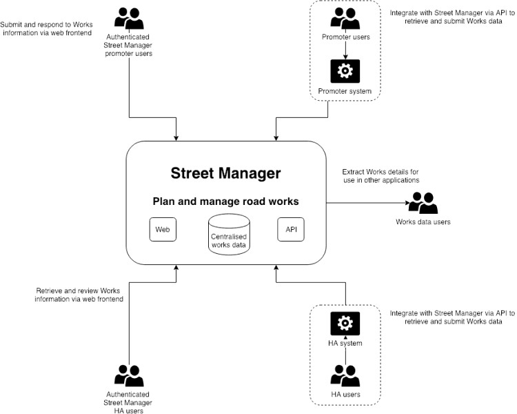

# API specification
{: .govuk-heading-xl}

Version 1.3
{: .govuk-body-l}

## Table of contents
{: .govuk-heading-l #table-of-contents}

<ul class="govuk-list govuk-list--number">
  <li><a class="govuk-link" href="#introduction">Introduction</a></li>
  <li><a class="govuk-link" href="#swagger-documentation">Swagger Documentation</a></li>
  <li><a class="govuk-link" href="#onboarding">Onboarding</a></li>
  <li><a class="govuk-link" href="#environments">Environments</a></li>
  <li><a class="govuk-link" href="#timing">Timing</a></li>
  <li><a class="govuk-link" href="#technical-overview">Technical Overview</a></li>
  <li><a class="govuk-link" href="#versioningandreleasemanagement">Versioning and Release Management</a></li>
  <li><a class="govuk-link" href="#testing">Testing</a></li>
  <li><a class="govuk-link" href="#security">Security</a></li>
  <li><a class="govuk-link" href="#sequencing">Sequencing</a></li>
  <li><a class="govuk-link" href="#resource-guide">Resource Guide</a></li>
  <li><a class="govuk-link" href="#roadmap">Roadmap</a></li>
  <li><a class="govuk-link" href="#versions">Versions</a></li>
</ul>

## Introduction
{: .govuk-heading-l #introduction}

This is the API guidance documentation for Street Manager, intended as a guide for developers integrating their systems to submit and retrieve information about street works. It is intended as a technical guide to be used with the API definition documentation and not a business change guide.
{: .govuk-body}

The Street Manager APIs are RESTful APIs to read/write data to the centralised Street Manager system following [GDS guidelines](https://www.gov.uk/guidance/gds-api-technical-and-data-standards), not a peer to peer solution.
{: .govuk-body}

### References
{: .govuk-heading-m}

For supplemental details, please see the following documents:
{: .govuk-body}

<ol class="govuk-list govuk-list--bullet">
  <li><a href="/street-manager-docs/business-rules/">Business rules</a>, for details on Street Managers business processes and logic</li>
  <li><a href="/street-manager-docs/onboarding/">Onboarding</a>, for details on how to start using Street Manager with-in your organisation</li>
</ol>

## Swagger Documentation
{: .govuk-heading-l #swagger-documentation}

The Swagger JSON files for each API are available below:
{: .govuk-body}

<ol class="govuk-list govuk-list--bullet">
  <li><a href="json/work-swagger.json">Work API</a></li>
  <li><a href="json/reporting-swagger.json">Reporting API</a></li>
  <li><a href="json/lookup-swagger.json">Street lookup API</a></li>
  <li><a href="json/geojson-swagger.json">GeoJSON API</a></li>
  <li><a href="json/party-swagger.json">Party API</a></li>
</ol>

**Please be aware of the following:**
{: .govuk-body}

If you attempt to validate the above swagger files using the online tool <a href="https://editor.swagger.io"> https://editor.swagger.io </a> or `swagger-cli`, you may see schema errors. Please note we are aware of this issue and it will not stop you from being able to generate mock server/clients. We aim to fix this in a future version.
{: .govuk-body}

Swagger UI does not display all description text for enumerations and child elements, instead check each of the swagger.json files above for full description text.
{: .govuk-body}

In the Work API several request definitions contain `internal_user_identifier` and `internal_user_name`. Please see <a class="govuk-link" href="#delegated-users">Works API - Delegated Users section</a> for details.
{: .govuk-body}

## Onboarding
{: .govuk-heading-l #onboarding}

### Access to sandbox environment for API testing
{: .govuk-heading-m}

Contact <a href="mailto:streetmanager@dft.gov.uk">streetmanager@dft.gov.uk</a> for details on how to access to the sandbox environment for API testing.
{: .govuk-body}

### Organisation registration and access to production system
{: .govuk-heading-m}

See the general <a href="/street-manager-docs/onboarding/">Onboarding</a> section of the documentation for more details on how to register your organisation with Street Manager and join the service.
{: .govuk-body}

## Environments
{: .govuk-heading-l #environments}

The Street Manager service provides three separate isolated application service environments.  Each of these environments contains a full stack deployment of Street Manager and are designated for specific purposes, as outlined below.
{: .govuk-body}

### SANDBOX environment
{: .govuk-heading-m}

<ol class="govuk-list govuk-list--bullet">
  <li>SANDBOX environment is primarily intended as an integration testing environment for API integrators and an initial orientation environment for organisations intending to use the Street Manager web frontend.</li>
  <li>Each Private Beta participant organisation will be provided with credentials as part of the initial onboarding process. These credentials will be equally valid for both the Street Manager web frontend service as well as the Street Manager API services.</li>
  <li>Organisations who are not a recognised Street Works Authority (do not have a SWA code, Contractor/Vendors etc.) may test using accounts for associated Street Works Authority organisations.</li>
  <li>Organisations intending to use only the Street Manager web frontend can leverage SANDBOX environment to test end-to-end permit journeys and familiarise their staff with the service.</li>
  <li>API integration developers can leverage the SANDBOX environment to access the latest Swagger documentation for the available API endpoints, as well as test their API clients against the Street Manager API services from their CI integration environment.</li>
  <li>SANDBOX is development-grade, therefore a) is subject to higher-velocity changes and releases; b) is not guaranteed to be highly-available nor highly-performant; c) may be subject to occasional resets of the underlying databases.</li>
  <li><b>Organisations and their users of Street Manager must agree not to submit sensitive nor personally identifiable data into the SANDBOX environment under any circumstances – only use of ‘dummy’ data is permitted.</b></li>
</ol>

### PRE-PRODUCTION environment
{: .govuk-heading-m}

<ol class="govuk-list govuk-list--bullet">
  <li>PRE-PRODUCTION is a stable, fully-scaled production-grade environment.   Primary purpose is to allow both web frontend and API integrators to validate end-to-end service operations and procedures against a stable version of the Street Manager services.</li>
  <li>Participant organisations must engage with the Street Manager project team to request access to this environment; access and credentials will be provided once it is agreed that the organisation has carried out sufficient preparation in SANDBOX and has reached a stage of PRE-PRODUCTION readiness.</li>
  <li>Where necessary, organisations are permitted to dual-key real production street works data within the PRE-PRODUCTION environment.</li>
  <li>PRE-PRODUCTION will also act as a ‘holding area’ to allow organisations to align with their local ecosystem partners prior to entering production-readiness.  That is, a Highway Authority may enter PRE-PRODUCTION a period of time before their local area promoters reach PRE-PRODUCTION readiness (or vice-versa).  The Highway Authority will not be able to enter PRODUCTION readiness until their local area promoter partners join them in PRE-PRODUCTION readiness and collaborate to comprehensively validate the end-to-end service operation procedures.</li>
  <li>Organisations are permitted to leverage PRE-PRODUCTION for additional assurance activities such as focussed end-user testing and non-functional (performance/availability) testing – <b>however, the Street Manager team must be engaged and in agreement around testing scope, volumes and scheduling before any such activities are approved.</b></li>
</ol>

### PRODUCTION environment
{: .govuk-heading-m}

<ol class="govuk-list govuk-list--bullet">
  <li>The PRODUCTION environment is an identical replica of the PRE-PRODUCTION environment.  <b>The environment is for LIVE use and LIVE data only</b> – neither functional nor non-functional testing shall be permitted within the live environment.</li>
  <li>Once an organisation has reached production-readiness – and have aligned with their local area ecosystem partners in that production-readiness – the organisations must engage with the Street Manager team to request access to the PRODUCTION environment.  At this stage the team will work with the organisation and its local area ecosystem partners to facilitate a transition into the PRODUCTION environment.</li>
  <li>In some cases, local area ecosystem alignment may not be possible within reasonable timeframes due to external factors.  In these cases, dual-keying may be necessary between the organisation, their existing EToN system, and the Street Manager Service.</li>
</ol>

## Timing
{: .govuk-heading-l #timing}

All Street Manager environments use standard [NTP Pool](https://www.ntppool.org/en/) servers to synchronise their system clocks, ensuring they keep accurate and consistent time. To learn more about how Street Manager uses time and defines rules like working day, see the [Business rules](/street-manager-docs/business-rules/).
{: .govuk-body}

## Technical Overview
{: .govuk-heading-l #technical-overview}

### Available APIs
{: .govuk-heading-m}

Street Manager exposes a number of APIs to allow external applications
to retrieve and submit data.
{: .govuk-body}

#### Work API
{: .govuk-heading-s}

The street manager work API allows promoters and highway authority
users to carry out a number of key workflows relevant to their
organization and role. We will cover each in detail but at a high level
they are:
{: .govuk-body}

**Promoter workflows**
{: .govuk-body}

<ol class="govuk-list govuk-list--bullet">
  <li>Submit permit application</li>
  <li>Carry out a work</li>
  <li>Create reinstatement</li>
  <li>Action an FPN</li>
  <li>Add comments to a works record</li>
</ol>

**Highway authority workflows**
{: .govuk-body}

<ol class="govuk-list govuk-list--bullet">
  <li>Assess permit application</li>
  <li>Issue an inspection</li>
  <li>Issue an FPN</li>
  <li>Add comments to a works record</li>
</ol>

In order to ensure a user has the appropriate permissions to carry out
the above workflows they must authenticate to the API and acquire a JWT
to be used as part of their request.
{: .govuk-body}

#### Street Lookup API
{: .govuk-heading-s}

The street manager street lookup API allows querying of NSG and ASD data
based on location and USRN. This function is only available as part of
submitting a permit for a work. See the resource guide for details.
{: .govuk-body}

#### GeoJson API
{: .govuk-heading-s}

The street manager GeoJson API exposes works spatial data to
authenticated users for use with mapping queries. See the resource guide for details.
{: .govuk-body}

#### Open data API
{: .govuk-heading-s}

*This API is not yet available.*
{: .govuk-body}

Street Manager will support an API for Open Data users, see the Roadmap section for details.
{: .govuk-body}

#### Reporting API
{: .govuk-heading-s}

The reporting API allows promoters and highway authority users to carry
out a number of data analysis and reporting workflows, allowing them to
retrieve data with configurable filtering, sorting and paging. This is
the backbone of our dashboard and list functionality. This API should be
used as a primary API to retrieve large volumes of data about your
works.
{: .govuk-body}

### Getting data from Street Manager
{: .govuk-heading-m}

External systems integrating with Street Manager need to retrieve data
from the service to give their users the most up-to-date view on what is
going on with their works. Street Manager has a number of ways which you
can extract data from the service.
{: .govuk-body}

**Individual work data**
{: .govuk-body}

The Work API provides endpoints which give the full detail available
for individual Works and Permits. Use these endpoints to retrieve
details such as timings, comments, history and changes.
{: .govuk-body}

**Reporting**
{: .govuk-body}

You can use the Reporting API to extract data from the service both as
JSON and CSV format. These endpoints allow you to extract most Work
information efficiently for your organisation.
{: .govuk-body}

**Continuous** **Polling**
{: .govuk-body}

The reporting API exposes a `/works/updates` endpoint for polling. See the resource guide for full information.
{: .govuk-body}

**Notifications**
{: .govuk-body}

*Note: Notifications are currently in roadmap for **Phase 3**, not in
private beta.*
{: .govuk-body}

Street Manager will offer a Notification service which will send Push
notifications to organisations for updates to their Works to subscribed
systems. Organisations who wish to receive notifications need to expose
an HTTPS endpoint capable of receiving POST requests from the
Notification service containing the update event data as JSON.
{: .govuk-body}

Notifications cannot offer guaranteed delivery (network issues, service
downtime etc.) so to reconcile for missed Notifications you can use the
Polling API endpoint to validate you have received notifications for all
updated works.
{: .govuk-body}

**Contractors**
{: .govuk-body}

Contractors can use the Reporting API to extract data from the service both as
JSON and CSV format. These endpoints allow you to extract most Work
information efficiently for the organisation you are working on behalf of. swa_code parameters are available on the endpoints which can be used by contractors to provide the swa code of the promoter they are working on behalf of.
{: .govuk-body}

## Versioning and Release Management
{: .govuk-heading-l #versioningandreleasemanagement}

During Private Beta and beyond, the Street Manager services will remain under continual active development.  Therefore, a process must be established which allows low-friction development to continue at pace, whilst providing the option for web frontend users and API integrators to focus on a higher-stability version of the services.
{: .govuk-body}

This section aims to describe the approach taken by the Street Manager team in order to meet both of those requirements.  The approach is based upon existing GDS [best practices](https://gdstechnology.blog.gov.uk/2016/07/26/considering-our-approach-to-api-iteration/) and will undergo continual refinement over time, based on feedback from the consumers of the service environments as well as observations by the Street Manager project team.
{: .govuk-body}

### API Versioning Approach
{: .govuk-heading-m}

The Street Manager API services will be versioned via the URL path, for example <code>api.sandbox.domain.com/v1/works/.../</code> versus <code>api.sandbox.domain.com/v2/works/.../</code>.  Initially, the Private Beta will focus on the <code>v1</code> major version of the codebase, with new major versions being introduced at a later date.
{: .govuk-body}

### Release Management
{: .govuk-heading-m}

As described in the section above, initially only <code>v1</code> of the Street Manager API services will be available within the environments.  Minor version updates will be released into <code>v1</code> every two weeks - these updates may include existing feature enhancements, entirely new feature additions, as well as issue hotfixes.  Although regular releases will continue throughout Private Beta, the Street Manager development team will strive to avoid breaking changes at all times.
{: .govuk-body}

It should however be noted that during Private Beta development, there remains the potential that breaking changes may occasionally be required in order to release corrective hotfixes deemed to be service critical.  In such situations, the project team will notify potentially affected participant organistations in advance of the release and provide support with a view to minimising disruption.
{: .govuk-body}

The following are examples of what we consider to be breaking and non-breaking changes.
{: .govuk-body}

#### What is a breaking change
{: .govuk-heading-s}

<ol class="govuk-list govuk-list--bullet">
<li>Adding new mandatory field to existing endpoint request object</li>
<li>Removing/renaming enum value for field in existing endpoint request object</li>
<li>Removing/renaming existing field in endpoint response object</li>
<li>Adding new required endpoint to use an existing flow (e.g. submitting a permit)</li>
</ol>

#### What is a non-breaking change
{: .govuk-heading-s}

<ol class="govuk-list govuk-list--bullet">
<li>Adding a new optional field to existing endpoint request object</li>
<li>Adding new enum values for field in existing endpoint request object</li>
<li>Adding new data to response objects (accepting risk that this breaks some formal contract JSON deserialisers)</li>
<li>Adding a new endpoint to support new functionality or an enhancement to existing functionality</li>
</ol>

When the first participant organisations are approaching Production readiness, <code>v1</code> will be 'locked down' to ensure only non-breaking hotfixes and additive enhancements are permitted into the codebase.  At this point in time, a <code>v2</code> version will be published alongside <code>v1</code> in the SANDBOX and PRE-PRODUCTION environments alongside updated Swagger JSON definitions - this is aimed at parties interested in tracking Street Manager development more closely. Similiar to <code>v1</code>, updates will be released into <code>v2</code> every two weeks, and whilst the Street Manager development team will strive to avoid them, the occasional breaking change may be required in order to release critical fixes.
{: .govuk-body}

## Testing
{: .govuk-heading-l #testing}

#### Environments and usage
{: .govuk-heading-s}

See the <a href="#environments">Environments</a> section for details on which environment to use for different types of testing. If you require non-functional performance or security testing please contact Street Manager support to agree scope, volumes and scheduling beforehand, as this may have an impact on other users and each environment has specific rate limiting and protective controls which may invalidate your tests.
{: .govuk-body}

#### Reporting issues
{: .govuk-heading-s}

In order to correct issues and bugs found in Street Manager we require specific information so we can trace and attempt to reproduce errors.
{: .govuk-body}

Details will be provided to you at onboarding regarding how to report issues, the format and information required.
{: .govuk-body}

#### Generating test client and server stubs
{: .govuk-heading-s}

It is possible to generate test clients and servers using the available API documentation (Swagger JSON) which can be retrieved directly from the exposed APIs in Sandbox environments. This allows isolated testing of your integration without dependency on test environments and can speed up development.
{: .govuk-body}

[Swagger-codegen](https://swagger.io/tools/swagger-codegen/) supports generating client and server stubs for a variety of languages, see here for details. Below is an example of generating Java client and server stubs using the [Swagger-codegen](https://swagger.io/tools/swagger-codegen/) utility.
{: .govuk-body}

**Requires**
{: .govuk-body}

<ol class="govuk-list govuk-list--bullet">
  <li>Java (tested with openjdk version "11.0.1" 2018-10-16)</li>
  <li>Maven for build</li>
  <li>Swagger Codegen</li>
</ol>

#### Client
{: .govuk-heading-s}

Generated with command:
{: .govuk-body}

<code>swagger-codegen generate -i swagger.json -l java -o ./streetmanager-apiclient-java</code>

The generated code for the template had a number of errors which required manual corrections.
{: .govuk-body}

Corrections:
{: .govuk-body}

<ol class="govuk-list govuk-list--bullet">
  <li>pom.xml - updated <java.version>1.7</java.version> to <java.version>1.8</java.version> to support annotations</li>
  <li>pom.xml - added dependency javax.annotation to replace deprecated class</li>
  <li>Find/Replace body@ApiParam to body,@ApiParam due to template error on generated clients</li>
  <li>Find/Replace new BigDecimal() to new BigDecimal(0)due to template error on generated tests</li>
</ol>

To build:
{: .govuk-body}

<code>mvn package</code>

#### Server
{: .govuk-heading-s}

Generated with command:
{: .govuk-body}

<code>swagger-codegen generate -i swagger.json -l spring -o ./streetmanager-apistub-java-spring<code>

The generated code for the template had a number of errors which required manual corrections.
{: .govuk-body}

Corrections:
{: .govuk-body}

<ol class="govuk-list govuk-list--bullet">
  <li>pom.xml - updated <java.version>1.7</java.version> to <java.version>1.8</java.version> to support annotations</li>
  <li>pom.xml - added dependencies for javax.xml.bind to replace deprecated class</li>
  <li>Find/Replace body\@ApiParam to body,\@ApiParam due to template error on generated controllers</li>
  <li>Find/Replace new BigDecimal() to new BigDecimal(0)due to template error on generated tests To run:</li>
</ol>

<code>
mvn package
java -jar target/swagger-spring-1.0.0.jar --server.port=8080
</code>

## Security
{: .govuk-heading-l #security}

### HTTPS
{: .govuk-heading-m}

All Street Manager web and API interfaces are secured using Transport Layer Security (TLS) v1.2
certificates issued by [Let's Encrypt](https://letsencrypt.org/), currently signed by the 'DST Root CA X3' IdenTrust cross-signed intermediate certificate as listed in the [Chain of Trust](https://letsencrypt.org/certificates/) document.
{: .govuk-body}

### Authentication and Authorisation
{: .govuk-heading-m}

All resource endpoints in the API, with the exception of authentication and
status, require a [JWT](#jwt) to be passed in the \'token\' header of the
request. The [JWT](#jwt) contains information about the user and allows them to
access routes, services, and resources that are permitted with that token.
Without it the request will be met with a 401 error response.
{: .govuk-body}

A 'systemToken' API key is also available on the Party API, this token is for internal use only and is not required for any exposed endpoint.
{: .govuk-body}

### User accounts and permissions
{: .govuk-heading-m}

External systems integrating with Street Manager should use specific
credentials setup for API users. This is to allow Street Manager to
differentiate between Web UI user accounts and API users. User accounts
are assigned specific roles, such as *planner* and *admin*.
{: .govuk-body}

Each user can perform read operations to every resource, however write
operations are restricted based on a user's role and the organisation they are
associated with.
{: .govuk-body}

**Note:** *Currently systems who need to act as users associated with
multiple organisations, i.e. submitting permits for multiple utility
companies, **need to use separate user accounts for each organisation**.*
{: .govuk-body}

The table below shows the current permissions per endpoint.
{: .govuk-body}

#### Work API
{: .govuk-heading-s}

<table class="govuk-table">
  <caption class="govuk-table__caption">Authorisation per endpoint for Work API</caption>
  <thead class="govuk-table__head">
    <tr class="govuk-table__row">
      <th class="govuk-table__header">Endpoint</th>
      <th class="govuk-table__header">Roles</th>
      <th class="govuk-table__header">Organisation Member*</th>
    </tr>
  </thead>
  <tbody class="govuk-table__body">
    <tr class="govuk-table__row">
      <td class="govuk-table__cell"><code>GET /*</code></td>
      <td class="govuk-table__cell">Planner, Contractor &amp; HAOfficer</td>
      <td class="govuk-table__cell">Not Required</td>
    </tr>
    <tr class="govuk-table__row">
      <td class="govuk-table__cell"><code>POST /authenticate</code></td>
      <td class="govuk-table__cell">None</td>
      <td class="govuk-table__cell">Not Required</td>
    </tr>
    <tr class="govuk-table__row">
      <td class="govuk-table__cell"><code>POST /files</code></td>
      <td class="govuk-table__cell">Planner, Contractor &amp; HAOfficer</td>
      <td class="govuk-table__cell">Required</td>
    </tr>
    <tr class="govuk-table__row">
      <td class="govuk-table__cell"><code>DELETE /files/{id}</code></td>
      <td class="govuk-table__cell">Planner, Contractor &amp; HAOfficer</td>
      <td class="govuk-table__cell">Required</td>
    </tr>
    <tr class="govuk-table__row">
      <td class="govuk-table__cell"><code>POST /works</code></td>
      <td class="govuk-table__cell">Planner &amp; Contractor</td>
      <td class="govuk-table__cell">Required</td>
    </tr>
    <tr class="govuk-table__row">
      <td class="govuk-table__cell"><code>PUT /works/*</code></td>
      <td class="govuk-table__cell">Planner &amp; Contractor</td>
      <td class="govuk-table__cell">Required</td>
    </tr>
    <tr class="govuk-table__row">
      <td class="govuk-table__cell"><code>POST /works/{referenceNumber}/comments</code></td>
      <td class="govuk-table__cell">Planner, Contractor &amp; HAOfficer</td>
      <td class="govuk-table__cell">Required</td>
    </tr>
    <tr class="govuk-table__row">
      <td class="govuk-table__cell"><code>POST /works/{referenceNumber}/fixed-penalty-notices</code></td>
      <td class="govuk-table__cell">HAOfficer</td>
      <td class="govuk-table__cell">Required</td>
    </tr>
    <tr class="govuk-table__row">
      <td class="govuk-table__cell"><code>PUT /works/{referenceNumber}/fixed-penalty-notices/{fpnReferenceNumber}/status</code></td>
      <td class="govuk-table__cell">Planner, Contractor &amp; HAOfficer</td>
      <td class="govuk-table__cell">Required</td>
    </tr>
    <tr class="govuk-table__row">
      <td class="govuk-table__cell"><code>POST /works/{referenceNumber}/inspections</code></td>
      <td class="govuk-table__cell">HAOfficer</td>
      <td class="govuk-table__cell">Required</td>
    </tr>
    <tr class="govuk-table__row">
      <td class="govuk-table__cell"><code>POST /works/{referenceNumber}/permits/{permitReferenceNumber}/alterations</code></td>
      <td class="govuk-table__cell">Planner, Contractor &amp; HAOfficer</td>
      <td class="govuk-table__cell">Required</td>
    </tr>
    <tr class="govuk-table__row">
      <td class="govuk-table__cell"><code>PUT /works/{referenceNumber}/permits/{permitReferenceNumber}/alterations</code></td>
      <td class="govuk-table__cell">HAOfficer</td>
      <td class="govuk-table__cell">Required</td>
    </tr>
    <tr class="govuk-table__row">
      <td class="govuk-table__cell"><code>POST /works/{referenceNumber}/permits/{permitReferenceNumber}/status</code></td>
      <td class="govuk-table__cell">Planner, Contractor &amp; HAOfficer</td>
      <td class="govuk-table__cell">Required</td>
    </tr>
    <tr class="govuk-table__row">
      <td class="govuk-table__cell"><code>POST /works/{referenceNumber}/sites/{siteId}/reinstatements</code></td>
      <td class="govuk-table__cell">Planner &amp; Contractor</td>
      <td class="govuk-table__cell">Required</td>
    </tr>
    <tr class="govuk-table__row">
      <td class="govuk-table__cell"><code>POST /activity</code></td>
      <td class="govuk-table__cell">HAOfficer</td>
      <td class="govuk-table__cell">Required</td>
    </tr>
    <tr class="govuk-table__row">
      <td class="govuk-table__cell"><code>GET /activity/{activityReferenceNumber}</code></td>
      <td class="govuk-table__cell">Planner, Contractor &amp; HAOfficer</td>
      <td class="govuk-table__cell">Not Required</td>
    </tr>
    <tr class="govuk-table__row">
      <td class="govuk-table__cell"><code>PUT /activity/{activityReferenceNumber}/cancel</code></td>
      <td class="govuk-table__cell">HAOfficer</td>
      <td class="govuk-table__cell">Required</td>
    </tr>
  </tbody>
</table>

#### Reporting API
{: .govuk-heading-s}

<table class="govuk-table">
  <caption class="govuk-table__caption">Authorisation per endpoint for Reporting API</caption>
  <thead class="govuk-table__head">
    <tr class="govuk-table__row">
      <th class="govuk-table__header">Endpoint</th>
      <th class="govuk-table__header">Roles</th>
      <th class="govuk-table__header">Organisation Member*</th>
    </tr>
  </thead>
  <tbody class="govuk-table__body">
    <tr class="govuk-table__row">
      <td class="govuk-table__cell"><code>GET /*</code></td>
      <td class="govuk-table__cell">Planner, Contractor &amp; HAOfficer</td>
      <td class="govuk-table__cell">Not Required</td>
    </tr>
  </tbody>
</table>

#### Street Lookup API
{: .govuk-heading-s}

<table class="govuk-table">
  <caption class="govuk-table__caption">Authorisation per endpoint for Street Lookup API</caption>
  <thead class="govuk-table__head">
    <tr class="govuk-table__row">
      <th class="govuk-table__header">Endpoint</th>
      <th class="govuk-table__header">Roles</th>
      <th class="govuk-table__header">Organisation Member*</th>
    </tr>
  </thead>
  <tbody class="govuk-table__body">
    <tr class="govuk-table__row">
      <td class="govuk-table__cell"><code>GET /*</code></td>
      <td class="govuk-table__cell">Planner, Contractor &amp; HAOfficer</td>
      <td class="govuk-table__cell">Not Required</td>
    </tr>
  </tbody>
</table>

#### Geojson API
{: .govuk-heading-s}

<table class="govuk-table">
  <caption class="govuk-table__caption">Authorisation per endpoint for Geojson API</caption>
  <thead class="govuk-table__head">
    <tr class="govuk-table__row">
      <th class="govuk-table__header">Endpoint</th>
      <th class="govuk-table__header">Roles</th>
      <th class="govuk-table__header">Organisation Member*</th>
    </tr>
  </thead>
  <tbody class="govuk-table__body">
    <tr class="govuk-table__row">
      <td class="govuk-table__cell"><code>GET /*</code></td>
      <td class="govuk-table__cell">Planner, Contractor &amp; HAOfficer</td>
      <td class="govuk-table__cell">Not Required</td>
    </tr>
  </tbody>
</table>

\* An Organisation Member is a user with a SWA code matching the permit's
<code>highway_authority_swa_code</code> or <code>promoter_swa_code</code>. This
is enforced in addition to the user's role.
{: .govuk-body}

### JWT
{: .govuk-heading-m}

Json Web Token (JWT) is an open standard for exchanging information
securely. The entities of Street Manager exchange information using JWTs
and resources of the Street Manager API require that a JWT ID token be provided
as part of the request.
{: .govuk-body}

The JWT is validated per service per request. Every service exposed by street
manager will attempt to validate the JWT as part of its authentication and
authorisation function.
{: .govuk-body}

The ID token expires 1 hour after it was generated, if an expired JWT is used in a
request, an error with the HTTP status `401` will be returned.  In this scenario
a new token will need to be generated using the <code>/party/refresh</code>
endpoint by supplying a Refresh token.

To invalidate all JWT tokens associated with a user, the Access token should be provided
to the <code>/party/logout</code> endpoint.
{: .govuk-body}

### Resource
{: .govuk-heading-m}

<code>POST /authenticate</code>

The authenticate endpoint takes a case sensitive username (email
address) and password, returning JWT ID, Access and Referesh tokens if successful.
**The JWT ID and Access tokens are valid for one hour, meanwhile the Refresh token
is valid for 1 day.** Once the ID token has been acquired it canbe added to all
protected resource requests made via swagger using the Authorize button.
{: .govuk-body}

When clicked this will present an input to enter the token. Once
authorized then all protected resource requests made via swagger will
have the token header set.
{: .govuk-body}

### Error responses
{: .govuk-heading-m}

It's important to distinguish between authentication and authorization
error responses as it will help narrow down where an issue is occurring.
{: .govuk-body}

### Authentication Failed
{: .govuk-heading-m}

<code>{ "message": "Authentication failed", "error": { "status": 401 } }</code>

Authentication fails when the token provided in the request is invalid.
The ID token may have expired or the value set as the token was incorrect.
You may also see this error when calling the POST /authenticate endpoint
with invalid credentials i.e. wrong username or password.
{: .govuk-body}

### Access Restricted
{: .govuk-heading-m}

<code>{ "message": "Access restricted", "error": { "status": 401 } }</code>

The access restricted error indicates that although the token was valid,
the user does not have permissions to perform the desired action. This
error could arise for several reasons which will be listed in detail as
part of the resource section, but common triggers would be attempting to
manipulate entities (permit, reinstatement, inspection etc.) not related
to your organization.
{: .govuk-body}

### Rate limiting
{: .govuk-heading-m}

To protect the system from denial of service attacks, repeated calls
made in a short period of time from a single IP source will receive 405
status responses. If you are receiving 405 responses ensure you are not
sending an excessive number of calls.
{: .govuk-body}

Note that rate limiting thresholds will be under regular review and
refinement during the Private Beta phase. The final Production values
will be confirmed prior to entering Public Beta.
{: .govuk-body}

## Sequencing
{: .govuk-heading-l #sequencing}

As detailed in the Technical Overview section, the reporting API drives
a large amount of data retrieval functionality whilst the Street Manager
API drives a lot of key user workflows e.g. submit permit, assess
permit, etc. These two APIs together form much of the common sequences a
user is likely to perform.
{: .govuk-body}

Below is an example of sequence calls used to submit and respond to a
permit application as well as how various actions affect the works
lifecycle. These endpoints are all available as part of the street
manager API and are discussed in more detail within the resource guide.
{: .govuk-body}

The following actions can be performed at any subsequent stage in the
sequence from the stage they are available:
{: .govuk-body}

<ol class="govuk-list govuk-list--bullet">
  <li>File upload</li>
  <li>Add a comment</li>
  <li>Add reinstatement</li>
  <li>Add inspections</li>
  <li>Make alteration</li>
</ol>

Whilst the above focuses much on data manipulation via the Work API, here is an example of some data retrieval calls that may be performed alongside these actions via the reporting API.
{: .govuk-body}

<ol class="govuk-list govuk-list--bullet">
  <li><strong>Permits awaiting assessment</strong>: <code>GET /permits?status=submitted</code></li>
  <li><strong>Expiring interim reinstatements</strong>: <code>GET /sites?status=interim</code></li>
  <li><strong>Disputed FPNs</strong>: <code>GET /fixed-penalty-notices?status=disputed</code></li>
</ol>

### Understanding the status of a work
{: .govuk-heading-m}

As a permit progresses through the sequence above the permit status
changes. Knowing the various statuses of a permit allows you to filter
lists of permits related to your organization through the reporting API.
The statuses of a permit are:
{: .govuk-body}

<ol class="govuk-list govuk-list--bullet">
  <li><strong>submitted</strong>: The permit is awaiting assessment</li>
  <li><strong>granted_proposed</strong>: The permit has been assessed as granted by an HA</li>
  <li><strong>granted_with_changes</strong>: The permit has been assessed as granted with changes by an HA</li>
  <li><strong>refused</strong>: The permit has been assessed as refused by an HA</li>
  <li><strong>granted_in_progress</strong>: The permit has been started by the promoter after being granted</li>
  <li><strong>closed</strong>: The permit has been stopped by the promoter</li>
  <li><strong>cancelled</strong>: The permit has been cancelled by the promoter</li>
  <li><strong>deemed_proposed</strong>: The permit has been automatically deemed as it was not assessed before the deadline date</li>
  <li><strong>deemed_in_progress</strong>: The permit has been started by the promoter after being deemed</li>
    <li><strong>revoked_proposed</strong>: The permit has been revoked when it was granted</li>
  <li><strong>revoked_in_progress</strong>: The permit has been revoked when it was in progress</li>
  <li><strong>revoked_closed</strong>: The permit has been revoked when it was in progress and the promoter has logged their actual stop date</li>
  <li><strong>awaiting_assessment_in_progress</strong>: The permit has been created and placed straight to in progress awaiting assessment by an HA</li>
  <li><strong>granted_auto</strong>: The PAA has been proceeded to a permit before it was assessed. The permit has been granted</li>
  <li><strong>refused_auto</strong>: The PAA has been proceeded to a permit before it was assessed. The permit has been refused</li>
  <li><strong>cancelled_auto</strong>: The PAA has been proceeded to a permit before it was assessed. The permit has been cancelled</li>
</ol>

Note: PAA/Major submission will be included as part of this sequence.
{: .govuk-body}

### Viewing works and permits
{: .govuk-heading-m}

#### Work API
{: .govuk-heading-s}

When a permit has been submitted and a works record exists both
promoters and HAs can view the works record via the GET work endpoint on
the work API. This endpoint requires you to provide the **work
reference number** which was supplied during the submission of the
permit application.
{: .govuk-body}

<code>GET /works/{work reference number}</code>

This contains information about all of the entities associated with the
work record, the properties of this response are:
{: .govuk-body}

<ol class="govuk-list govuk-list--bullet">
  <li><strong>Active permit</strong>: The currently active permit associated with the works. In the sequence above this would contain the permit awaiting assessment</li>
  <li><strong>Sites</strong>: Any reinstatement sites that have been added to the works (none initially)</li>
  <li><strong>Inspections</strong>: Any inspections that have been issued on the works (none initially)</li>
  <li><strong>FPNs</strong>: Any fixed penalty notices that have been issued on the works (none initially)</li>
  <li><strong>Permits</strong>: Summary of all permits that have been associated with that works (i.e. multiple permits)</li>
  <li><strong>Reinstatements</strong>: Summary of all reinstatements that have been associated with that works (none initially)</li>
  <li><strong>History</strong>: Summary of all history associated with that works</li>
  <li><strong>Files</strong>: Any files that have been uploaded on the works (none initially)</li>
</ol>

It's also possible to retrieve only information about the permit itself
using the GET permit endpoint. This endpoint requires you to provide the
**permit reference number** which is returned in the response of the
permit application submission. As detailed in the submit permit
application section of the resource guide, the permit reference number
is simply the works reference number suffixed by an incrementing number
e.g. {WRN}-01 for the first permit added to that work.
{: .govuk-body}

<code>GET /works/{work reference number}/permits/{permit reference number}</code>

#### Reporting API
{: .govuk-heading-s}

The reporting API permits endpoint will be the most useful way to see
all permits that are relevant to your organisation.
{: .govuk-body}

*Note: Reporting API data can be retrieved as CSV data to allow
exporting data to tools such as Excel for more complex reporting needs,
such as all permit details needed for Fee Reporting.*
{: .govuk-body}

For example, as an HA you can use the **status** property of a permit
indicates the current state it is in, for submitted permits that are
awaiting assessment the permit status will be "submitted".
{: .govuk-body}

<code>GET /permits?status=submitted</code>

The **status** query param can be changed to any of the values discussed
above to retrieve permits in any stage of the sequence. This is
discussed in more detail in the reporting API resource guide.
{: .govuk-body}

Promoters can use **status** values to find permits which the HA has
responded to, see the Street Manager API resource guide for more details
on Permit status values.
{: .govuk-body}

### Permits
{: .govuk-heading-m}

In order to carry out much of the actions against a work record the associated permit must be submitted and granted:
{: .govuk-body}

<ol class="govuk-list govuk-list--bullet">
  <li>
    <strong>Create a work record (Planner)</strong>: <code>POST /works</code>
    

      Initially a promoter will create a work, which will, in turn, create a
      permit application.
    

  </li>
  <li>
    <strong>Approve the permit (Highway Authority)</strong>: <code>PUT /works/{work reference number}/permits/{permit reference number}/status</code>
    

      As per the usual permit flow, if the work isn't an immediate, the Highway
      Authority will need to grant the application before work can begin.
    

  </li>
</ol>

### Inspections
{: .govuk-heading-m}

In order to create an inspection the following steps should be followed:
{: .govuk-body}

<ol class="govuk-list govuk-list--bullet">
  <li>
    <strong>Create a work record (Planner)</strong>: <code>POST /works</code>
    

      Initially a promoter will create a work, which will, in turn, create a
      permit application.
    

  </li>
  <li>
    <strong>Approve the permit (Highway Authority)</strong>: <code>PUT /works/{work reference number}/permits/{permit reference number}/status</code>
    

      As per the usual permit flow, if the work isn't an immediate, the Highway
      Authority will need to grant the application before work can begin.
    

  </li>
  <li>
    <strong>Start the work (Planner)</strong>: <code>PUT /works/{work reference number}/start</code>
    

      As per the usual permit flow, if the work isn't an immediate, the Highway
      Authority will need to grant the application before work can begin.
    

  </li>
  <li>
    <strong>Upload supporting evidence (Highway Authority)</strong>: <code>POST /files</code>
    

      If supporting evidence is required for an inspection (for example, a
      photograph of a defect) one or more files can be associated with the
      inspection as part of the POST request. The file(s) must be uploaded
      first, the returned <code>file_id</code> submitted in the
      <code>file_ids</code> array in the inspecion request and the
      <code>inspection_evidence</code> boolean set to <code>true</code>.
    

  </li>
  <li>
    <strong>Create an inspection (Highway Authority)</strong>: <code>POST /works/{work reference number}/inspections</code>
    

      Once a permit is in the "In Progress" or "Closed" state an inspection can
      be recorded against it. When recording a Failed inspection it is possible
      to create a reinspection which will act as a placeholder for a follow up
      inspection.
    

    

      Once an inspection is recorded against a work any previously scheduled
      reinspections, for that work, will be removed.
    

    

      Once an inspection is recorded against a work it cannot be updated.
    

  </li>
</ol>

### Fixed Penalty Notices
{: .govuk-heading-m}

In order to create a fixed penalty notice the following steps should be
followed:
{: .govuk-body}

<ol class="govuk-list govuk-list--bullet">
  <li>
    <strong>Create a work record (Planner)</strong>: <code>POST /works</code>
    

      Initially a promoter will create a work, which will, in turn, create a
      permit application.
    

  </li>
  <li>
    <strong>Upload supporting evidence (Highway Authority)</strong>: <code>POST /files</code>
    

      If supporting evidence is required for a fixed penalty notice (for
      example, a photograph of a breach of conditions) one or more files can be
      associated with the inspection as part of the POST request. The file(s)
      must be uploaded first, the returned <code>file_id</code> submitted in the
      <code>file_ids</code> array in the inspecion request and the
      <code>fpn_evidence</code> boolean set to <code>true</code>.
    

  </li>
  <li>
    <strong>Create a fixed penalty notice (Highway Authority)</strong>: <code>POST /works/{work reference number}/fixed-penalty-notices</code>
    

      A fixed penalty notice can be created against a work as soon as it has
      been created.
    

  </li>
  <li>
    <strong>Accept a fixed penalty notice (Planner)</strong>: <code>PUT /works/{work reference number}/fixed-penalty-notices/{fpn reference number}/status</code>
    

      Optional Step: A promoter can mark the fixed penalty notice as accepted
      or, alternatively, they can pay it offline.
    

  </li>
  <li>
    <strong>Dispute a fixed penalty notice (Planner)</strong>: <code>PUT /works/{work reference number}/fixed-penalty-notices/{fpn reference number}/status</code>
    

      Optional Step: A promoter can dispute a fixed penalty notice. Once a
      promoter disputes a fixed penality notice, they are able to retroactively
      mark it as accepted, if required.
    

  </li>
  <li>
    <strong>Set fixed penalty notice outcome (Highway Authority)</strong>: <code>PUT /works/{work reference number}/fixed-penalty-notices/{fpn reference number}/status</code>
    

      The Highway Authority issuing the fixed penalty notice is able to
      record the resolution of the fixed penality notice. Possible resolution
      states are: Paid, Paid with Discount or Withdrawn.
    

  </li>
</ol>

### Sites and reinstatements
{: .govuk-heading-m}

In order to create a reinstatement the following steps should be followed:
{: .govuk-body}

<ol class="govuk-list govuk-list--bullet">
  <li>
    <strong>Create a work record (Planner)</strong>: <code>POST /works</code>
    

      Initially a promoter will create a work, which will, in turn, create a
      permit application.
    

  </li>
  <li>
    <strong>Approve the permit (Highway Authority)</strong>: <code>PUT /works/{work reference number}/permits/{permit reference number}/status</code>
    

      As per the usual permit flow, if the work isn't an immediate, the Highway
      Authority will need to grant the application before work can begin.
    

  </li>
  <li>
    <strong>Start the work (Planner)</strong>: <code>PUT /works/{work reference number}/start</code>
    

      As per the usual permit flow, if the work isn't an immediate, the Highway
      Authority will need to grant the application before work can begin.
    

  </li>
  <li>
    <strong>Set excavation carried out (Planner)</strong>: <code>PUT /works/{work reference number}/excavation</code>
    

      This can be skipped if you set excavation_required to true during the creation of the permit
    

  </li>
  <li>
    <strong>Create a site (Planner)</strong>: <code>POST /works/{workReferenceNumber}/sites</code>
    

      Once a permit is in the "In Progress" or "Closed" state a site can
      be created.
    

    

      Once a site is recorded against a work a reinstatement can be optionally added to the site using <code>POST /works/{workReferenceNumber}/sites/{siteId}/reinstatements</code>
    

    

      Once a site/reinstatement is recorded against a work it cannot be updated.
    

  </li>
</ol>

### Permit alterations
{: .govuk-heading-m}

#### Promoter change request
{: .govuk-heading-s}

In order to create a promoter change request the following steps should be followed:
{: .govuk-body}

<ol class="govuk-list govuk-list--bullet">
  <li>
    <strong>Create a work record (Planner)</strong>: <code>POST /works</code>
    

      Initially a promoter will create a work, which will, in turn, create a
      permit application.
    

  </li>
  <li>
    <strong>Approve the permit (Highway Authority)</strong>: <code>PUT /works/{work reference number}/permits/{permit reference number}/status</code>
    

      As per the usual permit flow, if the work isn't an immediate, the Highway
      Authority will need to grant the application before work can begin.
    

  </li>
  <li>
    <strong>Request a change (Planner)</strong>: <code>POST /works/{workReferenceNumber}/permits/{permitReferenceNumber}/alterations</code>
    

      Promoter should submit all fields in the original permit with the changes they require included.
    

  </li>
  <li>
    <strong>Assess the alteration (Highway Authority)</strong>: <code>PUT
/works/{workReferenceNumber}/permits/{permitReferenceNumber}/alterations/{permitAlterationReferenceNumber}/status</code>
    

      Once a permit alteration is submitted the Highway Authority can either grant or refuse it.
    

    

      Once a permit alteration is granted by a Highway Authority the permit is updated with the altered values.
    

  </li>
</ol>

#### Promoter work extension
{: .govuk-heading-s}

In order to create a work extension the following steps should be followed:
{: .govuk-body}

<ol class="govuk-list govuk-list--bullet">
  <li>
    <strong>Create a work record (Planner)</strong>: <code>POST /works</code>
    

      Initially a promoter will create a work, which will, in turn, create a
      permit application.
    

  </li>
  <li>
    <strong>Approve the permit (Highway Authority)</strong>: <code>PUT /works/{work reference number}/permits/{permit reference number}/status</code>
    

      As per the usual permit flow, if the work isn't an immediate, the Highway
      Authority will need to grant the application before work can begin.
    

  </li>
  <li>
    <strong>Start the work (Planner)</strong>: <code>PUT /works/{work reference number}/start</code>
  </li>
  <li>
    <strong>Request a change (Planner)</strong>: <code>POST /works/{workReferenceNumber}/permits/{permitReferenceNumber}/alterations</code>
    

      Promoter should submit all fields in the original permit containing a change to the proposed_stop_date.
    

  </li>
  <li>
    <strong>Assess the alteration (Highway Authority)</strong>: <code>PUT
/works/{workReferenceNumber}/permits/{permitReferenceNumber}/alterations/{permitAlterationReferenceNumber}/status</code>
    

      Once a permit alteration is submitted the Highway Authority can either grant, grant with duration challenge or refuse it. If the Highway Authority grants with duration challenge they also provide an alternative end_date for the work to be complete.
    

    

      Once a permit alteration is granted by a Highway Authority the permit is updated with the altered values.
    

  </li>
</ol>

#### Highway Authority imposed changed
{: .govuk-heading-s}

In order to create a work extension the following steps should be followed:
{: .govuk-body}

<ol class="govuk-list govuk-list--bullet">
  <li>
    <strong>Create a work record (Planner)</strong>: <code>POST /works</code>
    

      Initially a promoter will create a work, which will, in turn, create a
      permit application.
    

  </li>
  <li>
    <strong>Approve the permit (Highway Authority)</strong>: <code>PUT /works/{work reference number}/permits/{permit reference number}/status</code>
    

      As per the usual permit flow, if the work isn't an immediate, the Highway
      Authority will need to grant the application before work can begin.
    

  </li>
  <li>
    <strong>Impose a change (Highway Authority)</strong>: <code>POST /works/{workReferenceNumber}/permits/{permitReferenceNumber}/alterations</code>
    

      Highway Authority can impose changes to the conditions only. Highway Authority should submit all fields in the original permit containing a change to the conditions.
    

    

      Once a imposed change is submitted by a Highway Authority the permit is updated with the altered values. No assessment is required.
    

  </li>
</ol>

## Resource Guide
{: .govuk-heading-l #resource-guide}

### Reporting API
{: .govuk-heading-m}

As discussed in the sequencing section, the reporting API allows
promoters and HAs to query resource lists for their organization,
filtering them by various properties. The reporting API currently allows
users to retrieve the following:
{: .govuk-body}

<ol class="govuk-list govuk-list--bullet">
  <li><a class="govuk-link" href="#get-permits">Permits</a></li>
  <li><a class="govuk-link" href="#get-inspections">Inspections</a></li>
  <li>Comments</li>
  <li><a class="govuk-link" href="#get-fpns">Fixed penalty notices</a></li>
  <li><a class="govuk-link" href="#get-site-endpoint">Sites</a></li>
  <li>Workstreams</li>
  <li><a class="govuk-link" href="#polling">Work updates (polling endpoint)</a></li>
  <li><a class="govuk-link" href="#get-inspections">Inspections</a></li>
</ol>

#### Pagination
{: .govuk-heading-s}

Most endpoints on the reporting API are driven with pagination. This
means the following common query params are available for most
endpoints:
{: .govuk-body}

<ol class="govuk-list govuk-list--bullet">
  <li><strong>Before</strong>: cursor to filter pagination results backwards (i.e. retrieve everything before this item)</li>
  <li><strong>After</strong>: cursor to filter pagination results forwards (i.e. retrieve everything after this item) Each paginated response in the reporting API contains the following meta-data:</li>
</ol>

<code>{ "pagination": { "page_start": 1, "total_rows": "50" }, "rows": [...] }</code>

The page_start and total_rows properties indicate the current page of
results returned in the response, in the context of the total number of
available rows (records). The rows property contains the records for the
current page.
{: .govuk-body}

By default there are a maximum 25 rows returned per page and each record
in the rows array has a cursor property, which is that record's
placement in the context of the total result set. Therefore in the
example above, if you have 50 items total, with 25 items per page, to
get the next page of results would simply involve taking the last item
in the rows array, and using it's cursor value as the \'after\' query
param value. This would result in the next metadata response
containing rows 26-50. The reason we use cursor based paging is to
handle real time data. That is to say, the same items will not show up
on different pages even as items are inserted/removed from the database
in-between queries.
{: .govuk-body}

#### Organisation specific data
{: .govuk-heading-s}

The various resources queryable through the reporting API are only for the currently authenticated user's organisation.
It is currently not possible to access other organisation's reporting data however the ability to provide an organisation SWA code as part of these requests is in the roadmap for Phase 2.
{: .govuk-body}

#### CSV
{: .govuk-heading-s}

Some of the resource endpoints on reporting API also include `/csv`. This will return all the results with the specified criteria in a CSV format.
{: .govuk-body}

#### Get permits
{: .govuk-heading-s}

<code>GET /permits</code>

Query params:
{: .govuk-body}

<ol class="govuk-list govuk-list--bullet">
  <li><strong>status</strong>: The permit status i.e. submitted, granted</li>
  <li><strong>work_status</strong>: The work status i.e. planned, completed</li>
  <li><strong>work_category</strong>: The work category i.e. minor, standard</li>
  <li><strong>query</strong>: The work reference number associated with the permit (partial match)</li>
  <li><strong>sort_column</strong>: The property of the permit to order results by</li>
  <li><strong>sort_direction</strong>: Ascending/descending</li>
  <li><strong>start_date</strong>: Date range filtering by actual dates if available, otherwise filter permits by proposed dates</li>
  <li><strong>end_date</strong>: Date range filtering by actual dates if available, otherwise filter permits by proposed dates</li>
  <li><strong>swa_code</strong>: Optional parameter to be used by contractors only. Used to provide the swa code of the promoter the contractor is working on behalf of</li>
  <li><strong>is_traffic_sensitive</strong>: When true this will return permits where a traffic sensitive ASD has been selected</li>
  <li><strong>is_high_impact_traffic_management</strong>: When true this will return permits with a traffic management type of road closure, contra-flow, lane closure, convoy workings, multi-way signals or two-way signals</li>
  <li><strong>has_no_final_registration</strong>: When true this will return permits that have not yet submitted their final reinstatement</li>
  <li><strong>has_excavation</strong>: When true this will return permits that have carried out an excavation</li>
  <li><strong>is_early_start</strong>: When true this will return permits that have been flagged as an early start</li>
  <li><strong>is_deemed</strong>: When true this will return permits that have been automatically deemed</li>
</ol>

#### Get inspections
{: .govuk-heading-s}

Query params:
{: .govuk-body}

<ol class="govuk-list govuk-list--bullet">
  <li><strong>inspection_response_type</strong>: inspection or reinspection</li>
  <li><strong>sort_column</strong>: The property of the inspection to order results by</li>
  <li><strong>sort_direction</strong>: Ascending/descending</li>
  <li><strong>swa_code</strong>: Optional parameter to be used by contractors only. Used to provide the swa code of the promoter the contractor is working on behalf of</li>
</ol>

#### Get FPNs
{: .govuk-heading-s}

<code>GET /fixed-penalty-notices</code>

Retrieves a list of FPNs that have been added to any works record. FPNs are issued via the work API. FPNs can be filtered by status. Contractors are required to provide optional swa_code parameter in order to state which promoter they are working on behalf of.

#### Get alterations
{: .govuk-heading-s}

<code>GET /alterations</code>

Query params:
{: .govuk-body}

<ol class="govuk-list govuk-list--bullet">
  <li><strong>alteration_status</strong>: The alteration status i.e. submitted, granted</li>
  <li><strong>work_status</strong>: The work status i.e. planned, completed</li>
  <li><strong>work_category</strong>: The work category i.e. minor, standard</li>
  <li><strong>sort_direction</strong>: Ascending/descending</li>
  <li><strong>start_date_created</strong>: Date range filtering based on the date_created property</li>
  <li><strong>end_date_created</strong>: Date range filtering based on the date_created property</li>
  <li><strong>swa_code</strong>: Optional parameter to be used by contractors only. Used to provide the swa code of the promoter the contractor is working on behalf of</li>
  <li><strong>is_traffic_sensitive</strong>: When true this will return permit alterations where a traffic sensitive ASD has been selected</li>
  <li><strong>is_high_impact_traffic_management</strong>: When true this will return permit alterations with a traffic management type of road closure, contra-flow, lane closure, convoy workings, multi-way signals or two-way signals</li>
  <li><strong>is_duration_extension</strong>: When true this will return permit alterations that raised a duration extension</li>
  <li><strong>is_early_start</strong>: When true this will return permit alterations that have been flagged as an early start</li>
  <li><strong>is_deemed</strong>: When true this will return permit alterations that have been automatically deemed</li>
</ol>

#### Polling
{: .govuk-heading-s}

<code>GET /works/updates</code>

Retrieves a list of works which have had changes within a defined time period. This allows
external integrators to provide a start and end date or the number of previous minutes to poll Street Manager for changes and use the results to retrieve further information from the works or reporting API.
{: .govuk-body}

In order to retrieve all updates since last usage, the start date could be set to the last date and time the user called the endpoint. Alternatively the user could provide the event date returned in the last entry of a previous result set.
{: .govuk-body}

Updates for a particular user can be excluded by populating the optional <code>exclude_events_from</code> field with their username.
{: .govuk-body}

Contractors are required to provide optional swa_code parameter in order to state which promoter they are working on behalf of.
{: .govuk-body}

#### Polling-search
{: .govuk-heading-s}

<code>POST /permits/search</code>

Retrieves further information for the works provided in the request. This allows
external integrators to retrieve additional information for the works returned by the <code>GET /works/updates</code> endpoint.
{: .govuk-body}

#### Fee reporting
{: .govuk-heading-s}

<code>POST /fees/csv</code>

Retrieves a list of chargeable items which have had occured within a defined time period in CSV format.
{: .govuk-body}

Chargeable activities include:
{: .govuk-body}
<ol class="govuk-list govuk-list--bullet">
  <li>Granting of a permit application</li>
  <li>PAA progressed to PA - note, this occurs when a PA is received, not when it’s granted</li>
  <li>Granting of a change request</li>
  <li>Change in work category</li>
</ol>

{: .govuk-body}

Contractors are required to provide optional swa_code parameter in order to state which promoter they are working on behalf of.
{: .govuk-body}

### **Work API**
{: .govuk-heading-m}

#### Work records and permits
{: .govuk-heading-s}

It's important to clarify the technical relationship between a work and a permit. When creating a permit for the first time, this will in effect create a works record. A work can have multiple permits. You can create a work and a permit at the same time, or you can create a permit against an existing work depending on the work records current status. A work cannot exist without a permit.
{: .govuk-body}

There is also a concept of a work record's active permit, that is simply the most recently added permit on that works record. In essence, a work is a representation of all the permits, reinstatements, FPNs, inspections etc. that have been added to a particular location.
{: .govuk-body}

### Delegated Users
{: .govuk-heading-s #delegated-users}

All POST and PUT endpoints will contain two properties, internal_user_identifier and internal_user_name, these are intended to allow external systems to pass their internal users identifiers to Street Manager so that they are recorded against actions performed via the API (e.g. displaying the internal users name against a Street Manager comment). These properties are currently placeholders but in Phase 2 they will be stored and link the action to a specific user rather than an organisation.
{: .govuk-body}

#### Create work endpoint
{: .govuk-heading-s}

<code>POST /works</code>

This endpoint takes all the information required to create a permit, as well as some key identification information about the works record as a whole.
{: .govuk-body}

If the user supplies a work_reference_number as part of the request body to POST /works then it must only contain alphanumeric characters, dashes ('-' - Unicode number U+002D) and underscores ('_' - Unicode number U+005F). If the user does not supply a work_reference_number then it will be auto-generated with the following format: 
 
<code><2 letter swa_org_prefix><3-letter workstream prefix><8 digit random number></code> 
 
The generated work_reference_number is returned in the response.
{: .govuk-body}

The promoter_swa_code and highway_authority_swa_code are particularly important fields in the request. Currently only a promoter can create a permit and works record so the promoter SWA code provided in the request much match that of the user authenticated to the system. This is determined by the token header of the request, which contains the JWT. In effect this means the promoter can only add a work or permit for their own organisation.
{: .govuk-body}

All SWA codes are left-padded to 4 digits, so for example if the SWA code of your promoter organisation is 10, this should be entered as "0010".
{: .govuk-body}

As a promoter, the HA SWA code you choose is the organisation which will be associated with the permit, and thus responsible for assessing the permit. This HA will also be the only organisation able to add inspections or issue FPNs against the work record. Although generally most information in the system is viewable by any organisation, only the HA and promoter responsible for the work can make actions against it.
{: .govuk-body}

You may provide a workstream_prefix, which corresponds to the workstream with
which you would like to associate the works. A default workstream with prefix
"000" exists for every organisation. If you do not explicitly provide a
workstream_prefix, the works are associated with your organisation's default
workstream. The workstream_prefix must match the prefix of a workstream
associated with the user's organisation.
{: .govuk-body}

NSG related fields are optional. If not provided; street_name, area_name and road_category will be inferred from NSG data relating to the provided USRN. Use Street Lookup API endpoint /nsg/streets or /nsg/usrn to lookup this information.
{: .govuk-body}

permit_asds for the provided USRN can be found at Street Lookup API endpoint /nsg/usrn
{: .govuk-body}

#### Create permit endpoint
{: .govuk-heading-s}

<code>POST /works/{work reference number}/permits</code>

A work can have multiple permits associated with it so it possible to add a new permit to an existing works. This endpoint requires some of the same fields as the create work request but much of the information from the first permit will be used as the value for additional permits, and so only a subset of information is required.
{: .govuk-body}

It's not possible to add an additional permit to an existing works, unless the work is in an inactive state. The state of the work is derived by the status of the most recently added permit. So in short, an additional permit can only be added to a work if the most recently added permit on the existing works record has a status of closed, cancelled, refused or revoked.
{: .govuk-body}

#### Update status endpoint
{: .govuk-heading-s}

<code>POST /works/{work reference number}/permits/{permit reference
number}/status</code>

The sequence section shows how a permit can be assessed and actioned at various stages by promoters and highway authorities. This endpoint drives all of these functions.
{: .govuk-body}

A permit can only be actioned by the promoter and highway authority organisation it is associated with, these are specified when creating the work record.
{: .govuk-body}

#### On site (start/stop works)
{: .govuk-heading-s}

Once a permit has been submitted and granted by an HA, the promoter which raised the permit is able to:
{: .govuk-body}

<ol class="govuk-list govuk-list--bullet">
  <li>Start a work</li>
  <li>Stop a work</li>
  <li>Provide inspection units</li>
  <li>Indicate whether or not an excavation was carried out</li>
</ol>

These actions control various stages of the works record life cycle as shown in the sequencing section.
{: .govuk-body}

#### Start work endpoint
{: .govuk-heading-s}

<code>PUT /works/{work reference number}/start</code>

When a permit is submitted initially, a proposed start and end date for the work must be provided. The start endpoint is then used to provide the date the work has actually began, and thus officially starting the work.
{: .govuk-body}

By setting an actual start date, the active permit's status will change to in-progress. This allows the promoter to add reinstatements against the works record if an excavation was carried out and it also allows highway authority users to add inspections, which will be covered in separate sections.
{: .govuk-body}

#### Stop work endpoint
{: .govuk-heading-s}

<code>PUT /works/{work reference number}/stop</code>

When a permit is submitted initially, a proposed start and end date for the work must be provided. The stop endpoint is then used to provide the date the work has actually ended, and thus officially stopping the work.
{: .govuk-body}

By setting an actual stop date via this endpoint, the active permit's status will change to closed. It's still possible to add reinstatements and inspections to closed works as they may be added retrospectively.
{: .govuk-body}

#### Excavation carried out endpoint
{: .govuk-heading-s}

<code>PUT /works/{work reference number}/excavation</code>

When a permit is submitted initially the excavation property indicates whether or not an excavation will need to be carried out as part of the work. Similar to proposed start and stop, this endpoint indicates whether or not an excavation was *actually* carried out.
{: .govuk-body}

Marking an excavation was carried out on an in-progress work record allows promoters to add reinstatements to that works record. Once a reinstatement exists you can no longer use this endpoint to change whether or not an excavation was carried out.
{: .govuk-body}

#### Inspection units endpoint
{: .govuk-heading-s}

<code>PUT /works/{work reference number}/inspection-units</code>

Once a permit is in progress and an excavation has been carried out, a promoter can log the inspection units associated with the currently active permit.
{: .govuk-body}

You can only provide inspection-units if a reinstatement currently exists on the works record, which will cover in a separate section.
{: .govuk-body}

#### Reinstatements (Promoter)
{: .govuk-heading-s}

As shown in the sequencing section, once a work has been started by the promoter and an excavation was carried out, then a promoter can add reinstatements and sites. A promoter can continue to create and view these even after the work has been stopped and completed, as they made need to do this retrospectively.
{: .govuk-body}

In a similar vein to the relationship between a works and a permit, it's important to clarify the technical relationship between a site and a reinstatement. When creating a reinstatement for the first time, this will in effect create a site record. A site can have multiple reinstatement. You can create a site and a reinstatement at the same time, or you can create a reinstatement against an existing site. A site cannot exist without a reinstatement.
{: .govuk-body}

A site is a representation of all the reinstatements carried out at a particular location but the most recently added reinstatement reflects the sites properties.
{: .govuk-body}

#### Create site endpoint
{: .govuk-heading-s}

<code>POST /works/{work reference number}/sites</code>

This endpoint takes all the information required to create a reinstatement, a successful request will create a site with an associated reinstatement.
{: .govuk-body}

#### Get site endpoint
{: .govuk-heading-s}

<code>GET /works/{work reference number}/sites/{site id}</code>

Once a site has been created it can be retrieved using the GET endpoint, passing the site id which is returned as part of the create request.
{: .govuk-body}

#### Create reinstatement endpoint
{: .govuk-heading-s}

<code>POST /works/{work reference number}/sites/{site id}/reinstatements</code>

A site can have multiple reinstatements associated with it so it is possible to add a new reinstatement to an existing site. This endpoint requires all of the same fields as the create site request.
{: .govuk-body}

A reinstatement can be interim or permanent. If the most recently added reinstatement on a site is interim, then a new permit is required to be granted and started before that site can be made permanent.
{: .govuk-body}

#### Inspections (HA)
{: .govuk-heading-s}

As shown in the sequencing section, once a work has been started then an HA can issue an inspection. Similar to reinstatements, this can be done even after the works has been stopped and completed, in cases where the HA needs to do this retrospectively.
{: .govuk-body}

#### Create inspection endpoint
{: .govuk-heading-s}

<code>POST /works/{work reference number}/inspections</code>

Creating an inspection will return a inspection reference number which can be used to retrieve an individual inspection via the GET endpoint provided.
{: .govuk-body}

#### Fixed Penalty Notices (HA)
{: .govuk-heading-s}

As shown in the sequencing section An HA user can issue a fixed penalty notice (FPN) against the work record at any point in the works life cycle. Promoters can view and dispute the FPN but they cannot issue their own. HA users may upload evidence to support their FPN but the workflow for this is explained in the file upload section.
{: .govuk-body}

#### Create FPN endpoint
{: .govuk-heading-s}

<code>POST /works/{work reference number}/fixed-penalty-notices</code>

Creating a FPN will return a FPN reference number which can be used to retrieve the individual FPN via the GET endpoint provided.
{: .govuk-body}

#### Update FPN status endpoint
{: .govuk-heading-s}

<code>PUT /works/{work reference number}/fixed-penalty-notices/{FPN reference
number}/status</code>

Both a promoter and HA can action FPNs in different ways as shown in the sequencing section. When an FPN is created by the HA it is considered issued. A promoter can accept or dispute FPNs, whilst an HA officer can mark an FPN as withdrawn or paid.
{: .govuk-body}

#### File upload
{: .govuk-heading-s}

Several flows discussed in the previous sections allow users to add files as part of their request:
{: .govuk-body}

<ol class="govuk-list govuk-list--bullet">
  <li>
    <strong>Submit permit application:</strong> planners can upload traffic management plans
  </li>
  <li>
    <strong>Add reinstatement:</strong> planners can upload evidence of the reinstatement
  </li>
  <li>
    <strong>Issue an inspection:</strong> HA users can upload evidence as part of issuing failed inspection
  </li>
  <li>
    <strong>Issue a fixed penalty notice:</strong> HA users can upload evidence as part of issuing an FPN
  </li>
  <li>
    <strong>Works record:</strong> Both promoters and HA users can upload files to the work record
  </li>
</ol>

Uploading a file is achieved through the file upload endpoint. This endpoint is required as part of all the above flows as any files that the user wishes to associate with the above requests must first be uploaded using this endpoint.
{: .govuk-body}

*Note: The sequence for uploading files may change to allow drafting permits before uploading files.*
{: .govuk-body}

#### Upload file endpoint
{: .govuk-heading-s}

<code>POST /files</code>

Once a file has been uploaded the response will contain a file ID. This is the unique identifier of the file in our system. Behind the scenes the file will be uploaded to S3 and virus scanned. This file ID can then be provided in the requests of the flows discussed above. Once a valid file ID is provided in the requests of the above flows, the file is then associated with the relevant entity.
{: .govuk-body}

One file can be uploaded at a time. This file cannot exceed 5MB.
{: .govuk-body}

The optional swaCode parameter is required for contractor users only. Contractors should provide the swaCode of the organisation they are working on behalf of.
{: .govuk-body}

#### Get file endpoint
{: .govuk-heading-s}

<code>GET /files/{file ID}</code>

Retrieves the file using the file ID.
{: .govuk-body}

As the file is virus scanned at the point of upload, it is not immediately available for retrieval. It's possible that this endpoint could return a file not found error response if the file has not yet been virus scanned and marked as safe or if the file was deemed unsafe and removed from the system.
{: .govuk-body}

Typically the virus scanning process will only take a few seconds.
{: .govuk-body}

#### Delete file endpoint
{: .govuk-heading-s}

<code>DELETE /files/{file ID}</code>

Deletes a file from the system. Users can only delete files which their organisation uploaded. You cannot remove a file that's been linked to an entity. As soon as the file id is used as part of a create permit/reinstatement/FPN/inspection request then it is considered linked to that entity.
{: .govuk-body}

#### History
{: .govuk-heading-s}

<code>GET /works/{work reference number}/history</code>

The history endpoint returns audit events associated with that works record such as when a permit is assessed, start etc. As well as that it also returns comments that have been added to the work record. You can distinguish history items as audits or comments by the **isComment** property.
{: .govuk-body}

Audit events in the history response will include an object_reference. Where further information is required about what has changed this object_reference can be used to find more details on the object.
{: .govuk-body}

<ol class="govuk-list govuk-list--bullet">
  <li><strong>Logging an Inspections</strong>: Inspection Reference Number</li>
  <li><strong>Applying for a Permit</strong>: Permit Reference Number</li>
  <li><strong>HA granting a permit applicaiton</strong>: Permit Reference Number</li>
  <li><strong>Permit application deeming</strong>: Permit Reference Number</li>
  <li><strong>Requesting a change</strong>: Change Request Reference Number</li>
  <li><strong>Creating a site or reinstatement</strong>: Site ID</li>
  <li><strong>Raising a FPN</strong>: FPN Reference Number</li>
  <li><strong>Adding or removing a File to a work record</strong>: File ID</li>
  <li><strong>Updating on site details of a work</strong>: Permit Reference Number</li>
</ol>

As well as viewing comments on a work record level, you can also call the reporting API comments endpoint to retrieve all comments associated with your users organization. See the Reporting API section of the resource guide.
{: .govuk-body}

#### Permit Alterations
{: .govuk-heading-s}

Permit alterations allows promoters and HA users the ability to alter a permit once it's been created. Not all properties of a permit are changeable and thus depending on what's been changed and by who, there are currently 5 types of permit alterations:
{: .govuk-body}

<ol class="govuk-list govuk-list--bullet">
  <li>
    <strong>Promoter change request:</strong> Promoter submitted alteration after permit is granted or in-progress
  </li>
  <li>
    <strong>Work extension</strong> Promoter submitted proposed end date alteration to in-progress work
  </li>
  <li>
    <strong>HA imposed change</strong> HA users impose changes to permit conditions after permit is granted or in-progress
  </li>
  <li>
    <strong>HA change request:</strong> Currently in the roadmap for phase 2
  </li>
  <li>
    <strong>Duration challenge:</strong> A work extension which has been challenged by the HA with a reasonable_period_end_date
  </li>
</ol>

Creating an alteration will return a alteration reference number which can be used to retrieve an individual alteration via the GET endpoint provided.
{: .govuk-body}

While HA imposed changes are applied to the permit automatically, promoter change requests need to be granted (or deemed) before the changes are applied to the target permit.
{: .govuk-body}

#### Create alteration endpoint
{: .govuk-heading-s}

<code>POST /works/{work reference number}/permits/{permit reference number}/alterations</code>

Creates a permit alteration. The model takes all editable fields on the permit. When a promoter uses this endpoint, the alteration will have an AlterationType of PROMOTER_CHANGE_REQUEST in the case that they do not extend the end date of the permit while it in in progress, or WORK_EXTENSION in the case that they do. Once the alteration is create it is required to be assessed by the associated HA.

A HA can use this endpoint to impose changes. The HA must provide all details of the permit with changes only to the conditions section. The AlterationType in this case will be HA_IMPOSED_CHANGE. When an HA imposes a change that change is automatically applied to the permit. It will continue to have a status of Submitted but the permit will reflect the changes submitted.
{: .govuk-body}

#### Update alteration status endpoint
{: .govuk-heading-s}

<code>PUT /works/{work reference number}/permits/{permit reference number}/alterations/{permit alteration reference number}/status</code>

The sequence section shows how an alteration can be assessed and actioned at various stages by promoters and highway authorities. This endpoint drives all of these functions.
{: .govuk-body}

#### Get alteration endpoint
{: .govuk-heading-s}

<code>GET /works/{work reference number}/permits/{permit reference number}/alterations/{permit alteration reference number}</code>

This alteration endpoint returns both the original and the proposed changes of a permit in addition to the reason for the alteration, assessment information and other information relevant to the alteration.
{: .govuk-body}

#### Events and Activities
{: .govuk-heading-s}

<code>POST /activity</code>

<code>GET /activity/{activity reference number}</code>

<code>PUT /activity/{activity reference number}/cancel</code>

Events or Activities allow a HA to represent different activites within Street Manager. There are 13 activity types currently supported by Street Manager:
{: .govuk-body}

<ol class="govuk-list govuk-list--bullet">
 <li>Highway improvement works</li>
 <li>Highway repair and maintenance works</li>
 <li>Utility asset works</li>
 <li>Utility repair and maintenance works</li>
 <li> Diversionary Works</li>
 <li>Disconnection or alteration of supply</li>
 <li>Permanent reinstatement</li>
 <li>Remedial works</li>
 <li>Section 58</li>
 <li>Section 50</li>
 <li>Core Sampling</li>
 <li>Statutory Infrastructure Works</li>
 <li>Works for Rail Purposes</li>
</ol>

Creating an activity using the POST endpoint will return an activity reference number which can be used to retrieve an individual activity via the GET endpoint provided
{: .govuk-body}

Activities can be flagged as being cancelled by HA which initially raised the activity. The activity reference number is required. Optionally a reason for cancelling the activity can be provided. Activites are cancelled via the PUT endpoint provided.
{: .govuk-body}

### GeoJSON API
{: .govuk-heading-m}

#### Get works endpoint
{: .govuk-heading-s}

<code>GET /works</code>

This endpoint takes min and max easting and northing values to select all works within a bounding box. The works selected can be optionally filtered using the start and end date params.
{: .govuk-body}

#### Get activities endpoint
{: .govuk-heading-s}

<code>GET /activities</code>

This endpoint takes min and max easting and northing values to select all activities within a bounding box. The activities selected can be optionally filtered using the start and end date params.
{: .govuk-body}

### Street Lookup API
{: .govuk-heading-m}

#### Get streets endpoint (coordinates)
{: .govuk-heading-s}

<code>GET /nsg/streets</code>

Returns NSG data based on a coordinate pair point. The information returned can be used to populate a PermitCreateRequest or a WorkCreateRequest.
{: .govuk-body}

#### Get streets endpoint (USRN)
{: .govuk-heading-s}

<code>GET /nsg/streets/{usrn}</code>

Returns NSG data based on a USRN. The information returned can be used to populate a PermitCreateRequest or a WorkCreateRequest.
{: .govuk-body}

### Party API
{: .govuk-heading-m}

#### Get workstream
{: .govuk-heading-s}

<code>GET /organisations/{organisationReference}/workstreams/{workstreamId}</code>

Returns the WorkstreamResponse associated with the organisation and workstream provided.
{: .govuk-body}

#### Get workstreams
{: .govuk-heading-s}

<code>GET /organisations/{organisationReference}/workstreams</code>

Returns all workstreams associated with the organisation provided.
{: .govuk-body}

#### Post workstreams
{: .govuk-heading-s}

<code>POST /organisations/{organisationReference}/workstreams</code>

Creates a new workstream associated with the organisation provided.
{: .govuk-body}

#### Put workstream
{: .govuk-heading-s}

<code>PUT /organisations/{organisationReference}/workstreams/{workstreamPrefix}</code>

Updates the workstream details associated with the organisation and workstream provided.
{: .govuk-body}

#### Get organisation
{: .govuk-heading-s}

<code>GET /organisations/{organisationReference}</code>

Returns the OrganisationResponse associated with the organisation provided.
{: .govuk-body}

#### Put organisation
{: .govuk-heading-s}

<code>PUT /organisations/{organisationReference}</code>

Updates the organisation details associated with the organisation provided.
{: .govuk-body}

#### Get organisations
{: .govuk-heading-s}

<code>GET /organisations</code>

Returns all organisations. Optional filter by organisation_type. Optional filter by query string which performs a partial search against organisation name.
{: .govuk-body}

#### Post contractors
{: .govuk-heading-s}

<code>POST /organisations/{organisationReference}/contractors</code>

Links contractors to organisation allowing the contractors provided to work on behalf of the organisation provided.
{: .govuk-body}

#### Delete organisation contractor
{: .govuk-heading-s}

<code>DELETE /organisations/{organisationReference}/contractors/{contractorOrganisationReference}</code>

Deletes link between contractor and organisation removing the ability of the contractor provided to work on behalf of the organisation provided.
{: .govuk-body}

#### Refresh tokens
{: .govuk-heading-s}

<code>POST /refresh</code>

Accepts the user's Refresh JWT token and returns new ID and Access JWT tokens that are valid for 1 hour.
{: .govuk-body}

#### Logout
{: .govuk-heading-s}

<code>POST /logout</code>

Accepts the user's Access JWT token and invalidates all JWTs associated with a user.
{: .govuk-body}

#### Forgot Password
{: .govuk-heading-s}

<code>POST /forgot-password</code>

Accepts the user's email address. An email will be sent to this address with a verification code, if a user with the address exists in Street Manager.
{: .govuk-body}

#### Reset Forgotten Password
{: .govuk-heading-s}

<code>POST /reset-password</code>

Accepts the user's email address, verification code and the new password. The verification code can be found in the email that was sent following a POST to <code>/forgot-password</code>.
{: .govuk-body}

## Roadmap
{: .govuk-heading-l #roadmap}

The Street Manager roadmap shows the things we’re working on and when we hope to have them ready for you to use. To see the full service roadmap refer to the DfT roadshow slides. Below are some details on planned API changes, detail on when they will be released and API changes will be available during private beta.
{: .govuk-body}

Street Manager is in private beta. This means it is still in active development and we’re regularly adding new features. The roadmap is a guide to what we have planned, but some things might change.
{: .govuk-body}

You can <a href="mailto:streetmanager@dft.gov.uk">contact us</a> for more detail about these features, or to suggest something else you’d like Street Manager to offer.
{: .govuk-body}

### Reporting API enhancements for search and filtering
{: .govuk-heading-s}

The Reporting API will be updated to allow additional search and filtering options, such as ability to query permit data from other organisations. The summary data returned will be increased to allow more flexible reporting and extracting data.
{: .govuk-body}

### Delegated user details fields for POST/PUT endpoints for comments/history
{: .govuk-heading-s}

The Work API will allow External systems which integrate with Street Manager to supply internal user identifer details in API calls from their own systems so that their actions in Street Manager can be distinguished from other internal users sent via API. This will be recorded and displayed in areas such as Comments and Works History.
{: .govuk-body}

The fields to be used for this have already been added to the Work API as placeholders for integration, see the **Swagger JSON** and **Resource Guide** for details.
{: .govuk-body}

### Returning transaction IDs on updates and use in polling endpoint
{: .govuk-heading-s}

The Reporting API continuous polling will be updated to allow the use of Transaction ID for filtering for easier polling.
{: .govuk-body}

### Making NSG inferred Street data non-mandatory if USRN supplied
{: .govuk-heading-s}

The Work API will be updated to make NSG Street data which can be inferred from USRN non-mandatory, to avoid data duplication and prevent potential differences in data due to external systems using different NSG releases.
{: .govuk-body}

### Inspections on historic works
{: .govuk-heading-s}

The Work API will be updated to allow submitting Inspections for works which have not been recorded in Street Manager. Note this is not intended as a way to migrate historic work data into Street Manager, only to support inspections during transition.
{: .govuk-body}

### Notifications
{: .govuk-heading-s}

See **Technical Overview - Getting data from Street Manager - Notifications** for details.
{: .govuk-body}

*Note: Notifications are currently in roadmap for **Phase 3**, not in
private beta.*
{: .govuk-body}

### User and organisation self registration
{: .govuk-heading-s}

API will support user and organisation administration and registration functions, as such password reset, profile editing and user self registriction. These functions will be exposed via a new Party API, which will allow API users with admin permissions to
{: .govuk-body}

### Forward plans
{: .govuk-heading-s}

The Work API will be updated to allow submission of Forward plans for works.
{: .govuk-body}

### Noticing
{: .govuk-heading-s}

The Work API will be updated to allow submission of notices to noticing Highway Authorities.
{: .govuk-body}

### Error correction
{: .govuk-heading-s}

The Work API will be updated to include endpoints for correcting errors in submitted data against works.
{: .govuk-body}

### Open data API
{: .govuk-heading-s}

The Open data API will allow non street works authority users, such as Mobile Application developers, to retrieve information about works. See the Technical Overview for details.
{: .govuk-body}

## Versions
{: .govuk-heading-l #versions}

The following is a list of significant changes by version of this document.
{: .govuk-body}

Version 1.2 (07/08/2019):
{: .govuk-body .govuk-!-font-weight-bold}

<ol class="govuk-list govuk-list--bullet">
Updated Work API with non-breaking changes:

<!-- 07/08/19 -->
<li>`New optional boolean properties have been added to the Reporting API `GET /permits` and `GET /alterations` endpoints for filtering results</li>

<li>`access_token` and `refresh_token` properties have been added to the response of `POST /authenticate`. The `refresh_token` can be provided to the new Party API `POST /refresh` endpoint to retrieve a refreshed `id_token` and `access_token`. The `access_token` can be provided to the Party API `POST /logout` endpoint to invalidate all tokens associated with a user.</li>

</ol>

Version 1.1 (25/07/2019):
{: .govuk-body .govuk-!-font-weight-bold}

<ol class="govuk-list govuk-list--bullet">
<!-- 16/05/19 -->
<li>An optional parameter, workstream_prefix, has been added to POST /work and POST /works/{work reference number}/permits endpoints, to allow API users to specify workstream for permit (if not set will default to "000"), see API Documentation Resource guide for details</li>
<li>API user can now request further information on the updates Permits by calling the POST /permits/search with a list of work reference numbers returned by the GET /works/updates end point, see API Documentation Resource guide for details</li>
<li>The street lookup information can now be returned using a USRN rather than coordinates. The GET streets/{usrn} endpoint will return a single street for the supplied USRN, see API Documentation Resource guide for details</li>
<!-- 30/5/2019 -->
Updated Work API with non-breaking changes:

<li>If the user does not supply a work_reference_number as part of the request body to POST /works then it will be auto-generated with the following format: 
 
<code><2 letter swa_org_prefix><3-letter workstream prefix><8 digit random number></code> 
 
The generated work_reference_number is returned in the response.
  
More detail is available in the V1.1 API documentation Resource Guide for the Create work endpoint.</li>

<li>Updated Reporting API, added new sorting options for GET /permits to allow sorting by start/end/status
Added new optional filter parameters for GET /fixed-penalty-notices to allow filtering by date
Added new fields to GET /inspections response, returning Highway Authority and Promoter Organisation</li>
</ol>

Version 1.0 (30/4/2019):
{: .govuk-body .govuk-!-font-weight-bold}

<ol class="govuk-list govuk-list--bullet">
  <li>Added <em>Environments</em> section</li>
  <li>Added <em>Versioning and Release Management</em> section</li>
  <li>Added <em>Roadmap</em> section</li>
  <li>Referenced Onboarding and Business rule documents</li>
  <li>Updated <em>Sequencing</em> section with new flows and details</li>
  <li>Updated security section with details on user roles, see <em>Security</em></li>
  <li>Added static Swagger JSON files, see <em>Resource guide</em></li>
  <li>Added detail on continuous polling endpoint, see <em>Technical Overview</em> and <em>Resource guide</em></li>
</ol>

Version 0.2 (27/03/2019 Draft)
{: .govuk-body .govuk-!-font-weight-bold}

<ol class="govuk-list govuk-list--bullet">
  <li>Exposed Street Lookup API, GeoJSON API and Reporting API for external use, see <em>Technical Overview</em></li>
  <li>Details added for Polling endpoint planned for Reporting API, see <em>Technical Overview</em></li>
  <li>Plans added for Notifications, see <em>Technical Overview</em></li>
  <li>Details added for User account roles and permissions, see <em>Security</em></li>
  <li>Additional features added to Work API
    <ul>
      <li>Works history</li>
      <li>Works comments</li>
      <li>Submit immediate permit</li>
      <li>Permit alterations</li>
      <li>Scheduled inspections</li>
      <li>Permit cancellation</li>
      <li>Submit PAA</li>
      <li>Progress PAA to PA</li>
    </ul>
  </li>
</ol>
