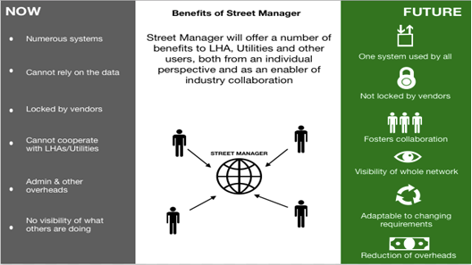
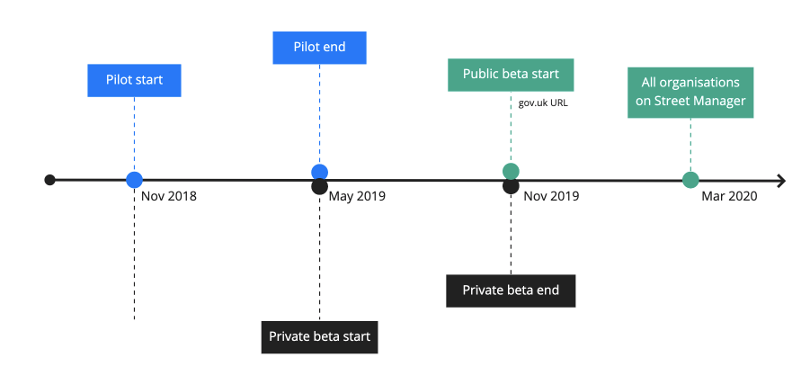
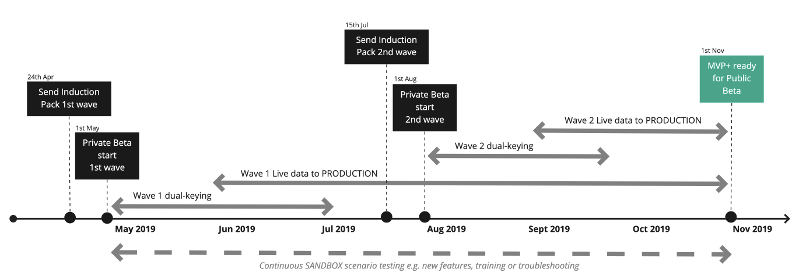
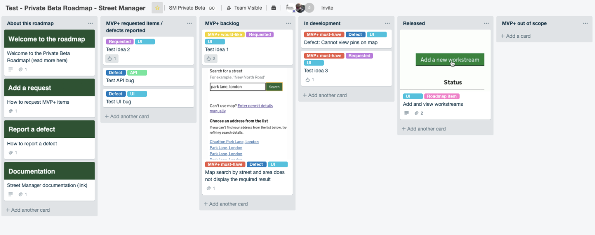

# Onboarding
{: .govuk-heading-xl}

<b>NOTE:</b> This documentation is being trialled for use with the Street Manager pilot and private beta, it is not in final state and should not be taken as production documentation.
{: .govuk-body}

## Table of contents
{: .govuk-heading-l #table-of-contents}

<ol class="govuk-list govuk-list--number">
  <li><a class="govuk-link" href="#introduction">Introduction</a></li>
  <li><a class="govuk-link" href="#about-street-manager">About Street Manager</a></li>
  <li><a class="govuk-link" href="#ways-of-working">Ways of working - Agile product delivery</a></li>
  <li><a class="govuk-link" href="#street-manager-phases-timeline">Street manager phases timeline</a></li>
  <li><a class="govuk-link" href="#progress-so-far">Progress so far</a></li>
  <li><a class="govuk-link" href="#private-beta-timeline">Private Beta timeline</a></li>
  <li><a class="govuk-link" href="#move-to-production">Move to Production</a></li>
  <li><a class="govuk-link" href="#your-roles-and-responsibilities">Your roles and responsibilities</a></li>
  <li><a class="govuk-link" href="#test-scenarios">Test scenarios</a></li>
  <li><a class="govuk-link" href="#important-information">Important information</a></li>
  <li><a class="govuk-link" href="#communication-channels">Communication channels</a></li>
  <li><a class="govuk-link" href="#known-issues-and-workarounds">Known issues and workarounds</a></li>
  <li><a class="govuk-link" href="#mvp-scope">MVP+ scope</a></li>
  <li><a class="govuk-link" href="#important-information">API documentation</a></li>
</ol>

## Introduction
{: .govuk-heading-l #introduction}

Many thanks for signing up to be part of Private Beta – we are excited to be working closely with you on Street Manager.
{: .govuk-body}

Your Private Beta Manager is Esme Moore, who will be your primary contact for all things related to Private Beta. (See the Communication channels section for more details)
{: .govuk-body}

In this Onboarding Induction Pack, you will find details about the scope and timelines of Street Manager, your roles and responsibilities, important information about communication channels, FAQ and what information we plan to produce and have available to you during this phase.
{: .govuk-body}

## About Street Manager
{: .govuk-heading-l #about-street-manager}

In early 2017, the DfT began to investigate whether or not the current system for managing
street works was fit for purpose in terms of the technology it uses, the needs of the user
community and the rising demand for up to date and accurate data about road works. People
were reporting frustrations about:
{: .govuk-body}

* the timeliness and accuracy of data
* a lack of visibility of the data across different local authority areas
* high costs
* the need for updates to reflect current needs and
* inconsistent systems and data.
{: .govuk-body}

To address the gap, the DfT worked with users from local authorities and utility companies
to design and develop a new digital service - Street Manager - that would enable a single
source of accurate, up-to-date and open data on road and street works with the vision of
transforming the planning, management and communication of street and road works to
ultimately minimise disruption and improve journeys for the public. The image below shows
the benefits of the new service.
{: .govuk-body}

## Ways of working - Agile product delivery
{: .govuk-heading-l #ways-of-working}

In line with Government Digital Service (GDS) guidelines, the Street Manager project is being
conducted in an agile way, meaning that we are following an iterative development approach.
{: .govuk-body}

We build the basics of the product first and then, based on regular user testing feedback, we
enhance as we go. It provides the ability to adapt the product to meet changing requirements
all the time. This means that you as users get to access the new system earlier on but also
for us to adapt the system continuously. Rather than a fixed system that may be missing a
few things, you get an organic one that can be added to as and when needed. The analogy
we like to use is of building a house - you build the basic walls and roof first so that you can
move in straight away but then you can choose what curtains or kitchen tiles you want when
you’ve moved in.
{: .govuk-body}

## Street Manager phases timeline
{: .govuk-heading-l #street-manager-phases-timeline}

Street Manager is now in the Beta development phase. This is when we build, test and roll
out the service. The Beta development phase is split into private beta, where we work with
a closed group of users, and then public beta which is when other users can start using the
service.
{: .govuk-body}

In line with feedback from users, we have reduced the public beta phase to five months to
help minimise the transition issues, such as dual running. It will now be between November
and March 2020, when legislation will be changed to make Street Manager the sole service
that should be used. The DfT hopes to publish a consultation shortly that will provide more
information on the legislative changes.
{: .govuk-body}

## Progress so far
{: .govuk-heading-l #progress-so-far}

We have had 15 users from 5 organisations involved in the pilot group, which has been
running since November 2018. These users have been using real life examples to test
Street Manager and help us to develop the various services. We have carried out 14 onsite
visits during the pilot phase to observe pilot users. Since the start of the pilot in November,
over 380 Slack messages have been exchanged. Our pilot users have:
{: .govuk-body}

* Created 720 work permits
* Raised 750 permit applications
* Granted 405 permits and refused 73 applications
* Commented on 79 permits
{: .govuk-body}

We are very grateful to Thames Water, Cadent, Transport for London, Hertfordshire and
UK Power Networks for their contribution so far.
{: .govuk-body}

## Private Beta timeline
{: .govuk-heading-l #private-beta-timeline}

## Move to production
{: .govuk-heading-l #move-to-production}

All private beta users will begin in the SANDBOX ENVIRONMENT. You may dual-key and/or to test with dummy data.
{: .govuk-body}

When you are ready, you can request access to the PRE-PRODUCTION & PRODUCTION ENVIRONMENT. Instead of dummy email
addresses like those that were provided for SANDBOX, we will be using your users’ email addresses as the login username. Please
avoid using dummy data within PRE-PRODUCTION and treat it as if it was the live system.
{: .govuk-body}

2 weeks’ notice will be required when you would like to move onto PRE-PRODUCTION/PRODUCTION. We will also need to ensure that
you are paired up with a works promoter and local highway authority (LHA) within your geographical area accordingly.
{: .govuk-body}

Important: If you dual-key in EToN and the PRODUCTION, there will be duplicate records in the live system and must be avoided.
{: .govuk-body}

## Your roles and responsibilities
{: .govuk-heading-l #your-roles-and-responsibilities}

### Organisation responsible party
{: .govuk-heading-m}

This contact should be the primary person that we can contact about your
organisation’s use of Street Manager and has sufficient authority to make decisions
around when to transition from the SANDBOX environment to PREPRODUCTION/
PRODUCTION, and who the users will be taking part in Private Beta.
{: .govuk-body}

Responsibilities include but not limited to the following:
{: .govuk-body}
* Ensure that we are provided with details for your organisation for onboarding
and testing/transition approach.
* Agree with Street Manager’s terms of use. These will be sent to you when
they are ready, hopefully at the end of May.
* [Agree to charging model for Street Manager and provide details for
invoicing/payment (details TBC).]
* Request login accounts for your organisation’s users (add/update/remove
users).
* Request access to PRE-PRODUCTION/PRODUCTION (when ready to use Street
Manager for live work use).
* Monitor the Street Manager roadmap and news to inform
your organisation’s users of changes and new functionality.
{: .govuk-body}

### Organisation responsible party with API integration
{: .govuk-heading-m}

In addition to the responsibilities above:
{: .govuk-body}
* Plan API integration for your existing System with Street Manager using the
available API documentation.
* Request API access to PRE-PRODUCTION/PRODUCTION ENVIRONMENT (when
ready to use Street Manager for live work use).
* Monitor the Street Manager roadmap and API updates to plan your
organisation’s API integration (ongoing, to handle new functionality and
changes).
{: .govuk-body}

### Street Manager Private Beta participants
{: .govuk-heading-m}

Responsibilities include but not limited to the following:
{: .govuk-body}
* Continuously provide feedback
  * This phase is all about your opinion and impressions of the product.
We want to ensure that MVP+ is fit for use and provides an overall
positive user experience and
  * Structure your feedback to be constructive with information-specific,
issue-focused, and based on observations wherever possible.
  * Let us know when something isn’t working as expected e.g. there is a
defect/bug or the functionality is not fit for use using the recommended
channel(s).
  * Be reasonably available for follow-up questions on any features or
defects that you have reported and to discuss potential interim
workarounds.
* Complete all test scenarios – see the section below about test scenarios
* Complete all surveys – you will be asked to complete surveys during Private
Beta, please complete these as soon as you have the opportunity to do so.
* Engage in discussions and contribution to the community
  * We’d like you to actively engage with other organisations’ users
participating in Private Beta to share thoughts, provide support to other
users, and vote for features to help us make decisions about the
roadmap.
* Take part in usability testing sessions – our user researchers may want to get
your feedback on upcoming features
* Communicate with your Private Beta Manager – If you need help or need to
leave the test, please let us know. Keep us in the loop if your circumstances
change at any point.
* Store your login details securely.
* Do not share information provided as part of private beta with anyone who is
not participating. Information will be shared with you, some of which may be
in draft to ask for your views. The project will make information more widely
available as and when it has been agreed by the project team.
{: .govuk-body}

## Test scenarios
{: .govuk-heading-l #test-scenarios}

### When you first join Street Manager
{: .govuk-heading-m}
You will be provided with a full list of test scenarios that we would like you to
complete in SANDBOX at least once during Private Beta.
You will be asked to advise if you have been able to complete the scenario; if you
were not able to complete the scenario, the reason why; how satisfied were you with
the journey; and any further comments.
It is highly recommended that all scenarios are completed before moving onto PREPRODUCTION/
PRODUCTION.
{: .govuk-body}

### New scenarios with each release
{: .govuk-heading-m}
As new functionality is released, we will provide new test scenarios to be completed
and added to the existing list of test scenarios.
{: .govuk-body}

## Important information
{: .govuk-heading-l #important-information}

## Communication channels
{: .govuk-heading-l #communication-channels}

### News and release notes
{: .govuk-heading-m}
Release notes and other announcements will be made available in a centralised
place.
Release notes will be published every two weeks as each development sprint is
completed and the system is updated. It will include details about new functionality,
defects that have been fixed and new test scenarios.
{: .govuk-body}

### Slack
{: .govuk-heading-m}
You will have access to the DfT Slack workspace. Slack is a hub of various channels
and direct messages where discussions can take place according to topic. Different
conversations can become interwoven within a channel, so it is most useful for
shorter conversations or collaboration in near real-time.
{: .govuk-body}

Exclusive channels that we will add you to on 1st May:
{: .govuk-body}
* privatebetaUI – if you access Street Manager through the web browser
* privatebetaAPI
Public channels that you may be interested in:
* #general – an open DfT Street Manager-wide general discussions and
announcements
* #api – an open API focused channel including members who are also not
involved in Private Beta
{: .govuk-body}

### Slack tips:
{: .govuk-heading-m}
* Add @here to your message to notify active (green status) members of a
channel
* Add @channel to notify all members of a channel
{: .govuk-body}

### Queries, MVP+ feature feedback and report defects
{: .govuk-heading-m}

We will be providing you with the ability to open new queries, provide MVP+ feature
feedback and report defects (bugs). More information on how you do this will be
provided when you begin the Private Beta phase.
{: .govuk-body}

We will respond to your queries as soon as possible with urgent issues taking
priority.
{: .govuk-body}

MVP+ feature feedback and non-critical defect reports will be reviewed and added to
the Private Beta roadmap. Please see the Private Beta roadmap section below for
more details on what will happen with these items.
{: .govuk-body}

Adding or removing users from SANDBOX or PRE-PRODUCTION/PRODUCTION can also be
requested through this process as and when required.
{: .govuk-body}

### Private Beta roadmap
{: .govuk-heading-m}

All users will be provided with access to view and vote on the Private Beta roadmap
which will show all feature requests and defects reported by Private Beta users.
You’ll be able to see what has received the greatest number of votes, what is in &
out of scope for MVP+, what is in development and released.
{: .govuk-body}

### Direct message to Private Beta Manager
{: .govuk-heading-m}

It is highly recommended to use the communication channels described above if
possible, however, if you feel that none of the channels are suitable, you can reach
me by with a direct message in Slack (Esme Moore).
{: .govuk-body}

## Known issues and workarounds
{: .govuk-heading-l #known-issues-and-workarounds}

We will be keeping track of known issues and workarounds and access to this will be
provided to you in the next few weeks.
{: .govuk-body}

Your input to helping us identify important and missing information is key to us. We
will be actively working on tracking known limitations and workarounds of Street
Manager throughout Private Beta and adding it to this tracker.
{: .govuk-body}

## MVP+ scope
{: .govuk-heading-l #mvp-scope}

The MVP scope will be made available to you and will be updated on a regular basis.
{: .govuk-body}

## API documentation
{: .govuk-heading-l #api-documentation}

Please find the latest API documentation here:
https://departmentfortransport.github.io/street-manager-docs/api-documentation/
{: .govuk-body}
